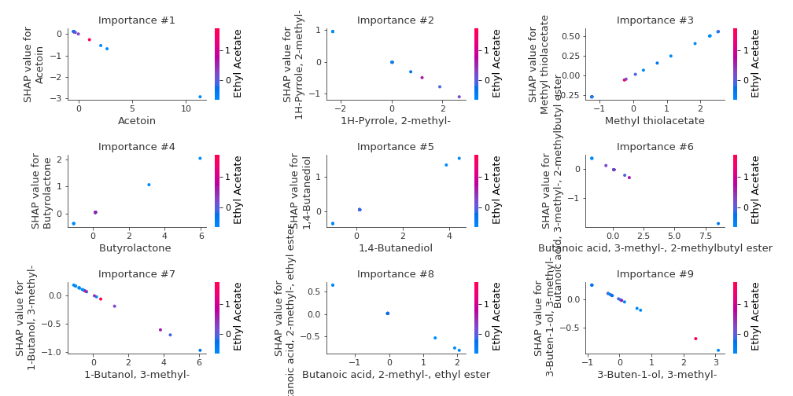
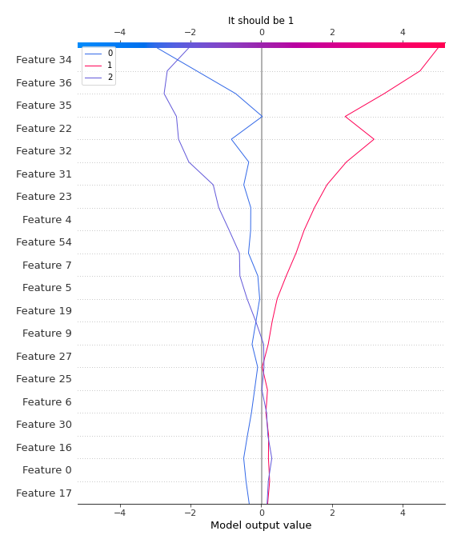

# Summary of 2_Linear

[<< Go back](../README.md)

## Logistic Regression (Linear)
- **n_jobs**: -1
- **num_class**: 3
- **explain_level**: 2

## Validation
 - **validation_type**: split
 - **train_ratio**: 0.75
 - **shuffle**: True
 - **stratify**: True

## Optimized metric
logloss

## Training time

12.5 seconds

### Metric details
|           |        0 |   1 |        2 |   accuracy |   macro avg |   weighted avg |   logloss |
|:----------|---------:|----:|---------:|-----------:|------------:|---------------:|----------:|
| precision | 1        |   1 | 0.75     |   0.888889 |    0.916667 |       0.916667 |  0.223379 |
| recall    | 0.714286 |   1 | 1        |   0.888889 |    0.904762 |       0.888889 |  0.223379 |
| f1-score  | 0.833333 |   1 | 0.857143 |   0.888889 |    0.896825 |       0.887566 |  0.223379 |
| support   | 7        |   5 | 6        |   0.888889 |   18        |      18        |  0.223379 |

## Confusion matrix
|              |   Predicted as 0 |   Predicted as 1 |   Predicted as 2 |
|:-------------|-----------------:|-----------------:|-----------------:|
| Labeled as 0 |                5 |                0 |                2 |
| Labeled as 1 |                0 |                5 |                0 |
| Labeled as 2 |                0 |                0 |                6 |

## Learning curves

## Coefficients

### Coefficients learner #1
|                                               |           0 |           1 |            2 |
|:----------------------------------------------|------------:|------------:|-------------:|
| intercept                                     | -0.180515   | -0.116913   |  0.297427    |
| Ethyl Acetate                                 | -0.256794   | -0.133225   |  0.390019    |
| Ethanol                                       | -0.170699   |  0.0134458  |  0.157253    |
| Propanoic acid, ethyl ester                   | -0.0240472  |  0.212482   | -0.188435    |
| 2-Pentanone                                   |  0.0456078  | -0.012396   | -0.0332118   |
| Decane                                        | -0.00715726 | -0.341853   |  0.349011    |
| Methyl Isobutyl Ketone                        |  0.0769866  | -0.398765   |  0.321778    |
| Amylene hydrate                               | -0.145766   | -0.0732014  |  0.218967    |
| Butanoic acid, 2-methyl-, methyl ester        |  0.251891   | -0.268827   |  0.0169361   |
| Isobutyl acetate                              |  0.0584868  | -0.128238   |  0.0697514   |
| Methyl isovalerate                            |  0.137887   |  0.138775   | -0.276663    |
| 1-Propanol                                    |  0.151657   | -0.0591664  | -0.0924908   |
| Methyl thiolacetate                           |  0.221478   |  0.121302   | -0.34278     |
| Butanoic acid, 2-methyl-, ethyl ester         | -0.391167   |  0.299437   |  0.0917304   |
| 2-Hexanone                                    |  0.0989563  |  0.274701   | -0.373657    |
| Ethyl isocyanide                              | -0.00554737 |  0.208334   | -0.202787    |
| 1-Propanol, 2-methyl-                         |  0.0362469  |  0.128037   | -0.164284    |
| 2-Pentanol, 2-methyl-                         | -0.160665   | -0.0108362  |  0.171501    |
| 2-Pentanol                                    | -0.12107    |  0.0799247  |  0.0411458   |
| 1-Butanol, 3-methyl-, acetate                 | -0.199123   |  0.24037    | -0.0412477   |
| 1 - Undecene                                  | -0.0956026  | -0.127135   |  0.222738    |
| 1-Butanol                                     |  0.036975   |  0.213487   | -0.250462    |
| 2-Heptanone                                   |  0.0120916  |  0.0108446  | -0.0229362   |
| Dodecane                                      |  0.276155   | -0.256128   | -0.0200272   |
| 1-Butanol, 3-methyl-                          | -0.159656   |  0.290375   | -0.130719    |
| S-Methyl 3-methylbutanethioate                |  0.0935673  | -0.108107   |  0.0145397   |
| 2-Heptanone, 4,6-dimethyl-                    |  0.145747   | -0.236032   |  0.0902846   |
| 3-Buten-1-ol, 3-methyl-                       | -0.294096   |  0.178268   |  0.115828    |
| Thiocyanic acid, methyl ester                 |  0.157172   | -0.172399   |  0.0152273   |
| Acetoin                                       | -0.258021   |  0.587896   | -0.329875    |
| 1-Pentanol, 2-methyl-                         |  0.0541753  |  0.207862   | -0.262037    |
| Butanoic acid, 3-methyl-, 2-methylbutyl ester | -0.219628   |  0.141586   |  0.0780418   |
| 2-Heptanol, 4-methyl-                         | -0.11821    | -0.454531   |  0.572741    |
| 2-Nonanone                                    | -0.123287   |  0.197741   | -0.074454    |
| Acetic acid                                   | -0.135896   | -0.171864   |  0.307759    |
| 2-Nonanol                                     | -0.239809   |  0.110028   |  0.129781    |
| Pyrrole                                       | -0.202181   |  0.297689   | -0.0955081   |
| 1H-Pyrrole, 2-methyl-                         | -0.414665   |  0.382751   |  0.0319138   |
| 1-Heptanol, 2,4-dimethyl-,                    |  0.0562714  | -0.0896384  |  0.0333669   |
| Propanoic acid                                |  0.13654    | -0.123524   | -0.0130161   |
| Propanoic acid, 2-methyl-                     |  0.479241   | -0.181751   | -0.297491    |
| 1-Octanol                                     | -0.152337   |  0.166413   | -0.0140766   |
| 2-Undecanone                                  |  0.0206296  | -0.0259871  |  0.0053575   |
| Benzoic acid, methyl ester                    | -0.0385648  |  0.0545713  | -0.0160065   |
| Butyrolactone                                 |  0.341519   | -0.017395   | -0.324123    |
| Decanoic acid, ethyl ester                    | -0.0819048  |  0.0742935  |  0.0076113   |
| Acetic acid, decyl ester                      | -0.075385   |  0.101633   | -0.0262477   |
| 2-Undecanol                                   | -0.0935969  |  0.0654655  |  0.0281313   |
| Butanoic acid, 3-methyl-                      | -0.0123061  | -0.236466   |  0.248772    |
| 2-Dodecanone                                  |  0.269845   | -0.0526646  | -0.217181    |
| 1-Decanol                                     | -0.131617   |  0.167719   | -0.036102    |
| 2-Tridecanone                                 |  0.140635   | -0.0808266  | -0.0598087   |
| Dodecanoic acid, ethyl ester                  | -0.0579853  |  0.056996   |  0.000989309 |
| 1,4-Butanediol                                |  0.349707   | -0.0230771  | -0.32663     |
| Phenylethyl Alcohol                           | -0.194187   |  0.173759   |  0.0204283   |
| Acetophenone, 2'-amino-                       | -0.0656149  | -0.236811   |  0.302426    |
| 2-Tridecanol                                  |  0.143914   |  0.0635291  | -0.207443    |
| Tetradecanal                                  | -0.0210711  |  0.0552948  | -0.0342237   |
| 1-Dodecanol                                   | -0.0853179  | -0.0705275  |  0.155845    |
| Methyl tetradecanoate                         | -0.0244681  | -0.0800934  |  0.104562    |
| 2-Pentadecanone                               |  0.129605   | -0.070908   | -0.0586972   |
| Tetradecanoic acid, ethyl ester               | -0.0238782  |  0.0545464  | -0.0306682   |
| Hexadecanal                                   |  0.0421365  |  0.102037   | -0.144173    |
| n-Tridecan-1-ol                               |  0.259018   | -0.0490521  | -0.209966    |
| 1-Tetradecanol                                | -0.0531367  |  0.0376594  |  0.0154773   |
| n-Pentadecanol                                |  0.110802   | -0.0297002  | -0.0811022   |
| 1-Hexadecanol                                 | -0.0505753  |  0.00693199 |  0.0436433   |
| Indole                                        |  0.013461   | -0.0291414  |  0.0156805   |

## Permutation-based Importance

## Confusion Matrix

## Normalized Confusion Matrix

## ROC Curve

## Precision Recall Curve

## SHAP Importance

## SHAP Dependence plots

### Dependence 0 (Fold 1)

### Dependence 1 (Fold 1)

### Dependence 2 (Fold 1)

## SHAP Decision plots

### Worst decisions for selected sample 1 (Fold 1)

### Worst decisions for selected sample 2 (Fold 1)

### Worst decisions for selected sample 3 (Fold 1)

### Worst decisions for selected sample 4 (Fold 1)

### Best decisions for selected sample 1 (Fold 1)

### Best decisions for selected sample 2 (Fold 1)

### Best decisions for selected sample 3 (Fold 1)

### Best decisions for selected sample 4 (Fold 1)

[<< Go back](../README.md)
