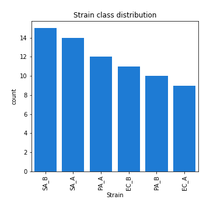
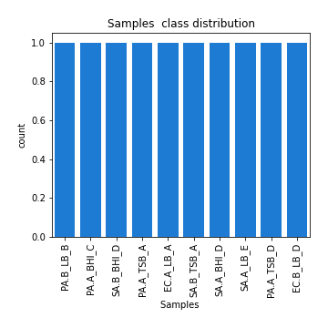

# Exploratory Data Analysis

[<< Go back](../README.md)
## Feature : target
- **Feature type** : discrete
- **Missing** : 0.0%
- **Unique** : 39
- **Count** :71.0
- **Mean** :200077.67605633804
- **Std** :300936.36616865284
- **Min** :0.0
- **25%th Percentile** : 0.0
- **50%th Percentile** : 102838.0
- **75%th Percentile** : 234844.0
- **Max** :1335746.0

## Feature : Species
- **Feature type** : categorical
- **Missing** : 0.0%
- **Unique** : 3
- **Count** :71
- **Unique** :3
- **Top** :SA
- **Freq** :29

## Feature : Strain
- **Feature type** : categorical
- **Missing** : 0.0%
- **Unique** : 6
- **Count** :71
- **Unique** :6
- **Top** :SA_B
- **Freq** :15

## Feature : Samples 
- **Feature type** : categorical
- **Missing** : 0.0%
- **Unique** : 71
- **Count** :71
- **Unique** :71
- **Top** :PA.B_LB_B
- **Freq** :1

[<< Go back](../README.md)
