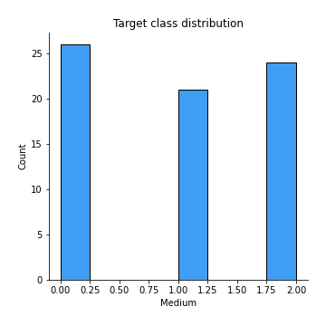
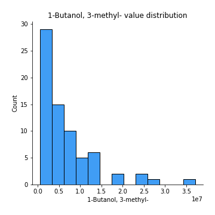
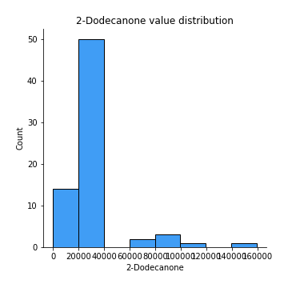
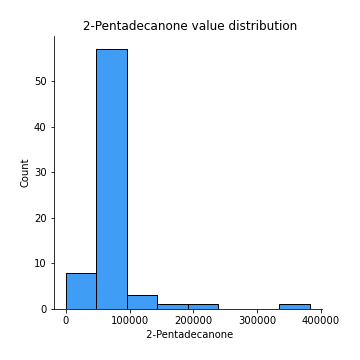

# Exploratory Data Analysis

[<< Go back](../README.md)
## Feature : target
- **Feature type** : discrete
- **Missing** : 0.0%
- **Unique** : 3
- **Count** :71.0
- **Mean** :0.971830985915493
- **Std** :0.8446779772859425
- **Min** :0.0
- **25%th Percentile** : 0.0
- **50%th Percentile** : 1.0
- **75%th Percentile** : 2.0
- **Max** :2.0

## Feature :  Ethyl Acetate
- **Feature type** : continous
- **Missing** : 0.0%
- **Unique** : 38
- **Count** :71.0
- **Mean** :183244.33293738335
- **Std** :279959.0401255074
- **Min** :0.0
- **25%th Percentile** : 0.0
- **50%th Percentile** : 72782.0
- **75%th Percentile** : 220586.5
- **Max** :1335746.0

## Feature : Ethanol
- **Feature type** : continous
- **Missing** : 0.0%
- **Unique** : 51
- **Count** :71.0
- **Mean** :1907364.2253521127
- **Std** :2546479.111408547
- **Min** :0.0
- **25%th Percentile** : 0.0
- **50%th Percentile** : 1010300.0
- **75%th Percentile** : 2922181.0
- **Max** :10739591.0

## Feature : Propanoic acid, ethyl ester
- **Feature type** : continous
- **Missing** : 0.0%
- **Unique** : 5
- **Count** :71.0
- **Mean** :18334.737610850294
- **Std** :26521.172418092818
- **Min** :0.0
- **25%th Percentile** : 8994.703703703704
- **50%th Percentile** : 17989.40740740741
- **75%th Percentile** : 17989.40740740741
- **Max** :175461.0

## Feature : 2-Pentanone
- **Feature type** : continous
- **Missing** : 0.0%
- **Unique** : 66
- **Count** :71.0
- **Mean** :1045009.5492957747
- **Std** :1018070.1759437353
- **Min** :0.0
- **25%th Percentile** : 417702.0
- **50%th Percentile** : 612393.0
- **75%th Percentile** : 1312842.5
- **Max** :4593791.0

## Feature : Decane
- **Feature type** : continous
- **Missing** : 0.0%
- **Unique** : 37
- **Count** :71.0
- **Mean** :283775.77464788733
- **Std** :447640.7728084204
- **Min** :0.0
- **25%th Percentile** : 0.0
- **50%th Percentile** : 15.0
- **75%th Percentile** : 463582.0
- **Max** :2992449.0

## Feature : Methyl Isobutyl Ketone
- **Feature type** : continous
- **Missing** : 0.0%
- **Unique** : 18
- **Count** :71.0
- **Mean** :203629.37731653085
- **Std** :302165.750587428
- **Min** :0.0
- **25%th Percentile** : 0.0
- **50%th Percentile** : 152829.0
- **75%th Percentile** : 218195.5614035088
- **Max** :1309090.0

## Feature : Amylene hydrate
- **Feature type** : continous
- **Missing** : 0.0%
- **Unique** : 29
- **Count** :71.0
- **Mean** :88064.14084507042
- **Std** :159376.34981822086
- **Min** :0.0
- **25%th Percentile** : 0.0
- **50%th Percentile** : 0.0
- **75%th Percentile** : 110313.5
- **Max** :759098.0

## Feature : Butanoic acid, 2-methyl-, methyl ester
- **Feature type** : continous
- **Missing** : 0.0%
- **Unique** : 12
- **Count** :71.0
- **Mean** :295339.1883150757
- **Std** :272456.35844084376
- **Min** :0.0
- **25%th Percentile** : 287247.7037037037
- **50%th Percentile** : 287247.7037037037
- **75%th Percentile** : 287247.7037037037
- **Max** :1437190.0

## Feature : Isobutyl acetate
- **Feature type** : continous
- **Missing** : 0.0%
- **Unique** : 14
- **Count** :71.0
- **Mean** :46646.930881585824
- **Std** :71794.1185842094
- **Min** :0.0
- **25%th Percentile** : 0.0
- **50%th Percentile** : 46016.2037037037
- **75%th Percentile** : 46016.2037037037
- **Max** :381024.0

## Feature : Methyl isovalerate
- **Feature type** : continous
- **Missing** : 0.0%
- **Unique** : 18
- **Count** :71.0
- **Mean** :99570.3876945886
- **Std** :150005.09211646055
- **Min** :0.0
- **25%th Percentile** : 0.0
- **50%th Percentile** : 93385.0
- **75%th Percentile** : 97276.9298245614
- **Max** :634921.0

## Feature : 1-Propanol
- **Feature type** : continous
- **Missing** : 0.0%
- **Unique** : 9
- **Count** :71.0
- **Mean** :323538.41001564974
- **Std** :344604.7210798142
- **Min** :0.0
- **25%th Percentile** : 317293.22222222225
- **50%th Percentile** : 317293.22222222225
- **75%th Percentile** : 317293.22222222225
- **Max** :1821750.0

## Feature : Methyl thiolacetate
- **Feature type** : continous
- **Missing** : 0.0%
- **Unique** : 53
- **Count** :71.0
- **Mean** :120426.92957746479
- **Std** :106508.21433503536
- **Min** :0.0
- **25%th Percentile** : 0.0
- **50%th Percentile** : 94646.0
- **75%th Percentile** : 183409.0
- **Max** :361484.0

## Feature : Butanoic acid, 2-methyl-, ethyl ester
- **Feature type** : continous
- **Missing** : 0.0%
- **Unique** : 19
- **Count** :71.0
- **Mean** :741955.9990610324
- **Std** :436360.9174493209
- **Min** :0.0
- **25%th Percentile** : 713709.4333333333
- **50%th Percentile** : 713709.4333333333
- **75%th Percentile** : 713709.4333333333
- **Max** :2198502.0

## Feature : 2-Hexanone
- **Feature type** : continous
- **Missing** : 0.0%
- **Unique** : 16
- **Count** :71.0
- **Mean** :38247.79367432664
- **Std** :48276.52857111252
- **Min** :0.0
- **25%th Percentile** : 0.0
- **50%th Percentile** : 39797.61403508772
- **75%th Percentile** : 39797.61403508772
- **Max** :183084.0

## Feature : Ethyl isocyanide
- **Feature type** : continous
- **Missing** : 0.0%
- **Unique** : 7
- **Count** :71.0
- **Mean** :19762.521126760563
- **Std** :19893.117239645017
- **Min** :0.0
- **25%th Percentile** : 19984.0
- **50%th Percentile** : 19984.0
- **75%th Percentile** : 19984.0
- **Max** :105966.0

## Feature : 1-Propanol, 2-methyl-
- **Feature type** : continous
- **Missing** : 0.0%
- **Unique** : 58
- **Count** :71.0
- **Mean** :216096.661971831
- **Std** :185939.19656151376
- **Min** :0.0
- **25%th Percentile** : 55365.0
- **50%th Percentile** : 179831.0
- **75%th Percentile** : 373653.5
- **Max** :636845.0

## Feature : 2-Pentanol, 2-methyl-
- **Feature type** : continous
- **Missing** : 0.0%
- **Unique** : 29
- **Count** :71.0
- **Mean** :39417.27693874088
- **Std** :60075.64573270627
- **Min** :0.0
- **25%th Percentile** : 0.0
- **50%th Percentile** : 0.0
- **75%th Percentile** : 75099.0
- **Max** :302615.0

## Feature : 2-Pentanol
- **Feature type** : continous
- **Missing** : 0.0%
- **Unique** : 26
- **Count** :71.0
- **Mean** :282523.966641957
- **Std** :406644.4838918174
- **Min** :0.0
- **25%th Percentile** : 0.0
- **50%th Percentile** : 265630.649122807
- **75%th Percentile** : 265630.649122807
- **Max** :2282603.0

## Feature : 1-Butanol, 3-methyl-, acetate
- **Feature type** : continous
- **Missing** : 0.0%
- **Unique** : 7
- **Count** :71.0
- **Mean** :20473.115492957728
- **Std** :28688.275887320975
- **Min** :0.0
- **25%th Percentile** : 0.0
- **50%th Percentile** : 19126.2
- **75%th Percentile** : 19126.2
- **Max** :156927.0

## Feature : 1 - Undecene
- **Feature type** : continous
- **Missing** : 0.0%
- **Unique** : 26
- **Count** :71.0
- **Mean** :5620391.3291601455
- **Std** :2310750.3525545085
- **Min** :0.0
- **25%th Percentile** : 5627687.703703703
- **50%th Percentile** : 5627687.703703703
- **75%th Percentile** : 5627687.703703703
- **Max** :12921628.0

## Feature : 1-Butanol
- **Feature type** : continous
- **Missing** : 0.0%
- **Unique** : 37
- **Count** :71.0
- **Mean** :1401296.5446009391
- **Std** :1150930.193310235
- **Min** :0.0
- **25%th Percentile** : 521099.0
- **50%th Percentile** : 1456599.6666666667
- **75%th Percentile** : 1496117.0
- **Max** :5985957.0

## Feature : 2-Heptanone
- **Feature type** : continous
- **Missing** : 0.0%
- **Unique** : 35
- **Count** :71.0
- **Mean** :113517.08450704225
- **Std** :176565.3790887789
- **Min** :0.0
- **25%th Percentile** : 0.0
- **50%th Percentile** : 0.0
- **75%th Percentile** : 176263.5
- **Max** :1022779.0

## Feature : Dodecane
- **Feature type** : continous
- **Missing** : 0.0%
- **Unique** : 8
- **Count** :71.0
- **Mean** :18638.807511737086
- **Std** :44534.35128550933
- **Min** :0.0
- **25%th Percentile** : 0.0
- **50%th Percentile** : 0.0
- **75%th Percentile** : 16751.333333333332
- **Max** :265644.0

## Feature : 1-Butanol, 3-methyl-
- **Feature type** : continous
- **Missing** : 0.0%
- **Unique** : 71
- **Count** :71.0
- **Mean** :6730763.3239436615
- **Std** :6969640.012050148
- **Min** :496920.0
- **25%th Percentile** : 2174309.0
- **50%th Percentile** : 4257835.0
- **75%th Percentile** : 8334995.0
- **Max** :37125000.0

## Feature :  S-Methyl 3-methylbutanethioate
- **Feature type** : continous
- **Missing** : 0.0%
- **Unique** : 26
- **Count** :71.0
- **Mean** :335197.17370892013
- **Std** :151008.41070325638
- **Min** :0.0
- **25%th Percentile** : 334880.3333333333
- **50%th Percentile** : 334880.3333333333
- **75%th Percentile** : 334880.3333333333
- **Max** :1013976.0

## Feature : 2-Heptanone, 4,6-dimethyl-
- **Feature type** : continous
- **Missing** : 0.0%
- **Unique** : 24
- **Count** :71.0
- **Mean** :60875.95878977572
- **Std** :61857.59788973957
- **Min** :0.0
- **25%th Percentile** : 0.0
- **50%th Percentile** : 59419.96296296296
- **75%th Percentile** : 74402.5
- **Max** :277538.0

## Feature :  3-Buten-1-ol, 3-methyl-
- **Feature type** : continous
- **Missing** : 0.0%
- **Unique** : 52
- **Count** :71.0
- **Mean** :131743.11267605633
- **Std** :151001.48032430006
- **Min** :0.0
- **25%th Percentile** : 0.0
- **50%th Percentile** : 92165.0
- **75%th Percentile** : 155214.5
- **Max** :715127.0

## Feature : Thiocyanic acid, methyl ester
- **Feature type** : continous
- **Missing** : 0.0%
- **Unique** : 9
- **Count** :71.0
- **Mean** :59673.10172143969
- **Std** :66324.1425177321
- **Min** :0.0
- **25%th Percentile** : 29019.11111111111
- **50%th Percentile** : 58038.22222222222
- **75%th Percentile** : 58038.22222222222
- **Max** :347183.0

## Feature : Acetoin
- **Feature type** : continous
- **Missing** : 0.0%
- **Unique** : 24
- **Count** :71.0
- **Mean** :215794.2394366197
- **Std** :597176.8440922302
- **Min** :0.0
- **25%th Percentile** : 0.0
- **50%th Percentile** : 0.0
- **75%th Percentile** : 161919.0
- **Max** :4216736.0

## Feature : 1-Pentanol, 2-methyl-
- **Feature type** : continous
- **Missing** : 0.0%
- **Unique** : 13
- **Count** :71.0
- **Mean** :49634.10537297863
- **Std** :31706.821510144116
- **Min** :0.0
- **25%th Percentile** : 48789.62962962963
- **50%th Percentile** : 48789.62962962963
- **75%th Percentile** : 48789.62962962963
- **Max** :186787.0

## Feature : Butanoic acid, 3-methyl-, 2-methylbutyl ester
- **Feature type** : continous
- **Missing** : 0.0%
- **Unique** : 15
- **Count** :71.0
- **Mean** :101736.64632237877
- **Std** :80909.47633320205
- **Min** :0.0
- **25%th Percentile** : 103049.88888888888
- **50%th Percentile** : 103049.88888888888
- **75%th Percentile** : 103049.88888888888
- **Max** :590669.0

## Feature : 2-Heptanol, 4-methyl-
- **Feature type** : continous
- **Missing** : 0.0%
- **Unique** : 9
- **Count** :71.0
- **Mean** :46673.2373500261
- **Std** :50533.64470052613
- **Min** :0.0
- **25%th Percentile** : 22697.25925925926
- **50%th Percentile** : 45394.51851851852
- **75%th Percentile** : 45394.51851851852
- **Max** :254736.0

## Feature : 2-Nonanone 
- **Feature type** : continous
- **Missing** : 0.0%
- **Unique** : 47
- **Count** :71.0
- **Mean** :584125.4671361502
- **Std** :460867.64526687225
- **Min** :0.0
- **25%th Percentile** : 297162.0
- **50%th Percentile** : 618535.1666666666
- **75%th Percentile** : 618535.1666666666
- **Max** :2271616.0

## Feature : Acetic acid
- **Feature type** : continous
- **Missing** : 0.0%
- **Unique** : 47
- **Count** :71.0
- **Mean** :3399092.0387941687
- **Std** :3720042.5276610344
- **Min** :125680.0
- **25%th Percentile** : 1309197.5
- **50%th Percentile** : 3241608.0701754387
- **75%th Percentile** : 3241608.0701754387
- **Max** :21176351.0

## Feature : 2-Nonanol
- **Feature type** : continous
- **Missing** : 0.0%
- **Unique** : 23
- **Count** :71.0
- **Mean** :608488.8226395412
- **Std** :367646.22529937915
- **Min** :0.0
- **25%th Percentile** : 532955.0370370371
- **50%th Percentile** : 628854.074074074
- **75%th Percentile** : 628854.074074074
- **Max** :2173133.0

## Feature : Pyrrole
- **Feature type** : continous
- **Missing** : 0.0%
- **Unique** : 26
- **Count** :71.0
- **Mean** :370667.5065206051
- **Std** :135022.4631876413
- **Min** :83078.0
- **25%th Percentile** : 371058.6296296296
- **50%th Percentile** : 371058.6296296296
- **75%th Percentile** : 371058.6296296296
- **Max** :862790.0

## Feature : 1H-Pyrrole, 2-methyl-
- **Feature type** : continous
- **Missing** : 0.0%
- **Unique** : 18
- **Count** :71.0
- **Mean** :329167.7193531562
- **Std** :154441.14859952635
- **Min** :0.0
- **25%th Percentile** : 333395.7407407408
- **50%th Percentile** : 333395.7407407408
- **75%th Percentile** : 333395.7407407408
- **Max** :709941.0

## Feature : 1-Heptanol, 2,4-dimethyl-,
- **Feature type** : continous
- **Missing** : 0.0%
- **Unique** : 21
- **Count** :71.0
- **Mean** :47477.073030777225
- **Std** :54698.08567105141
- **Min** :0.0
- **25%th Percentile** : 0.0
- **50%th Percentile** : 49898.40740740741
- **75%th Percentile** : 52627.0
- **Max** :274686.0

## Feature : Propanoic acid
- **Feature type** : continous
- **Missing** : 0.0%
- **Unique** : 22
- **Count** :71.0
- **Mean** :60398.23641851105
- **Std** :75327.79808362092
- **Min** :0.0
- **25%th Percentile** : 0.0
- **50%th Percentile** : 57874.07142857143
- **75%th Percentile** : 57874.07142857143
- **Max** :364754.0

## Feature : Propanoic acid, 2-methyl-
- **Feature type** : continous
- **Missing** : 0.0%
- **Unique** : 7
- **Count** :71.0
- **Mean** :21444.952112676066
- **Std** :33375.048749262896
- **Min** :0.0
- **25%th Percentile** : 0.0
- **50%th Percentile** : 20034.1
- **75%th Percentile** : 20034.1
- **Max** :245699.0

## Feature : 1-Octanol
- **Feature type** : continous
- **Missing** : 0.0%
- **Unique** : 20
- **Count** :71.0
- **Mean** :639573.8716744906
- **Std** :296078.40661491157
- **Min** :0.0
- **25%th Percentile** : 664654.7777777778
- **50%th Percentile** : 664654.7777777778
- **75%th Percentile** : 664654.7777777778
- **Max** :1910713.0

## Feature : 2-Undecanone
- **Feature type** : continous
- **Missing** : 0.0%
- **Unique** : 46
- **Count** :71.0
- **Mean** :586178.3758476789
- **Std** :565515.7400816793
- **Min** :0.0
- **25%th Percentile** : 291116.5
- **50%th Percentile** : 590926.9074074074
- **75%th Percentile** : 590926.9074074074
- **Max** :4396492.0

## Feature : Benzoic acid, methyl ester
- **Feature type** : continous
- **Missing** : 0.0%
- **Unique** : 26
- **Count** :71.0
- **Mean** :131940.4804381846
- **Std** :134949.49868382546
- **Min** :0.0
- **25%th Percentile** : 0.0
- **50%th Percentile** : 134161.44444444444
- **75%th Percentile** : 134161.44444444444
- **Max** :584398.0

## Feature : Butyrolactone 
- **Feature type** : continous
- **Missing** : 0.0%
- **Unique** : 8
- **Count** :71.0
- **Mean** :42159.37652582161
- **Std** :43668.7622203308
- **Min** :0.0
- **25%th Percentile** : 0.0
- **50%th Percentile** : 43750.23333333333
- **75%th Percentile** : 43750.23333333333
- **Max** :254746.0

## Feature :  Decanoic acid, ethyl ester
- **Feature type** : continous
- **Missing** : 0.0%
- **Unique** : 6
- **Count** :71.0
- **Mean** :33569.974960876396
- **Std** :30034.1640630442
- **Min** :0.0
- **25%th Percentile** : 37525.444444444445
- **50%th Percentile** : 37525.444444444445
- **75%th Percentile** : 37525.444444444445
- **Max** :173839.0

## Feature : Acetic acid, decyl ester
- **Feature type** : continous
- **Missing** : 0.0%
- **Unique** : 7
- **Count** :71.0
- **Mean** :34452.33176838807
- **Std** :28878.854247905678
- **Min** :0.0
- **25%th Percentile** : 37478.11111111111
- **50%th Percentile** : 37478.11111111111
- **75%th Percentile** : 37478.11111111111
- **Max** :164633.0

## Feature : 2-Undecanol
- **Feature type** : continous
- **Missing** : 0.0%
- **Unique** : 29
- **Count** :71.0
- **Mean** :351978.1554512258
- **Std** :559600.0776104899
- **Min** :0.0
- **25%th Percentile** : 0.0
- **50%th Percentile** : 338121.48148148146
- **75%th Percentile** : 338121.48148148146
- **Max** :3287479.0

## Feature : Butanoic acid, 3-methyl-
- **Feature type** : continous
- **Missing** : 0.0%
- **Unique** : 26
- **Count** :71.0
- **Mean** :2452216.852582159
- **Std** :717676.2759853295
- **Min** :1194878.0
- **25%th Percentile** : 2403459.033333333
- **50%th Percentile** : 2403459.033333333
- **75%th Percentile** : 2403459.033333333
- **Max** :5887513.0

## Feature : 2-Dodecanone
- **Feature type** : continous
- **Missing** : 0.0%
- **Unique** : 9
- **Count** :71.0
- **Mean** :31188.691184141924
- **Std** :26347.19650773126
- **Min** :0.0
- **25%th Percentile** : 30908.48148148148
- **50%th Percentile** : 30908.48148148148
- **75%th Percentile** : 30908.48148148148
- **Max** :159402.0

## Feature : 1-Decanol
- **Feature type** : continous
- **Missing** : 0.0%
- **Unique** : 22
- **Count** :71.0
- **Mean** :1464873.6593635902
- **Std** :855051.1563645606
- **Min** :0.0
- **25%th Percentile** : 1524509.2962962964
- **50%th Percentile** : 1524509.2962962964
- **75%th Percentile** : 1524509.2962962964
- **Max** :5542281.0

## Feature : 2-Tridecanone
- **Feature type** : continous
- **Missing** : 0.0%
- **Unique** : 22
- **Count** :71.0
- **Mean** :308511.3119457484
- **Std** :131304.04782243088
- **Min** :0.0
- **25%th Percentile** : 314530.962962963
- **50%th Percentile** : 314530.962962963
- **75%th Percentile** : 314530.962962963
- **Max** :975303.0

## Feature :  Dodecanoic acid, ethyl ester
- **Feature type** : continous
- **Missing** : 0.0%
- **Unique** : 5
- **Count** :71.0
- **Mean** :19067.346374543555
- **Std** :18949.88853666924
- **Min** :0.0
- **25%th Percentile** : 10705.425925925925
- **50%th Percentile** : 21410.85185185185
- **75%th Percentile** : 21410.85185185185
- **Max** :118849.0

## Feature : 1,4-Butanediol
- **Feature type** : continous
- **Missing** : 0.0%
- **Unique** : 8
- **Count** :71.0
- **Mean** :20712.368075117352
- **Std** :20947.75076372234
- **Min** :0.0
- **25%th Percentile** : 0.0
- **50%th Percentile** : 21398.13333333333
- **75%th Percentile** : 21398.13333333333
- **Max** :100676.0

## Feature : Phenylethyl Alcohol
- **Feature type** : continous
- **Missing** : 0.0%
- **Unique** : 20
- **Count** :71.0
- **Mean** :147088.76734480946
- **Std** :48235.20353924825
- **Min** :0.0
- **25%th Percentile** : 147761.62962962964
- **50%th Percentile** : 147761.62962962964
- **75%th Percentile** : 147761.62962962964
- **Max** :386583.0

## Feature : Acetophenone, 2'-amino-
- **Feature type** : continous
- **Missing** : 0.0%
- **Unique** : 21
- **Count** :71.0
- **Mean** :348453.4971309336
- **Std** :289098.7465018193
- **Min** :0.0
- **25%th Percentile** : 343307.962962963
- **50%th Percentile** : 343307.962962963
- **75%th Percentile** : 343307.962962963
- **Max** :1937240.0

## Feature : 2-Tridecanol
- **Feature type** : continous
- **Missing** : 0.0%
- **Unique** : 12
- **Count** :71.0
- **Mean** :56203.55920709446
- **Std** :37075.787612793356
- **Min** :0.0
- **25%th Percentile** : 56845.07407407407
- **50%th Percentile** : 56845.07407407407
- **75%th Percentile** : 56845.07407407407
- **Max** :226100.0

## Feature : Tetradecanal
- **Feature type** : continous
- **Missing** : 0.0%
- **Unique** : 3
- **Count** :71.0
- **Mean** :7424.028169014085
- **Std** :13051.147838925173
- **Min** :0.0
- **25%th Percentile** : 0.0
- **50%th Percentile** : 8317.0
- **75%th Percentile** : 8317.0
- **Max** :111256.0

## Feature : 1-Dodecanol
- **Feature type** : continous
- **Missing** : 0.0%
- **Unique** : 22
- **Count** :71.0
- **Mean** :2006423.5805946807
- **Std** :1014201.3139436748
- **Min** :242246.0
- **25%th Percentile** : 2098782.4444444445
- **50%th Percentile** : 2098782.4444444445
- **75%th Percentile** : 2098782.4444444445
- **Max** :8172616.0

## Feature : Methyl tetradecanoate
- **Feature type** : continous
- **Missing** : 0.0%
- **Unique** : 9
- **Count** :71.0
- **Mean** :94517.96713615015
- **Std** :92986.5373695475
- **Min** :0.0
- **25%th Percentile** : 97878.33333333331
- **50%th Percentile** : 97878.33333333331
- **75%th Percentile** : 97878.33333333331
- **Max** :698476.0

## Feature :  2-Pentadecanone
- **Feature type** : continous
- **Missing** : 0.0%
- **Unique** : 15
- **Count** :71.0
- **Mean** :83888.2044861763
- **Std** :50764.32379507203
- **Min** :0.0
- **25%th Percentile** : 85753.37037037036
- **50%th Percentile** : 85753.37037037036
- **75%th Percentile** : 85753.37037037036
- **Max** :382222.0

## Feature : Tetradecanoic acid, ethyl ester
- **Feature type** : continous
- **Missing** : 0.0%
- **Unique** : 3
- **Count** :71.0
- **Mean** :8847.493479394892
- **Std** :14121.840132990843
- **Min** :0.0
- **25%th Percentile** : 0.0
- **50%th Percentile** : 10167.74074074074
- **75%th Percentile** : 10167.74074074074
- **Max** :119785.0

## Feature : Hexadecanal
- **Feature type** : continous
- **Missing** : 0.0%
- **Unique** : 11
- **Count** :71.0
- **Mean** :87478.30307772559
- **Std** :69412.20346285161
- **Min** :0.0
- **25%th Percentile** : 93011.68518518518
- **50%th Percentile** : 94159.37037037036
- **75%th Percentile** : 94159.37037037036
- **Max** :408288.0

## Feature : n-Tridecan-1-ol
- **Feature type** : continous
- **Missing** : 0.0%
- **Unique** : 10
- **Count** :71.0
- **Mean** :84756.90818988005
- **Std** :67928.53270320264
- **Min** :0.0
- **25%th Percentile** : 85581.62962962964
- **50%th Percentile** : 85581.62962962964
- **75%th Percentile** : 85581.62962962964
- **Max** :448151.0

## Feature : 1-Tetradecanol
- **Feature type** : continous
- **Missing** : 0.0%
- **Unique** : 22
- **Count** :71.0
- **Mean** :567037.8706311946
- **Std** :293332.0392213935
- **Min** :0.0
- **25%th Percentile** : 586042.2962962963
- **50%th Percentile** : 586042.2962962963
- **75%th Percentile** : 586042.2962962963
- **Max** :2450605.0

## Feature : n-Pentadecanol
- **Feature type** : continous
- **Missing** : 0.0%
- **Unique** : 8
- **Count** :71.0
- **Mean** :161326.8223185266
- **Std** :169468.17185489298
- **Min** :0.0
- **25%th Percentile** : 173037.61538461538
- **50%th Percentile** : 173037.61538461538
- **75%th Percentile** : 173037.61538461538
- **Max** :1389615.0

## Feature :  1-Hexadecanol
- **Feature type** : continous
- **Missing** : 0.0%
- **Unique** : 19
- **Count** :71.0
- **Mean** :656464.6437141369
- **Std** :535857.8709002438
- **Min** :0.0
- **25%th Percentile** : 662122.074074074
- **50%th Percentile** : 662122.074074074
- **75%th Percentile** : 662122.074074074
- **Max** :4268126.0

## Feature : Indole
- **Feature type** : continous
- **Missing** : 0.0%
- **Unique** : 22
- **Count** :71.0
- **Mean** :82496598.42253521
- **Std** :12076111.235353744
- **Min** :10282706.0
- **25%th Percentile** : 82469063.0
- **50%th Percentile** : 82469063.0
- **75%th Percentile** : 82469063.0
- **Max** :111534573.0

[<< Go back](../README.md)
