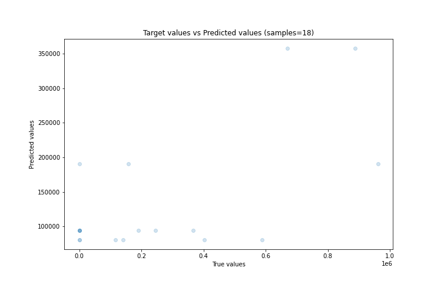
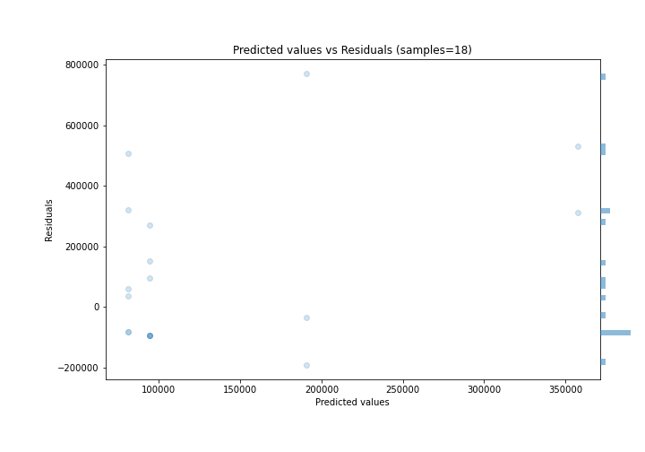

# Summary of Ensemble

[<< Go back](../README.md)

## Ensemble structure
| Model                  |   Weight |
|:-----------------------|---------:|
| 2_Default_RandomForest |        1 |

### Metric details:
| Metric   |            Score |
|:---------|-----------------:|
| MAE      | 212427           |
| MSE      |      8.51302e+10 |
| RMSE     | 291771           |
| R2       |      0.107838    |
| MAPE     |      1.82318e+20 |

## Learning curves

## True vs Predicted

## Predicted vs Residuals

[<< Go back](../README.md)
