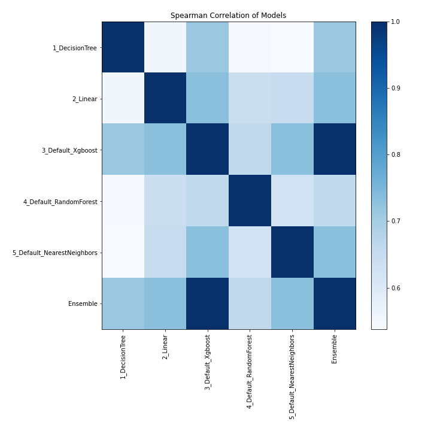

# AutoML Leaderboard

| Best model   | name                                                       | model_type    | metric_type   |   metric_value |   train_time |
|:-------------|:-----------------------------------------------------------|:--------------|:--------------|---------------:|-------------:|
|              | [1_DecisionTree](1_DecisionTree/README.md)                 | Decision Tree | rmse          |         322510 |        19.39 |
| **the best** | [2_Default_RandomForest](2_Default_RandomForest/README.md) | Random Forest | rmse          |         291771 |        11.31 |
|              | [Ensemble](Ensemble/README.md)                             | Ensemble      | rmse          |         291771 |         0.32 |

### AutoML Performance

### AutoML Performance Boxplot

### Features Importance

### Spearman Correlation of Models

