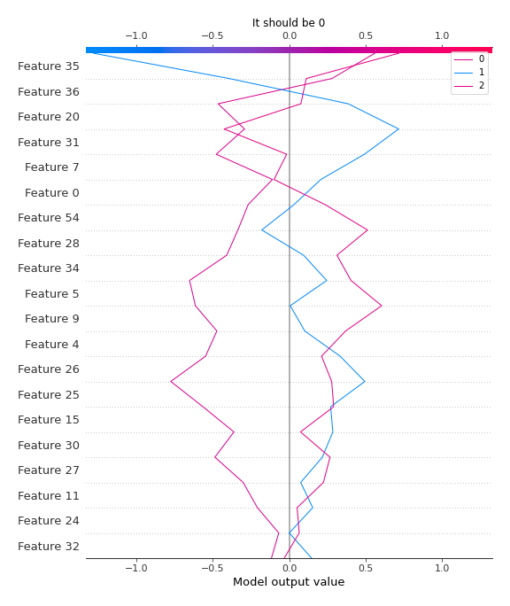

# Summary of 2_Linear

[<< Go back](../README.md)

## Logistic Regression (Linear)
- **n_jobs**: -1
- **num_class**: 3
- **explain_level**: 2

## Validation
 - **validation_type**: split
 - **train_ratio**: 0.75
 - **shuffle**: True
 - **stratify**: True

## Optimized metric
logloss

## Training time

11.3 seconds

### Metric details
|           |        0 |   1 |        2 |   accuracy |   macro avg |   weighted avg |   logloss |
|:----------|---------:|----:|---------:|-----------:|------------:|---------------:|----------:|
| precision | 1        |   1 | 0.666667 |   0.823529 |    0.888889 |       0.882353 |  0.483168 |
| recall    | 0.5      |   1 | 1        |   0.823529 |    0.833333 |       0.823529 |  0.483168 |
| f1-score  | 0.666667 |   1 | 0.8      |   0.823529 |    0.822222 |       0.811765 |  0.483168 |
| support   | 6        |   5 | 6        |   0.823529 |   17        |      17        |  0.483168 |

## Confusion matrix
|              |   Predicted as 0 |   Predicted as 1 |   Predicted as 2 |
|:-------------|-----------------:|-----------------:|-----------------:|
| Labeled as 0 |                3 |                0 |                3 |
| Labeled as 1 |                0 |                5 |                0 |
| Labeled as 2 |                0 |                0 |                6 |

## Learning curves

## Coefficients

### Coefficients learner #1
|                                               |            0 |           1 |           2 |
|:----------------------------------------------|-------------:|------------:|------------:|
| intercept                                     | -0.320201    | -0.046295   |  0.366496   |
| Ethyl Acetate                                 | -0.215923    | -0.232855   |  0.448778   |
| Ethanol                                       | -0.129951    |  0.0148766  |  0.115074   |
| Propanoic acid, ethyl ester                   | -0.0345056   |  0.16598    | -0.131475   |
| 2-Pentanone                                   |  0.179354    | -0.124592   | -0.054762   |
| Decane                                        |  0.158706    | -0.46516    |  0.306454   |
| Methyl Isobutyl Ketone                        |  0.0528077   | -0.380743   |  0.327936   |
| Amylene hydrate                               |  0.000213327 | -0.0974428  |  0.0972295  |
| Butanoic acid, 2-methyl-, methyl ester        |  0.345688    | -0.27183    | -0.073858   |
| Isobutyl acetate                              |  0.0957948   | -0.140938   |  0.0451437  |
| Methyl isovalerate                            |  0.191611    |  0.132997   | -0.324608   |
| 1-Propanol                                    |  0.136577    | -0.0392286  | -0.0973487  |
| Methyl thiolacetate                           |  0.242276    |  0.212703   | -0.454979   |
| Butanoic acid, 2-methyl-, ethyl ester         | -0.238813    |  0.26555    | -0.0267367  |
| 2-Hexanone                                    |  0.0854208   |  0.217591   | -0.303012   |
| Ethyl isocyanide                              | -0.013129    |  0.178427   | -0.165298   |
| 1-Propanol, 2-methyl-                         |  0.20085     |  0.0136088  | -0.214459   |
| 2-Pentanol, 2-methyl-                         | -0.0307427   | -0.0578168  |  0.0885594  |
| 2-Pentanol                                    | -0.0206563   | -0.0405353  |  0.0611916  |
| 1-Butanol, 3-methyl-, acetate                 | -0.162028    |  0.191138   | -0.0291103  |
| 1 - Undecene                                  | -0.00368181  | -0.0521617  |  0.0558435  |
| 1-Butanol                                     |  0.120053    |  0.235252   | -0.355306   |
| 2-Heptanone                                   |  0.0852571   |  0.00528764 | -0.0905447  |
| Dodecane                                      |  0.242135    | -0.212187   | -0.0299475  |
| 1-Butanol, 3-methyl-                          | -0.00064608  |  0.104528   | -0.103882   |
| S-Methyl 3-methylbutanethioate                |  0.0804776   | -0.0919847  |  0.0115071  |
| 2-Heptanone, 4,6-dimethyl-                    |  0.207717    | -0.226635   |  0.0189171  |
| 3-Buten-1-ol, 3-methyl-                       | -0.224955    |  0.155548   |  0.0694076  |
| Thiocyanic acid, methyl ester                 |  0.194209    | -0.153598   | -0.0406112  |
| Acetoin                                       | -0.16578     |  0.579312   | -0.413531   |
| 1-Pentanol, 2-methyl-                         |  0.0942975   |  0.123842   | -0.218139   |
| Butanoic acid, 3-methyl-, 2-methylbutyl ester | -0.116411    | -0.0622189  |  0.17863    |
| 2-Heptanol, 4-methyl-                         | -0.198647    | -0.235072   |  0.43372    |
| 2-Nonanone                                    | -0.0834877   |  0.230137   | -0.146649   |
| Acetic acid                                   | -0.1098      | -0.177657   |  0.287457   |
| 2-Nonanol                                     | -0.192339    |  0.116875   |  0.0754634  |
| Pyrrole                                       | -0.13588     |  0.421571   | -0.285691   |
| 1H-Pyrrole, 2-methyl-                         | -0.338556    |  0.351786   | -0.0132298  |
| 1-Heptanol, 2,4-dimethyl-,                    |  0.0448518   | -0.0922041  |  0.0473523  |
| Propanoic acid                                |  0.0483055   | -0.202801   |  0.154496   |
| Propanoic acid, 2-methyl-                     |  0.389504    | -0.169989   | -0.219514   |
| 1-Octanol                                     | -0.0912481   |  0.124921   | -0.0336725  |
| 2-Undecanone                                  |  0.0130494   | -0.00996953 | -0.0030799  |
| Benzoic acid, methyl ester                    | -0.0541162   |  0.0493167  |  0.00479955 |
| Butyrolactone                                 |  0.39476     | -0.0632353  | -0.331525   |
| Decanoic acid, ethyl ester                    | -0.0458006   |  0.120793   | -0.0749921  |
| Acetic acid, decyl ester                      | -0.0470366   |  0.10707    | -0.0600337  |
| 2-Undecanol                                   | -0.0856897   |  0.0661521  |  0.0195376  |
| Butanoic acid, 3-methyl-                      | -0.0247624   | -0.114025   |  0.138787   |
| 2-Dodecanone                                  |  0.190179    | -0.0481988  | -0.14198    |
| 1-Decanol                                     | -0.0780432   |  0.166863   | -0.0888201  |
| 2-Tridecanone                                 |  0.072968    | -0.0565536  | -0.0164144  |
| Dodecanoic acid, ethyl ester                  | -0.0473703   |  0.100805   | -0.0534347  |
| 1,4-Butanediol                                |  0.389918    | -0.051908   | -0.33801    |
| Phenylethyl Alcohol                           | -0.124356    |  0.204968   | -0.0806124  |
| Acetophenone, 2'-amino-                       | -0.0816879   | -0.240908   |  0.322596   |
| 2-Tridecanol                                  | -0.0635226   |  0.073369   | -0.00984638 |
| Tetradecanal                                  | -0.0107566   |  0.0683146  | -0.057558   |
| 1-Dodecanol                                   | -0.0522884   | -0.0272468  |  0.0795353  |
| Methyl tetradecanoate                         | -0.0145884   | -0.0432879  |  0.0578763  |
| 2-Pentadecanone                               |  0.0300339   | -0.0368744  |  0.00684043 |
| Tetradecanoic acid, ethyl ester               | -0.0149535   |  0.108872   | -0.0939182  |
| Hexadecanal                                   | -0.0340248   |  0.121839   | -0.0878143  |
| n-Tridecan-1-ol                               |  0.201596    | -0.0457522  | -0.155844   |
| 1-Tetradecanol                                | -0.036856    | -0.0241618  |  0.0610178  |
| n-Pentadecanol                                |  0.0985458   | -0.0423246  | -0.0562212  |
| 1-Hexadecanol                                 | -0.062678    | -0.0675866  |  0.130265   |
| Indole                                        | -0.107068    | -0.00858523 |  0.115653   |

## Permutation-based Importance

## Confusion Matrix

## Normalized Confusion Matrix

## ROC Curve

## Precision Recall Curve

## SHAP Importance

## SHAP Dependence plots

### Dependence 0 (Fold 1)

### Dependence 1 (Fold 1)

### Dependence 2 (Fold 1)

## SHAP Decision plots

### Worst decisions for selected sample 1 (Fold 1)

### Worst decisions for selected sample 2 (Fold 1)

### Worst decisions for selected sample 3 (Fold 1)

### Worst decisions for selected sample 4 (Fold 1)

### Best decisions for selected sample 1 (Fold 1)

### Best decisions for selected sample 2 (Fold 1)

### Best decisions for selected sample 3 (Fold 1)

### Best decisions for selected sample 4 (Fold 1)

[<< Go back](../README.md)
