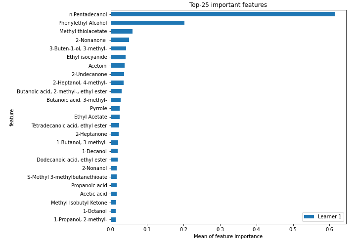
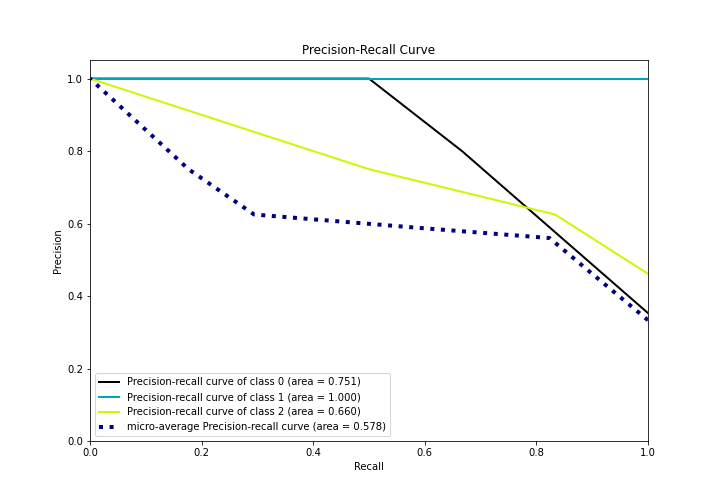

# Summary of 5_Default_NearestNeighbors

[<< Go back](../README.md)

## k-Nearest Neighbors (Nearest Neighbors)
- **n_jobs**: -1
- **n_neighbors**: 5
- **weights**: uniform
- **num_class**: 3
- **explain_level**: 2

## Validation
 - **validation_type**: split
 - **train_ratio**: 0.75
 - **shuffle**: True
 - **stratify**: True

## Optimized metric
logloss

## Training time

4.1 seconds

### Metric details
|           |        0 |    1 |        2 |   accuracy |   macro avg |   weighted avg |   logloss |
|:----------|---------:|-----:|---------:|-----------:|------------:|---------------:|----------:|
| precision | 1        | 1    | 0.461538 |   0.588235 |    0.820513 |       0.809955 |   2.11212 |
| recall    | 0.166667 | 0.6  | 1        |   0.588235 |    0.588889 |       0.588235 |   2.11212 |
| f1-score  | 0.285714 | 0.75 | 0.631579 |   0.588235 |    0.555764 |       0.544339 |   2.11212 |
| support   | 6        | 5    | 6        |   0.588235 |   17        |      17        |   2.11212 |

## Confusion matrix
|              |   Predicted as 0 |   Predicted as 1 |   Predicted as 2 |
|:-------------|-----------------:|-----------------:|-----------------:|
| Labeled as 0 |                1 |                0 |                5 |
| Labeled as 1 |                0 |                3 |                2 |
| Labeled as 2 |                0 |                0 |                6 |

## Learning curves

## Permutation-based Importance

## Confusion Matrix

## Normalized Confusion Matrix

## ROC Curve

## Precision Recall Curve

[<< Go back](../README.md)
