# Exploratory Data Analysis

[<< Go back](../README.md)
## Feature : target
- **Feature type** : discrete
- **Missing** : 0.0%
- **Unique** : 3
- **Count** :67.0
- **Mean** :1.0298507462686568
- **Std** :0.8343051773187978
- **Min** :0.0
- **25%th Percentile** : 0.0
- **50%th Percentile** : 1.0
- **75%th Percentile** : 2.0
- **Max** :2.0

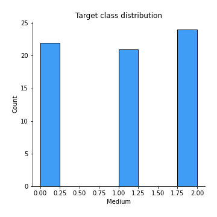
## Feature :  Ethyl Acetate
- **Feature type** : continous
- **Missing** : 0.0%
- **Unique** : 40
- **Count** :67.0
- **Mean** :220779.8602769286
- **Std** :289953.43331414805
- **Min** :0.0
- **25%th Percentile** : 0.0
- **50%th Percentile** : 128397.0
- **75%th Percentile** : 312884.0
- **Max** :1077717.0

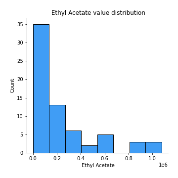
## Feature : Ethanol
- **Feature type** : continous
- **Missing** : 0.0%
- **Unique** : 52
- **Count** :67.0
- **Mean** :2175537.4029850746
- **Std** :2559431.653375793
- **Min** :0.0
- **25%th Percentile** : 85656.0
- **50%th Percentile** : 1050974.0
- **75%th Percentile** : 3308845.5
- **Max** :8155560.0

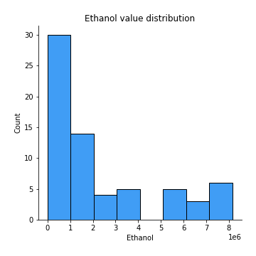
## Feature : Propanoic acid, ethyl ester
- **Feature type** : continous
- **Missing** : 0.0%
- **Unique** : 5
- **Count** :67.0
- **Mean** :17157.14814814815
- **Std** :25251.97108675409
- **Min** :0.0
- **25%th Percentile** : 0.0
- **50%th Percentile** : 17989.40740740741
- **75%th Percentile** : 17989.40740740741
- **Max** :175461.0

## Feature : 2-Pentanone
- **Feature type** : continous
- **Missing** : 0.0%
- **Unique** : 62
- **Count** :67.0
- **Mean** :1064678.4925373134
- **Std** :997750.4463071577
- **Min** :0.0
- **25%th Percentile** : 446629.0
- **50%th Percentile** : 635916.0
- **75%th Percentile** : 1418101.5
- **Max** :4593791.0

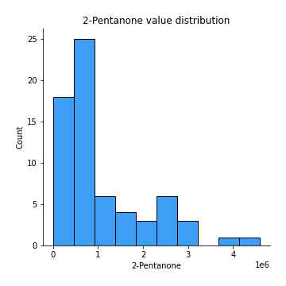
## Feature : Decane
- **Feature type** : continous
- **Missing** : 0.0%
- **Unique** : 36
- **Count** :67.0
- **Mean** :284708.10447761195
- **Std** :452484.0852171062
- **Min** :0.0
- **25%th Percentile** : 0.0
- **50%th Percentile** : 66082.0
- **75%th Percentile** : 456742.5
- **Max** :2992449.0

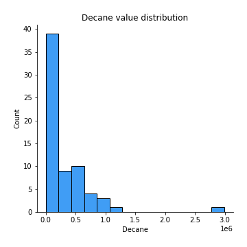
## Feature : Methyl Isobutyl Ketone
- **Feature type** : continous
- **Missing** : 0.0%
- **Unique** : 15
- **Count** :67.0
- **Mean** :214699.4464519509
- **Std** :323320.50763322384
- **Min** :0.0
- **25%th Percentile** : 0.0
- **50%th Percentile** : 218195.5614035088
- **75%th Percentile** : 218195.5614035088
- **Max** :1309090.0

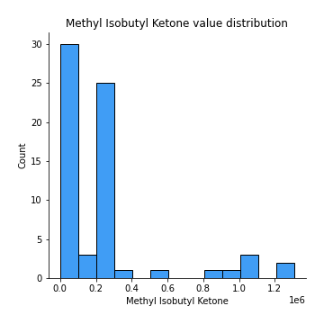
## Feature : Amylene hydrate
- **Feature type** : continous
- **Missing** : 0.0%
- **Unique** : 32
- **Count** :67.0
- **Mean** :94496.67164179105
- **Std** :157685.58021768354
- **Min** :0.0
- **25%th Percentile** : 0.0
- **50%th Percentile** : 0.0
- **75%th Percentile** : 137735.0
- **Max** :759098.0

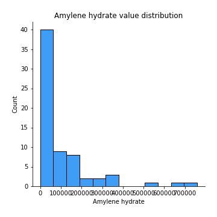
## Feature : Butanoic acid, 2-methyl-, methyl ester
- **Feature type** : continous
- **Missing** : 0.0%
- **Unique** : 10
- **Count** :67.0
- **Mean** :285795.45771144284
- **Std** :265351.9019403903
- **Min** :0.0
- **25%th Percentile** : 287247.7037037037
- **50%th Percentile** : 287247.7037037037
- **75%th Percentile** : 287247.7037037037
- **Max** :1437190.0

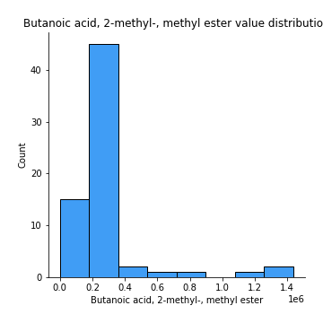
## Feature : Isobutyl acetate
- **Feature type** : continous
- **Missing** : 0.0%
- **Unique** : 14
- **Count** :67.0
- **Mean** :43306.29076838033
- **Std** :67383.86317301316
- **Min** :0.0
- **25%th Percentile** : 0.0
- **50%th Percentile** : 46016.2037037037
- **75%th Percentile** : 46016.2037037037
- **Max** :381024.0

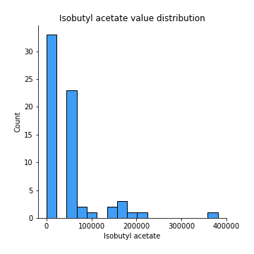
## Feature : Methyl isovalerate
- **Feature type** : continous
- **Missing** : 0.0%
- **Unique** : 14
- **Count** :67.0
- **Mean** :98082.2296412674
- **Std** :139851.81026293818
- **Min** :0.0
- **25%th Percentile** : 0.0
- **50%th Percentile** : 97276.9298245614
- **75%th Percentile** : 97276.9298245614
- **Max** :608115.0

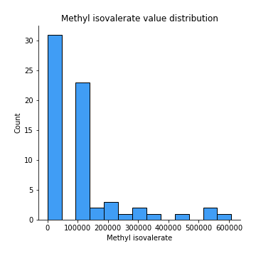
## Feature : 1-Propanol
- **Feature type** : continous
- **Missing** : 0.0%
- **Unique** : 11
- **Count** :67.0
- **Mean** :329023.1310116088
- **Std** :361316.6399119936
- **Min** :0.0
- **25%th Percentile** : 241172.5
- **50%th Percentile** : 317293.22222222225
- **75%th Percentile** : 317293.22222222225
- **Max** :1821750.0

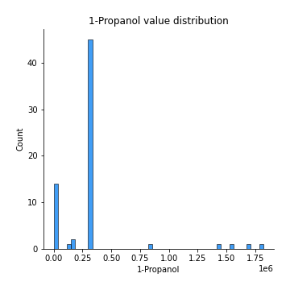
## Feature : Methyl thiolacetate
- **Feature type** : continous
- **Missing** : 0.0%
- **Unique** : 51
- **Count** :67.0
- **Mean** :114421.74626865672
- **Std** :99817.18475055062
- **Min** :0.0
- **25%th Percentile** : 25549.0
- **50%th Percentile** : 90122.0
- **75%th Percentile** : 177237.5
- **Max** :352289.0

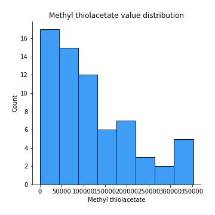
## Feature : Butanoic acid, 2-methyl-, ethyl ester
- **Feature type** : continous
- **Missing** : 0.0%
- **Unique** : 19
- **Count** :67.0
- **Mean** :751711.8582089547
- **Std** :407011.15547066025
- **Min** :0.0
- **25%th Percentile** : 713709.4333333333
- **50%th Percentile** : 713709.4333333333
- **75%th Percentile** : 713709.4333333333
- **Max** :2198502.0

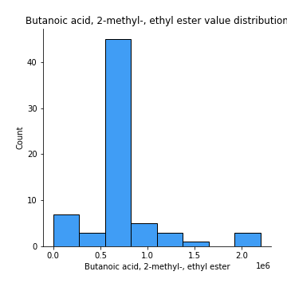
## Feature : 2-Hexanone
- **Feature type** : continous
- **Missing** : 0.0%
- **Unique** : 18
- **Count** :67.0
- **Mean** :40368.500130924316
- **Std** :48224.44255431598
- **Min** :0.0
- **25%th Percentile** : 0.0
- **50%th Percentile** : 39797.61403508772
- **75%th Percentile** : 39797.61403508772
- **Max** :183084.0

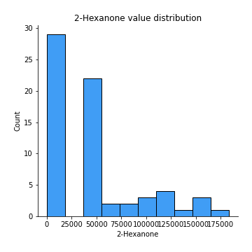
## Feature : Ethyl isocyanide
- **Feature type** : continous
- **Missing** : 0.0%
- **Unique** : 8
- **Count** :67.0
- **Mean** :19595.492537313432
- **Std** :19570.348088737144
- **Min** :0.0
- **25%th Percentile** : 9992.0
- **50%th Percentile** : 19984.0
- **75%th Percentile** : 19984.0
- **Max** :105656.0

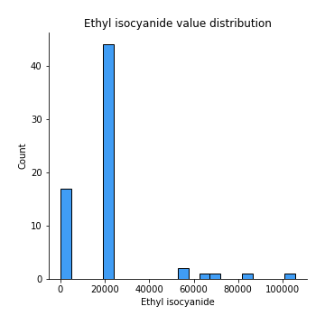
## Feature : 1-Propanol, 2-methyl-
- **Feature type** : continous
- **Missing** : 0.0%
- **Unique** : 56
- **Count** :67.0
- **Mean** :216011.94029850746
- **Std** :174053.87558592664
- **Min** :0.0
- **25%th Percentile** : 62121.0
- **50%th Percentile** : 189839.0
- **75%th Percentile** : 333946.0
- **Max** :613288.0

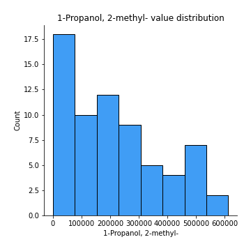
## Feature : 2-Pentanol, 2-methyl-
- **Feature type** : continous
- **Missing** : 0.0%
- **Unique** : 27
- **Count** :67.0
- **Mean** :37780.338248516455
- **Std** :58890.18905793192
- **Min** :0.0
- **25%th Percentile** : 0.0
- **50%th Percentile** : 0.0
- **75%th Percentile** : 70087.0
- **Max** :302615.0

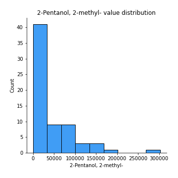
## Feature : 2-Pentanol
- **Feature type** : continous
- **Missing** : 0.0%
- **Unique** : 23
- **Count** :67.0
- **Mean** :277063.11835559044
- **Std** :399907.30035605293
- **Min** :0.0
- **25%th Percentile** : 0.0
- **50%th Percentile** : 265630.649122807
- **75%th Percentile** : 265630.649122807
- **Max** :2282603.0

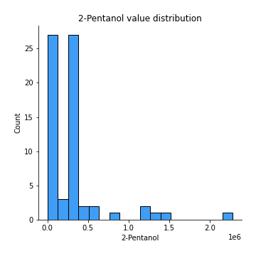
## Feature : 1-Butanol, 3-methyl-, acetate
- **Feature type** : continous
- **Missing** : 0.0%
- **Unique** : 7
- **Count** :67.0
- **Mean** :21409.925373134316
- **Std** :29204.903730892693
- **Min** :0.0
- **25%th Percentile** : 9563.1
- **50%th Percentile** : 19126.2
- **75%th Percentile** : 19126.2
- **Max** :156927.0

## Feature : 1 - Undecene
- **Feature type** : continous
- **Missing** : 0.0%
- **Unique** : 23
- **Count** :67.0
- **Mean** :5623803.636815919
- **Std** :2143097.073607715
- **Min** :0.0
- **25%th Percentile** : 5627687.703703703
- **50%th Percentile** : 5627687.703703703
- **75%th Percentile** : 5627687.703703703
- **Max** :12179961.0

## Feature : 1-Butanol
- **Feature type** : continous
- **Missing** : 0.0%
- **Unique** : 39
- **Count** :67.0
- **Mean** :1463296.6368159207
- **Std** :1085741.5760168273
- **Min** :0.0
- **25%th Percentile** : 536536.0
- **50%th Percentile** : 1456599.6666666667
- **75%th Percentile** : 1713023.0
- **Max** :3989960.0

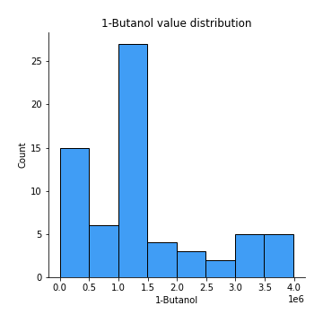
## Feature : 2-Heptanone
- **Feature type** : continous
- **Missing** : 0.0%
- **Unique** : 35
- **Count** :67.0
- **Mean** :117985.0895522388
- **Std** :177651.95522252432
- **Min** :0.0
- **25%th Percentile** : 0.0
- **50%th Percentile** : 56603.0
- **75%th Percentile** : 184415.5
- **Max** :1022779.0

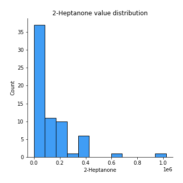
## Feature : Dodecane
- **Feature type** : continous
- **Missing** : 0.0%
- **Unique** : 6
- **Count** :67.0
- **Mean** :14685.885572139307
- **Std** :40054.77991663676
- **Min** :0.0
- **25%th Percentile** : 0.0
- **50%th Percentile** : 0.0
- **75%th Percentile** : 16751.333333333332
- **Max** :265644.0

## Feature : 1-Butanol, 3-methyl-
- **Feature type** : continous
- **Missing** : 0.0%
- **Unique** : 67
- **Count** :67.0
- **Mean** :6851140.014925373
- **Std** :6803186.740384474
- **Min** :908313.0
- **25%th Percentile** : 2374455.5
- **50%th Percentile** : 5020894.0
- **75%th Percentile** : 8334995.0
- **Max** :37125000.0

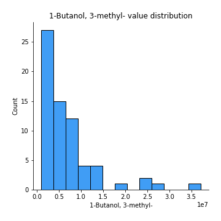
## Feature :  S-Methyl 3-methylbutanethioate
- **Feature type** : continous
- **Missing** : 0.0%
- **Unique** : 23
- **Count** :67.0
- **Mean** :337029.35820895503
- **Std** :150129.31500408903
- **Min** :0.0
- **25%th Percentile** : 334880.3333333333
- **50%th Percentile** : 334880.3333333333
- **75%th Percentile** : 334880.3333333333
- **Max** :1013976.0

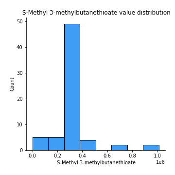
## Feature : 2-Heptanone, 4,6-dimethyl-
- **Feature type** : continous
- **Missing** : 0.0%
- **Unique** : 21
- **Count** :67.0
- **Mean** :54474.48037589832
- **Std** :59222.09144544831
- **Min** :0.0
- **25%th Percentile** : 0.0
- **50%th Percentile** : 59419.96296296296
- **75%th Percentile** : 68224.5
- **Max** :277538.0

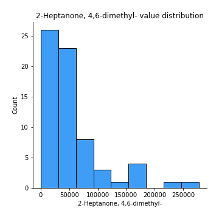
## Feature :  3-Buten-1-ol, 3-methyl-
- **Feature type** : continous
- **Missing** : 0.0%
- **Unique** : 51
- **Count** :67.0
- **Mean** :148925.6567164179
- **Std** :162740.5826901199
- **Min** :0.0
- **25%th Percentile** : 27922.5
- **50%th Percentile** : 97760.0
- **75%th Percentile** : 160066.5
- **Max** :704490.0

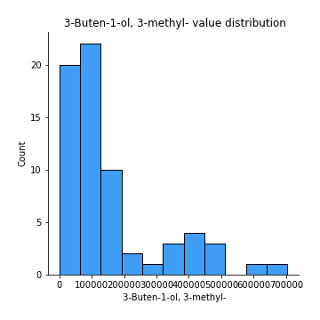
## Feature : Thiocyanic acid, methyl ester
- **Feature type** : continous
- **Missing** : 0.0%
- **Unique** : 7
- **Count** :67.0
- **Mean** :55468.850746268596
- **Std** :57397.380428126264
- **Min** :0.0
- **25%th Percentile** : 29019.11111111111
- **50%th Percentile** : 58038.22222222222
- **75%th Percentile** : 58038.22222222222
- **Max** :301551.0

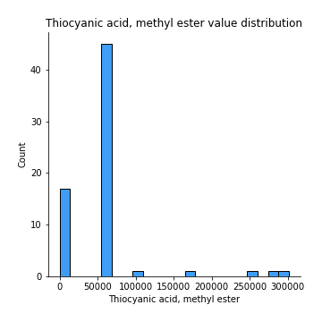
## Feature : Acetoin
- **Feature type** : continous
- **Missing** : 0.0%
- **Unique** : 26
- **Count** :67.0
- **Mean** :167222.49253731343
- **Std** :356265.8753991892
- **Min** :0.0
- **25%th Percentile** : 0.0
- **50%th Percentile** : 0.0
- **75%th Percentile** : 161919.0
- **Max** :2056879.0

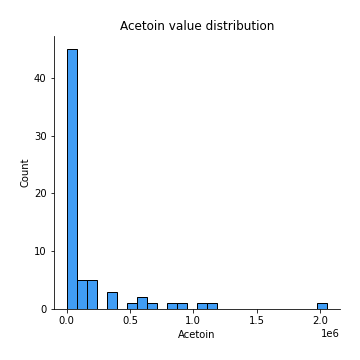
## Feature : 1-Pentanol, 2-methyl-
- **Feature type** : continous
- **Missing** : 0.0%
- **Unique** : 14
- **Count** :67.0
- **Mean** :47661.14483139858
- **Std** :29243.639985990132
- **Min** :0.0
- **25%th Percentile** : 48789.62962962963
- **50%th Percentile** : 48789.62962962963
- **75%th Percentile** : 48789.62962962963
- **Max** :163793.0

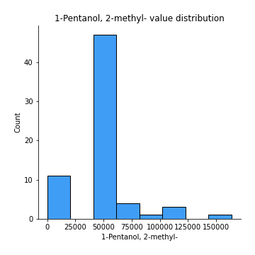
## Feature : Butanoic acid, 3-methyl-, 2-methylbutyl ester
- **Feature type** : continous
- **Missing** : 0.0%
- **Unique** : 13
- **Count** :67.0
- **Mean** :103972.65671641797
- **Std** :83698.37761530526
- **Min** :0.0
- **25%th Percentile** : 103049.88888888888
- **50%th Percentile** : 103049.88888888888
- **75%th Percentile** : 103049.88888888888
- **Max** :590669.0

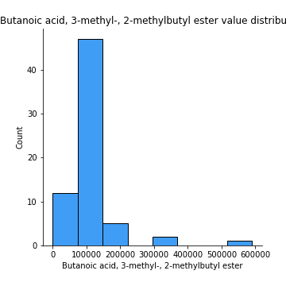
## Feature : 2-Heptanol, 4-methyl-
- **Feature type** : continous
- **Missing** : 0.0%
- **Unique** : 8
- **Count** :67.0
- **Mean** :47006.019900497544
- **Std** :50626.104209342826
- **Min** :0.0
- **25%th Percentile** : 45394.51851851852
- **50%th Percentile** : 45394.51851851852
- **75%th Percentile** : 45394.51851851852
- **Max** :254736.0

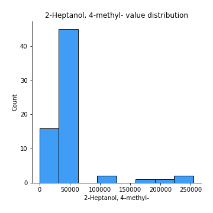
## Feature : 2-Nonanone 
- **Feature type** : continous
- **Missing** : 0.0%
- **Unique** : 46
- **Count** :67.0
- **Mean** :611284.3383084576
- **Std** :535552.2701414832
- **Min** :75932.0
- **25%th Percentile** : 297162.0
- **50%th Percentile** : 618535.1666666666
- **75%th Percentile** : 618535.1666666666
- **Max** :2654044.0

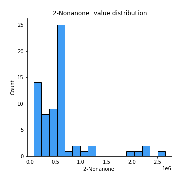
## Feature : Acetic acid
- **Feature type** : continous
- **Missing** : 0.0%
- **Unique** : 46
- **Count** :67.0
- **Mean** :3468416.63498298
- **Std** :3822078.6539016212
- **Min** :125680.0
- **25%th Percentile** : 1309197.5
- **50%th Percentile** : 3241608.0701754387
- **75%th Percentile** : 3241608.0701754387
- **Max** :21176351.0

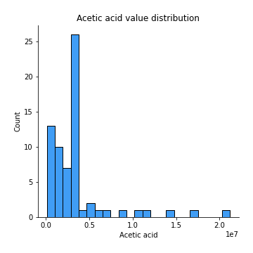
## Feature : 2-Nonanol
- **Feature type** : continous
- **Missing** : 0.0%
- **Unique** : 21
- **Count** :67.0
- **Mean** :640516.8557213933
- **Std** :430265.0251975525
- **Min** :0.0
- **25%th Percentile** : 628854.074074074
- **50%th Percentile** : 628854.074074074
- **75%th Percentile** : 628854.074074074
- **Max** :2526340.0

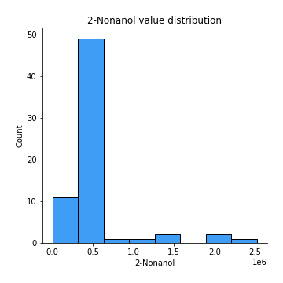
## Feature : Pyrrole
- **Feature type** : continous
- **Missing** : 0.0%
- **Unique** : 23
- **Count** :67.0
- **Mean** :375898.46766169165
- **Std** :121496.58240644996
- **Min** :83078.0
- **25%th Percentile** : 371058.6296296296
- **50%th Percentile** : 371058.6296296296
- **75%th Percentile** : 371058.6296296296
- **Max** :862790.0

## Feature : 1H-Pyrrole, 2-methyl-
- **Feature type** : continous
- **Missing** : 0.0%
- **Unique** : 17
- **Count** :67.0
- **Mean** :334982.16915422917
- **Std** :142666.77202609248
- **Min** :0.0
- **25%th Percentile** : 333395.7407407408
- **50%th Percentile** : 333395.7407407408
- **75%th Percentile** : 333395.7407407408
- **Max** :709941.0

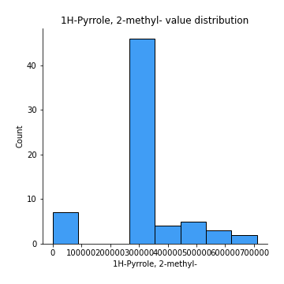
## Feature : 1-Heptanol, 2,4-dimethyl-,
- **Feature type** : continous
- **Missing** : 0.0%
- **Unique** : 22
- **Count** :67.0
- **Mean** :49241.85019347702
- **Std** :54814.8099458746
- **Min** :0.0
- **25%th Percentile** : 0.0
- **50%th Percentile** : 49898.40740740741
- **75%th Percentile** : 56241.0
- **Max** :274686.0

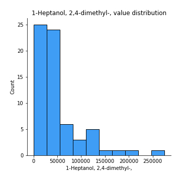
## Feature : Propanoic acid
- **Feature type** : continous
- **Missing** : 0.0%
- **Unique** : 23
- **Count** :67.0
- **Mean** :64996.830490405104
- **Std** :78370.36670786346
- **Min** :0.0
- **25%th Percentile** : 0.0
- **50%th Percentile** : 57874.07142857143
- **75%th Percentile** : 58964.5
- **Max** :364754.0

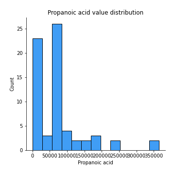
## Feature : Propanoic acid, 2-methyl-
- **Feature type** : continous
- **Missing** : 0.0%
- **Unique** : 4
- **Count** :67.0
- **Mean** :18271.992537313436
- **Std** :30646.540259389745
- **Min** :0.0
- **25%th Percentile** : 0.0
- **50%th Percentile** : 20034.1
- **75%th Percentile** : 20034.1
- **Max** :245699.0

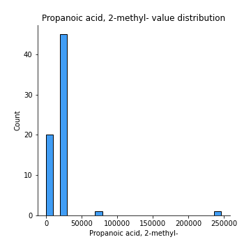
## Feature : 1-Octanol
- **Feature type** : continous
- **Missing** : 0.0%
- **Unique** : 22
- **Count** :67.0
- **Mean** :661633.1973465997
- **Std** :345893.8863854687
- **Min** :0.0
- **25%th Percentile** : 664654.7777777778
- **50%th Percentile** : 664654.7777777778
- **75%th Percentile** : 664654.7777777778
- **Max** :1910713.0

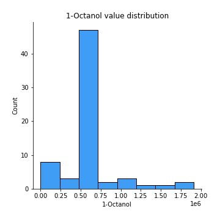
## Feature : 2-Undecanone
- **Feature type** : continous
- **Missing** : 0.0%
- **Unique** : 45
- **Count** :67.0
- **Mean** :553404.1188501935
- **Std** :339259.5463092617
- **Min** :0.0
- **25%th Percentile** : 295805.5
- **50%th Percentile** : 590926.9074074074
- **75%th Percentile** : 590926.9074074074
- **Max** :1644906.0

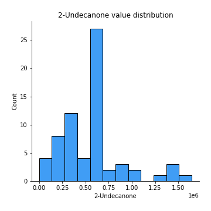
## Feature : Benzoic acid, methyl ester
- **Feature type** : continous
- **Missing** : 0.0%
- **Unique** : 26
- **Count** :67.0
- **Mean** :134329.05638474287
- **Std** :130402.65627690537
- **Min** :0.0
- **25%th Percentile** : 0.0
- **50%th Percentile** : 134161.44444444444
- **75%th Percentile** : 135340.22222222222
- **Max** :556478.0

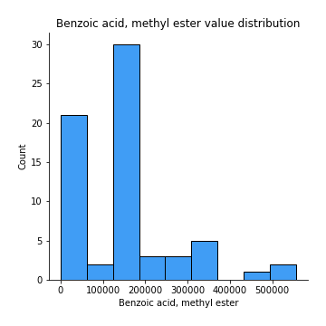
## Feature : Butyrolactone 
- **Feature type** : continous
- **Missing** : 0.0%
- **Unique** : 6
- **Count** :67.0
- **Mean** :39021.08208955227
- **Std** :36886.42139053309
- **Min** :0.0
- **25%th Percentile** : 0.0
- **50%th Percentile** : 43750.23333333333
- **75%th Percentile** : 43750.23333333333
- **Max** :191311.0

## Feature :  Decanoic acid, ethyl ester
- **Feature type** : continous
- **Missing** : 0.0%
- **Unique** : 8
- **Count** :67.0
- **Mean** :39765.76948590384
- **Std** :51298.84567490522
- **Min** :0.0
- **25%th Percentile** : 18762.722222222223
- **50%th Percentile** : 37525.444444444445
- **75%th Percentile** : 37525.444444444445
- **Max** :344949.0

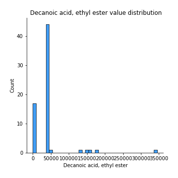
## Feature : Acetic acid, decyl ester
- **Feature type** : continous
- **Missing** : 0.0%
- **Unique** : 8
- **Count** :67.0
- **Mean** :38940.983416252035
- **Std** :44391.417565553515
- **Min** :0.0
- **25%th Percentile** : 18739.055555555555
- **50%th Percentile** : 37478.11111111111
- **75%th Percentile** : 37478.11111111111
- **Max** :261433.0

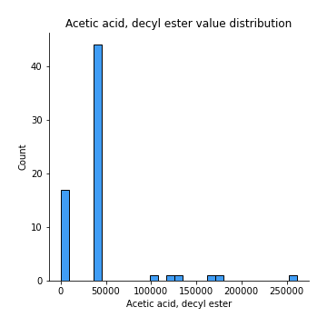
## Feature : 2-Undecanol
- **Feature type** : continous
- **Missing** : 0.0%
- **Unique** : 26
- **Count** :67.0
- **Mean** :320298.9043670536
- **Std** :505692.3519093741
- **Min** :0.0
- **25%th Percentile** : 0.0
- **50%th Percentile** : 336517.0
- **75%th Percentile** : 338121.48148148146
- **Max** :3287479.0

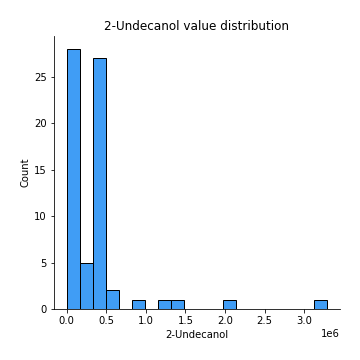
## Feature : Butanoic acid, 3-methyl-
- **Feature type** : continous
- **Missing** : 0.0%
- **Unique** : 23
- **Count** :67.0
- **Mean** :2459626.141791044
- **Std** :734309.4556931424
- **Min** :1194878.0
- **25%th Percentile** : 2403459.033333333
- **50%th Percentile** : 2403459.033333333
- **75%th Percentile** : 2403459.033333333
- **Max** :5887513.0

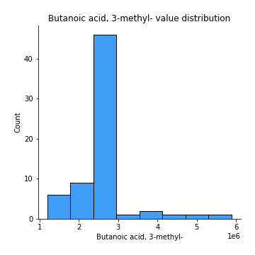
## Feature : 2-Dodecanone
- **Feature type** : continous
- **Missing** : 0.0%
- **Unique** : 10
- **Count** :67.0
- **Mean** :31452.25649530129
- **Std** :28024.710933094364
- **Min** :0.0
- **25%th Percentile** : 30908.48148148148
- **50%th Percentile** : 30908.48148148148
- **75%th Percentile** : 30908.48148148148
- **Max** :159402.0

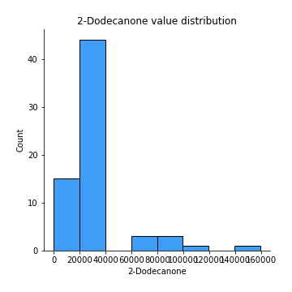
## Feature : 1-Decanol
- **Feature type** : continous
- **Missing** : 0.0%
- **Unique** : 23
- **Count** :67.0
- **Mean** :1554745.642343837
- **Std** :1183465.7577289457
- **Min** :0.0
- **25%th Percentile** : 1524509.2962962964
- **50%th Percentile** : 1524509.2962962964
- **75%th Percentile** : 1524509.2962962964
- **Max** :7740141.0

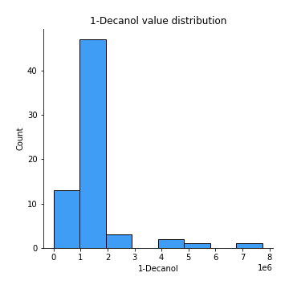
## Feature : 2-Tridecanone
- **Feature type** : continous
- **Missing** : 0.0%
- **Unique** : 24
- **Count** :67.0
- **Mean** :324551.1249309009
- **Std** :138593.91544434353
- **Min** :67510.0
- **25%th Percentile** : 314530.962962963
- **50%th Percentile** : 314530.962962963
- **75%th Percentile** : 314530.962962963
- **Max** :975303.0

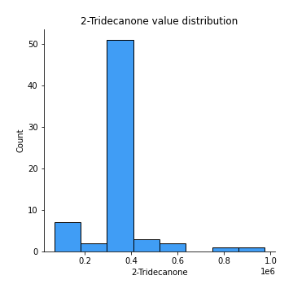
## Feature :  Dodecanoic acid, ethyl ester
- **Feature type** : continous
- **Missing** : 0.0%
- **Unique** : 7
- **Count** :67.0
- **Mean** :22689.111663902713
- **Std** :29726.629265811887
- **Min** :0.0
- **25%th Percentile** : 0.0
- **50%th Percentile** : 21410.85185185185
- **75%th Percentile** : 21410.85185185185
- **Max** :171353.0

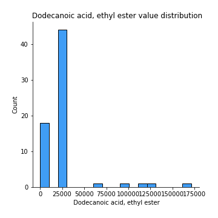
## Feature : 1,4-Butanediol
- **Feature type** : continous
- **Missing** : 0.0%
- **Unique** : 6
- **Count** :67.0
- **Mean** :18884.253731343266
- **Std** :17266.14333307473
- **Min** :0.0
- **25%th Percentile** : 0.0
- **50%th Percentile** : 21398.13333333333
- **75%th Percentile** : 21398.13333333333
- **Max** :84674.0

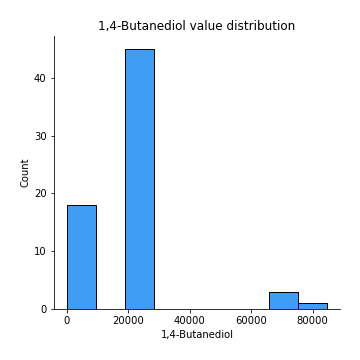
## Feature : Phenylethyl Alcohol
- **Feature type** : continous
- **Missing** : 0.0%
- **Unique** : 21
- **Count** :67.0
- **Mean** :148154.74184632386
- **Std** :53785.576743474376
- **Min** :0.0
- **25%th Percentile** : 147761.62962962964
- **50%th Percentile** : 147761.62962962964
- **75%th Percentile** : 147761.62962962964
- **Max** :386583.0

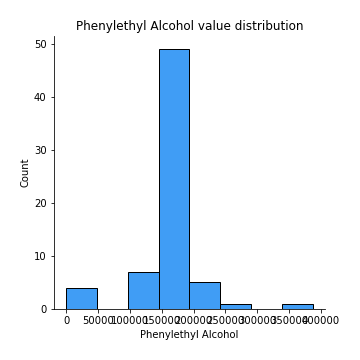
## Feature : Acetophenone, 2'-amino-
- **Feature type** : continous
- **Missing** : 0.0%
- **Unique** : 19
- **Count** :67.0
- **Mean** :334421.9900497511
- **Std** :253095.913375502
- **Min** :0.0
- **25%th Percentile** : 343307.962962963
- **50%th Percentile** : 343307.962962963
- **75%th Percentile** : 343307.962962963
- **Max** :1937240.0

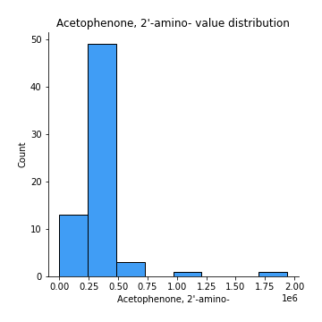
## Feature : 2-Tridecanol
- **Feature type** : continous
- **Missing** : 0.0%
- **Unique** : 13
- **Count** :67.0
- **Mean** :57323.70536207852
- **Std** :43921.274376598674
- **Min** :0.0
- **25%th Percentile** : 56845.07407407407
- **50%th Percentile** : 56845.07407407407
- **75%th Percentile** : 56845.07407407407
- **Max** :231601.0

## Feature : Tetradecanal
- **Feature type** : continous
- **Missing** : 0.0%
- **Unique** : 4
- **Count** :67.0
- **Mean** :8813.537313432837
- **Std** :18689.89411851938
- **Min** :0.0
- **25%th Percentile** : 0.0
- **50%th Percentile** : 8317.0
- **75%th Percentile** : 8317.0
- **Max** :113303.0

## Feature : 1-Dodecanol
- **Feature type** : continous
- **Missing** : 0.0%
- **Unique** : 24
- **Count** :67.0
- **Mean** :2152926.948590383
- **Std** :1265634.9874357495
- **Min** :242246.0
- **25%th Percentile** : 2087262.2222222222
- **50%th Percentile** : 2098782.4444444445
- **75%th Percentile** : 2098782.4444444445
- **Max** :8172616.0

## Feature : Methyl tetradecanoate
- **Feature type** : continous
- **Missing** : 0.0%
- **Unique** : 11
- **Count** :67.0
- **Mean** :102622.15920398005
- **Std** :110087.50473585786
- **Min** :0.0
- **25%th Percentile** : 97878.33333333331
- **50%th Percentile** : 97878.33333333331
- **75%th Percentile** : 97878.33333333331
- **Max** :698476.0

## Feature :  2-Pentadecanone
- **Feature type** : continous
- **Missing** : 0.0%
- **Unique** : 18
- **Count** :67.0
- **Mean** :89976.66113875067
- **Std** :56192.087881284904
- **Min** :0.0
- **25%th Percentile** : 85753.37037037036
- **50%th Percentile** : 85753.37037037036
- **75%th Percentile** : 85753.37037037036
- **Max** :382222.0

## Feature : Tetradecanoic acid, ethyl ester
- **Feature type** : continous
- **Missing** : 0.0%
- **Unique** : 5
- **Count** :67.0
- **Mean** :10774.770038695422
- **Std** :18803.267394181137
- **Min** :0.0
- **25%th Percentile** : 0.0
- **50%th Percentile** : 10167.74074074074
- **75%th Percentile** : 10167.74074074074
- **Max** :119785.0

## Feature : Hexadecanal
- **Feature type** : continous
- **Missing** : 0.0%
- **Unique** : 15
- **Count** :67.0
- **Mean** :99780.82531785515
- **Std** :98544.71775755253
- **Min** :0.0
- **25%th Percentile** : 93011.68518518518
- **50%th Percentile** : 94159.37037037036
- **75%th Percentile** : 94159.37037037036
- **Max** :652645.0

## Feature : n-Tridecan-1-ol
- **Feature type** : continous
- **Missing** : 0.0%
- **Unique** : 11
- **Count** :67.0
- **Mean** :87575.08512990605
- **Std** :78615.18884361975
- **Min** :0.0
- **25%th Percentile** : 85581.62962962964
- **50%th Percentile** : 85581.62962962964
- **75%th Percentile** : 85581.62962962964
- **Max** :448151.0

## Feature : 1-Tetradecanol
- **Feature type** : continous
- **Missing** : 0.0%
- **Unique** : 24
- **Count** :67.0
- **Mean** :599562.9110005527
- **Std** :324294.00034533686
- **Min** :78672.0
- **25%th Percentile** : 586042.2962962963
- **50%th Percentile** : 586042.2962962963
- **75%th Percentile** : 586042.2962962963
- **Max** :2450605.0

## Feature : n-Pentadecanol
- **Feature type** : continous
- **Missing** : 0.0%
- **Unique** : 9
- **Count** :67.0
- **Mean** :183368.21928817456
- **Std** :273072.5068496589
- **Min** :0.0
- **25%th Percentile** : 155812.3076923077
- **50%th Percentile** : 173037.61538461538
- **75%th Percentile** : 173037.61538461538
- **Max** :1869692.0

## Feature :  1-Hexadecanol
- **Feature type** : continous
- **Missing** : 0.0%
- **Unique** : 22
- **Count** :67.0
- **Mean** :685811.0784964071
- **Std** :573297.6918344221
- **Min** :0.0
- **25%th Percentile** : 662122.074074074
- **50%th Percentile** : 662122.074074074
- **75%th Percentile** : 662122.074074074
- **Max** :4268126.0

## Feature : Indole
- **Feature type** : continous
- **Missing** : 0.0%
- **Unique** : 24
- **Count** :67.0
- **Mean** :83978861.14925373
- **Std** :10118534.784720156
- **Min** :43562718.0
- **25%th Percentile** : 82469063.0
- **50%th Percentile** : 82469063.0
- **75%th Percentile** : 82469063.0
- **Max** :112700686.0

[<< Go back](../README.md)
