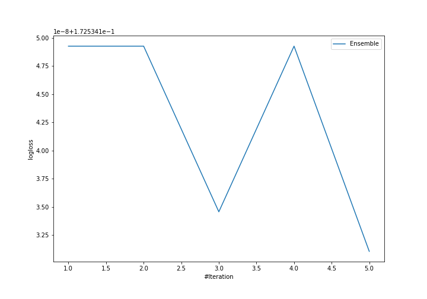
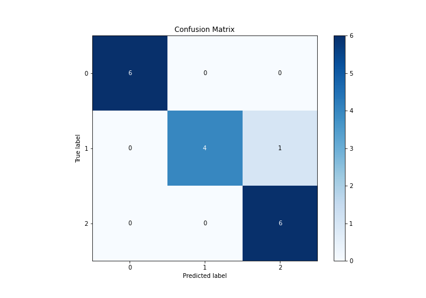
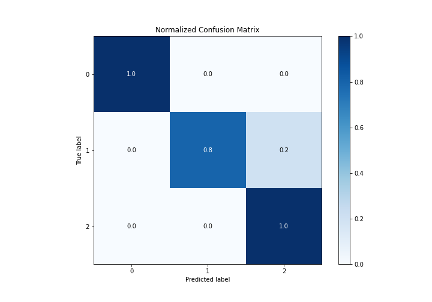
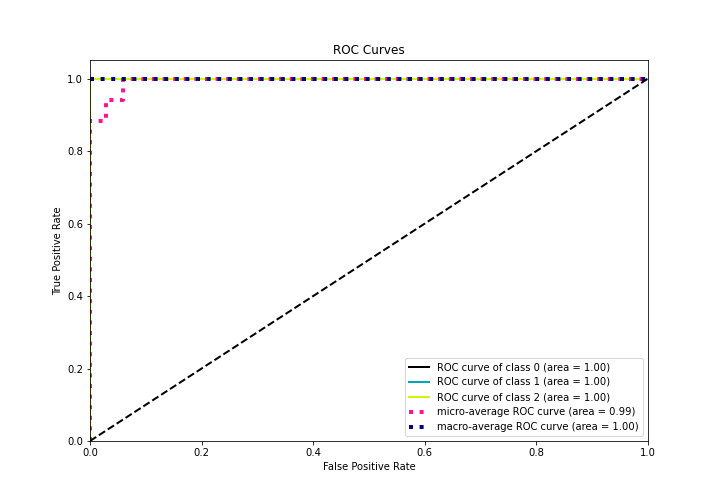
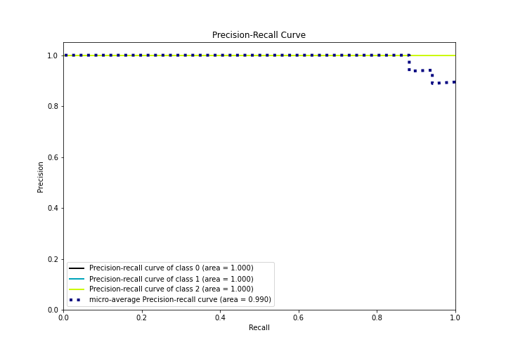

# Summary of Ensemble

[<< Go back](../README.md)

## Ensemble structure
| Model             |   Weight |
|:------------------|---------:|
| 3_Default_Xgboost |        5 |

### Metric details
|           |   0 |        1 |        2 |   accuracy |   macro avg |   weighted avg |   logloss |
|:----------|----:|---------:|---------:|-----------:|------------:|---------------:|----------:|
| precision |   1 | 1        | 0.857143 |   0.941176 |    0.952381 |       0.94958  |  0.172534 |
| recall    |   1 | 0.8      | 1        |   0.941176 |    0.933333 |       0.941176 |  0.172534 |
| f1-score  |   1 | 0.888889 | 0.923077 |   0.941176 |    0.937322 |       0.940171 |  0.172534 |
| support   |   6 | 5        | 6        |   0.941176 |   17        |      17        |  0.172534 |

## Confusion matrix
|              |   Predicted as 0 |   Predicted as 1 |   Predicted as 2 |
|:-------------|-----------------:|-----------------:|-----------------:|
| Labeled as 0 |                6 |                0 |                0 |
| Labeled as 1 |                0 |                4 |                1 |
| Labeled as 2 |                0 |                0 |                6 |

## Learning curves

## Confusion Matrix

## Normalized Confusion Matrix

## ROC Curve

## Precision Recall Curve

[<< Go back](../README.md)
