# Summary of 2_Linear

[<< Go back](../README.md)

## Logistic Regression (Linear)
- **n_jobs**: -1
- **num_class**: 3
- **explain_level**: 2

## Validation
 - **validation_type**: split
 - **train_ratio**: 0.75
 - **shuffle**: True
 - **stratify**: True

## Optimized metric
logloss

## Training time

11.2 seconds

### Metric details
|           |   0 |    1 |        2 |   accuracy |   macro avg |   weighted avg |   logloss |
|:----------|----:|-----:|---------:|-----------:|------------:|---------------:|----------:|
| precision |   1 | 1    | 0.75     |      0.875 |    0.916667 |       0.90625  |    0.4325 |
| recall    |   1 | 0.6  | 1        |      0.875 |    0.866667 |       0.875    |    0.4325 |
| f1-score  |   1 | 0.75 | 0.857143 |      0.875 |    0.869048 |       0.868304 |    0.4325 |
| support   |   5 | 5    | 6        |      0.875 |   16        |      16        |    0.4325 |

## Confusion matrix
|              |   Predicted as 0 |   Predicted as 1 |   Predicted as 2 |
|:-------------|-----------------:|-----------------:|-----------------:|
| Labeled as 0 |                5 |                0 |                0 |
| Labeled as 1 |                0 |                3 |                2 |
| Labeled as 2 |                0 |                0 |                6 |

## Learning curves
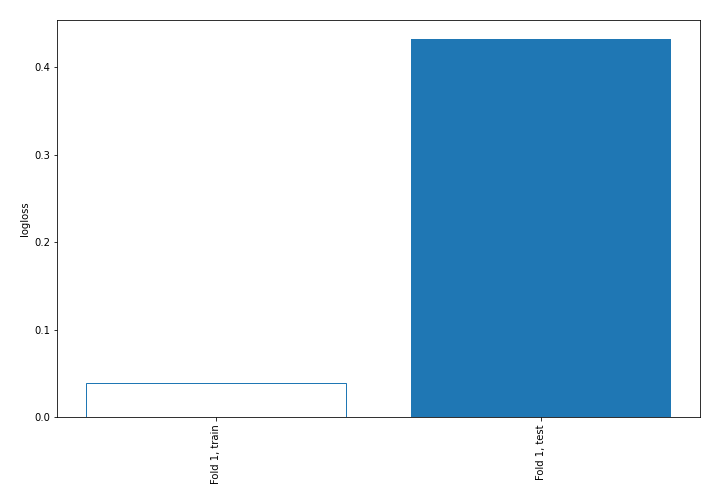

## Coefficients

### Coefficients learner #1
|                                               |            0 |           1 |           2 |
|:----------------------------------------------|-------------:|------------:|------------:|
| intercept                                     | -0.48649     | -0.0918842  |  0.578374   |
| Ethyl Acetate                                 | -0.246563    | -0.208801   |  0.455364   |
| Ethanol                                       | -0.132901    |  0.0606982  |  0.0722023  |
| Propanoic acid, ethyl ester                   | -0.0526087   |  0.123644   | -0.0710355  |
| 2-Pentanone                                   |  0.169567    | -0.115091   | -0.0544751  |
| Decane                                        |  0.0749065   | -0.35376    |  0.278854   |
| Methyl Isobutyl Ketone                        |  0.136646    | -0.355816   |  0.21917    |
| Amylene hydrate                               |  0.0121594   | -0.134942   |  0.122782   |
| Butanoic acid, 2-methyl-, methyl ester        |  0.227559    | -0.279049   |  0.0514906  |
| Isobutyl acetate                              |  0.047552    | -0.090618   |  0.0430659  |
| Methyl isovalerate                            |  0.0102082   |  0.376141   | -0.386349   |
| 1-Propanol                                    |  0.11996     | -0.0311505  | -0.0888092  |
| Methyl thiolacetate                           |  0.0668504   |  0.295855   | -0.362706   |
| Butanoic acid, 2-methyl-, ethyl ester         | -0.166898    |  0.270178   | -0.10328    |
| 2-Hexanone                                    |  0.135444    |  0.0488273  | -0.184271   |
| Ethyl isocyanide                              | -0.0714778   |  0.137125   | -0.0656474  |
| 1-Propanol, 2-methyl-                         |  0.0353193   |  0.097519   | -0.132838   |
| 2-Pentanol, 2-methyl-                         | -0.0201623   | -0.0668172  |  0.0869795  |
| 2-Pentanol                                    |  0.0240646   | -0.0549357  |  0.0308712  |
| 1-Butanol, 3-methyl-, acetate                 | -0.110586    |  0.190332   | -0.0797461  |
| 1 - Undecene                                  | -0.17144     |  0.0151388  |  0.156301   |
| 1-Butanol                                     | -0.0511232   |  0.250258   | -0.199134   |
| 2-Heptanone                                   |  0.185478    | -0.129135   | -0.0563433  |
| Dodecane                                      |  0.219849    | -0.155991   | -0.0638581  |
| 1-Butanol, 3-methyl-                          | -0.0740358   |  0.0547852  |  0.0192506  |
| S-Methyl 3-methylbutanethioate                | -0.0150958   | -0.0409784  |  0.0560742  |
| 2-Heptanone, 4,6-dimethyl-                    |  0.140095    | -0.157987   |  0.0178925  |
| 3-Buten-1-ol, 3-methyl-                       | -0.232442    |  0.181156   |  0.0512865  |
| Thiocyanic acid, methyl ester                 |  0.0959066   | -0.122784   |  0.0268778  |
| Acetoin                                       | -0.186845    |  0.611441   | -0.424596   |
| 1-Pentanol, 2-methyl-                         | -0.000727451 |  0.0651112  | -0.0643837  |
| Butanoic acid, 3-methyl-, 2-methylbutyl ester | -0.152367    |  0.0474575  |  0.10491    |
| 2-Heptanol, 4-methyl-                         | -0.208855    | -0.220951   |  0.429806   |
| 2-Nonanone                                    | -0.11862     |  0.222206   | -0.103585   |
| Acetic acid                                   | -0.119534    | -0.238665   |  0.358199   |
| 2-Nonanol                                     | -0.195136    |  0.046734   |  0.148401   |
| Pyrrole                                       | -0.165289    |  0.279409   | -0.11412    |
| 1H-Pyrrole, 2-methyl-                         | -0.378528    |  0.256104   |  0.122424   |
| 1-Heptanol, 2,4-dimethyl-,                    | -0.0254534   | -0.0216873  |  0.0471407  |
| Propanoic acid                                |  0.168609    | -0.105335   | -0.0632741  |
| Propanoic acid, 2-methyl-                     |  0.108188    | -0.082064   | -0.0261235  |
| 1-Octanol                                     | -0.179831    |  0.152087   |  0.0277437  |
| 2-Undecanone                                  | -0.0442736   |  0.105423   | -0.061149   |
| Benzoic acid, methyl ester                    | -0.139642    | -0.0374564  |  0.177098   |
| Butyrolactone                                 |  0.47008     | -0.116469   | -0.353611   |
| Decanoic acid, ethyl ester                    | -0.0777717   |  0.141193   | -0.0634214  |
| Acetic acid, decyl ester                      | -0.0885607   |  0.148974   | -0.0604133  |
| 2-Undecanol                                   | -0.0964204   |  0.00170582 |  0.0947146  |
| Butanoic acid, 3-methyl-                      | -0.0168675   | -0.241366   |  0.258234   |
| 2-Dodecanone                                  |  0.256034    | -0.0369043  | -0.219129   |
| 1-Decanol                                     | -0.134297    |  0.12593    |  0.00836731 |
| 2-Tridecanone                                 |  0.0756169   |  0.00498075 | -0.0805976  |
| Dodecanoic acid, ethyl ester                  | -0.0766254   |  0.147025   | -0.0703995  |
| 1,4-Butanediol                                |  0.478625    | -0.112464   | -0.366161   |
| Phenylethyl Alcohol                           | -0.234742    |  0.105181   |  0.12956    |
| Acetophenone, 2'-amino-                       | -0.129996    | -0.169707   |  0.299703   |
| 2-Tridecanol                                  | -0.0115353   |  0.0524313  | -0.040896   |
| Tetradecanal                                  | -0.030195    |  0.135166   | -0.104971   |
| 1-Dodecanol                                   | -0.121591    |  0.0716672  |  0.0499239  |
| Methyl tetradecanoate                         | -0.059594    |  0.0267173  |  0.0328768  |
| 2-Pentadecanone                               |  0.0652005   |  0.0326089  | -0.0978095  |
| Tetradecanoic acid, ethyl ester               | -0.0370734   |  0.177431   | -0.140358   |
| Hexadecanal                                   | -0.00195725  |  0.136407   | -0.13445    |
| n-Tridecan-1-ol                               |  0.262408    | -0.033097   | -0.229311   |
| 1-Tetradecanol                                | -0.0655895   |  0.115179   | -0.0495896  |
| n-Pentadecanol                                |  0.0904105   | -0.0247763  | -0.0656342  |
| 1-Hexadecanol                                 | -0.0597498   |  0.0959171  | -0.0361673  |
| Indole                                        | -0.142617    | -0.0569832  |  0.1996     |

## Permutation-based Importance
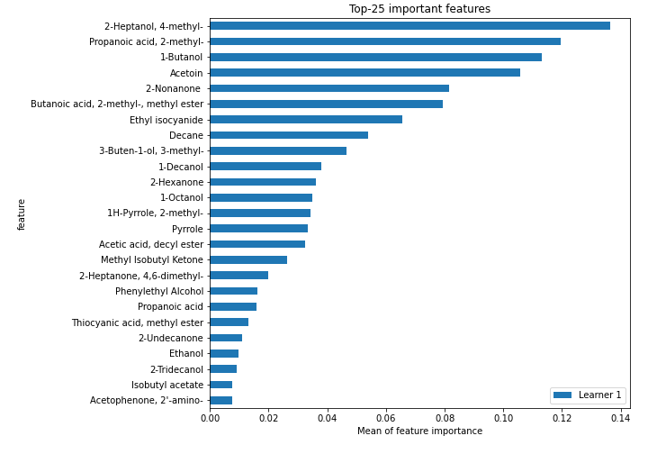
## Confusion Matrix

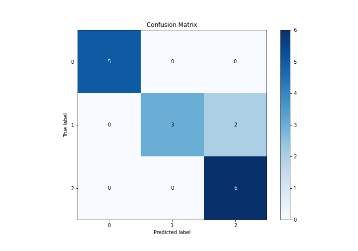

## Normalized Confusion Matrix

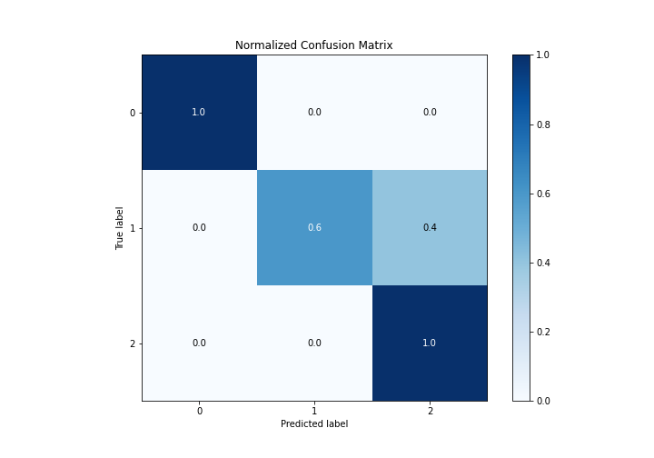

## ROC Curve

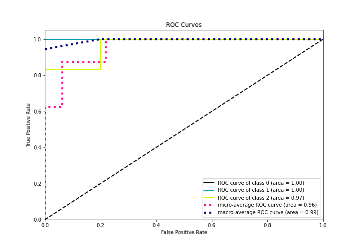

## Precision Recall Curve

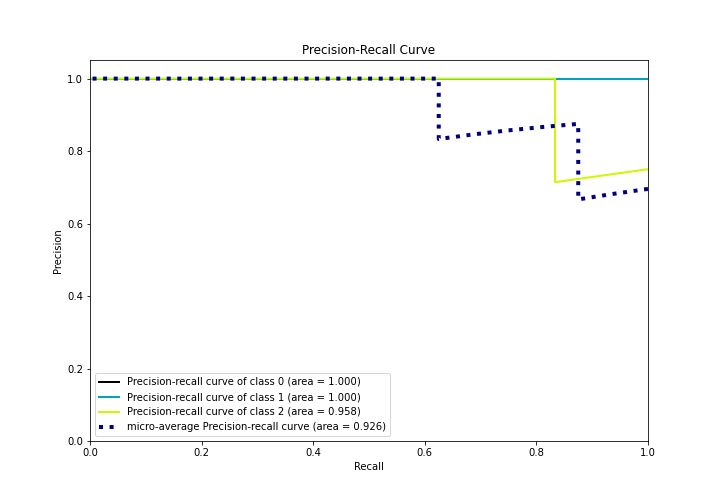

## SHAP Importance
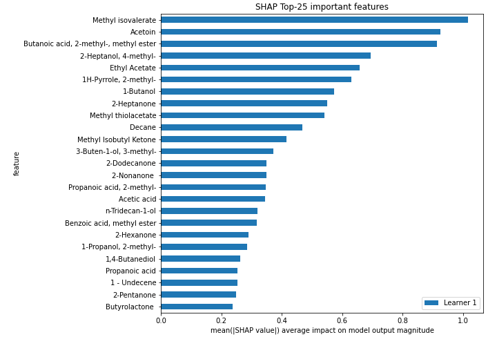

## SHAP Dependence plots

### Dependence 0 (Fold 1)
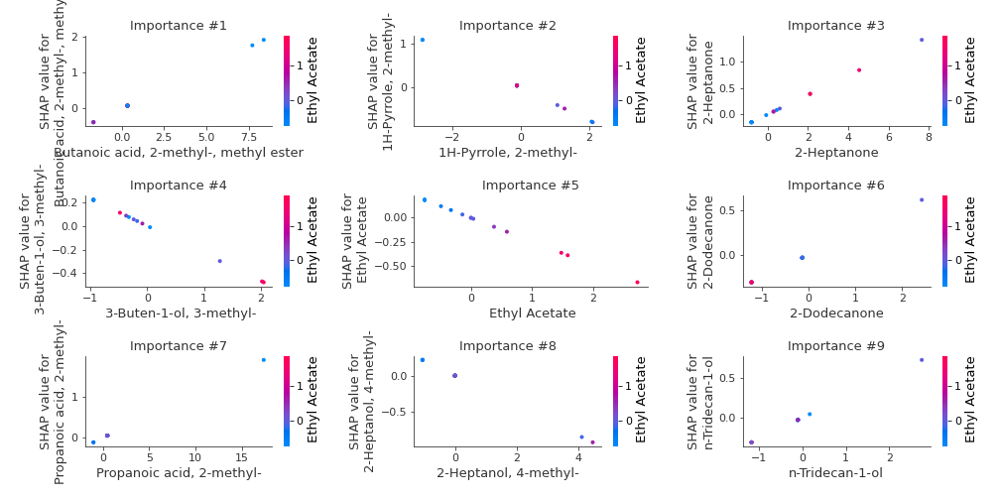
### Dependence 1 (Fold 1)
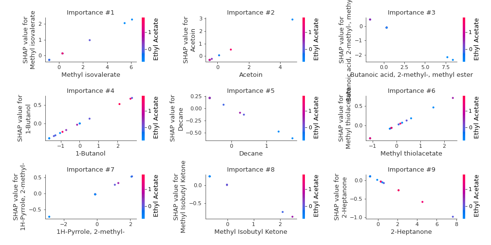
### Dependence 2 (Fold 1)
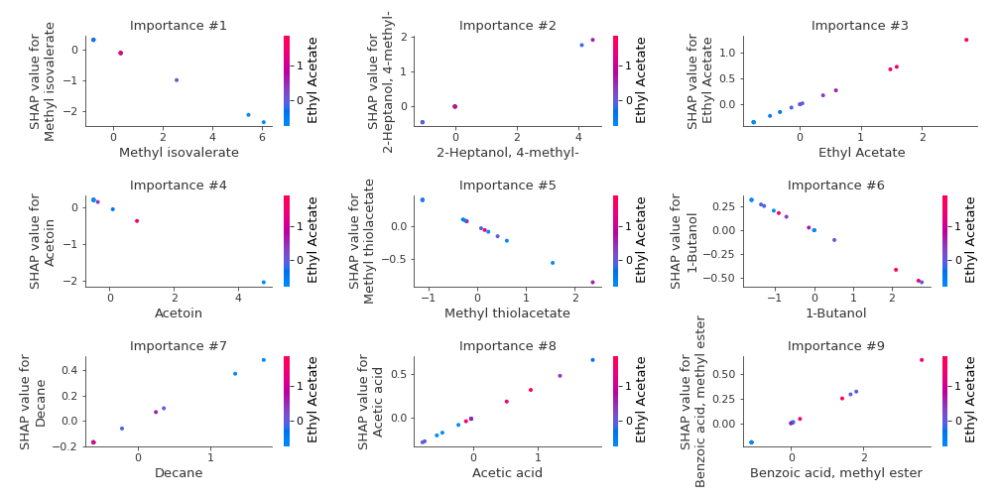

## SHAP Decision plots

### Worst decisions for selected sample 1 (Fold 1)
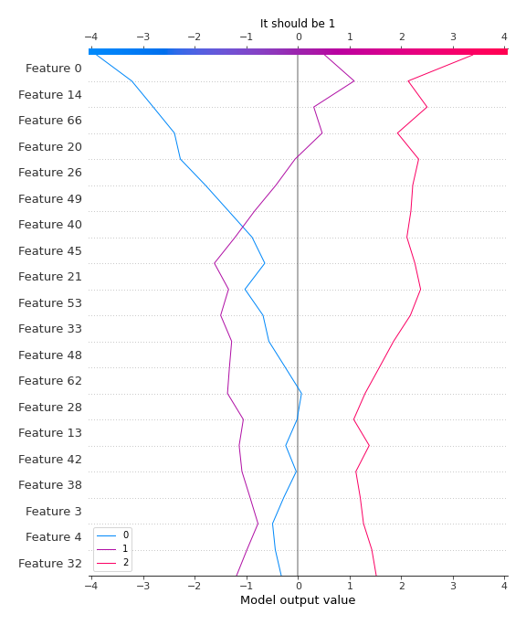
### Worst decisions for selected sample 2 (Fold 1)
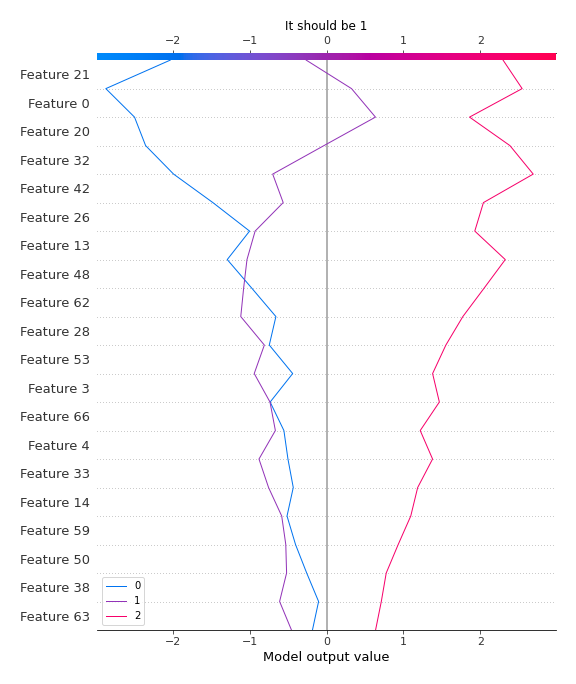
### Worst decisions for selected sample 3 (Fold 1)
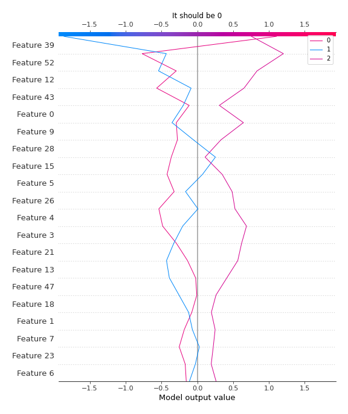
### Worst decisions for selected sample 4 (Fold 1)
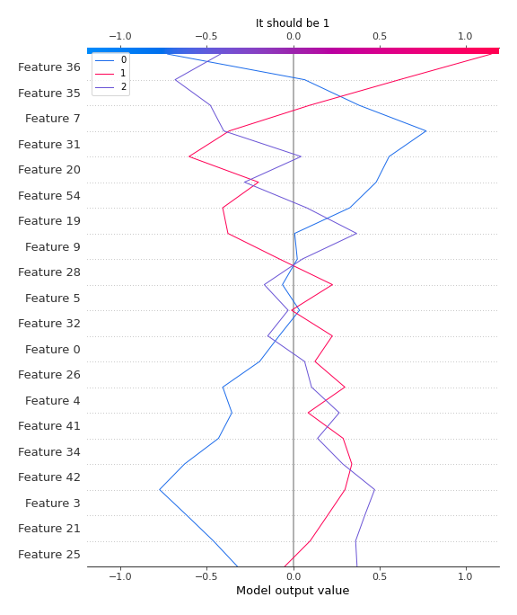
### Best decisions for selected sample 1 (Fold 1)

### Best decisions for selected sample 2 (Fold 1)
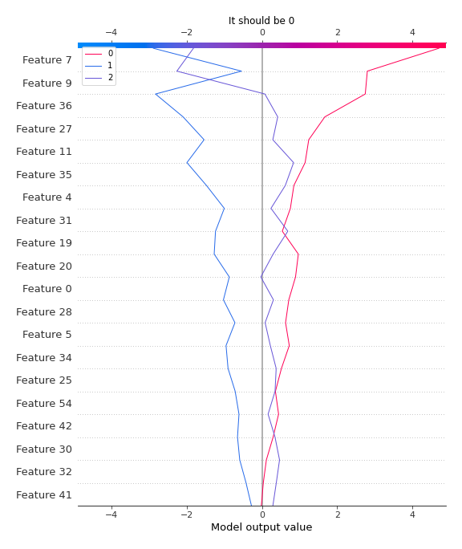
### Best decisions for selected sample 3 (Fold 1)
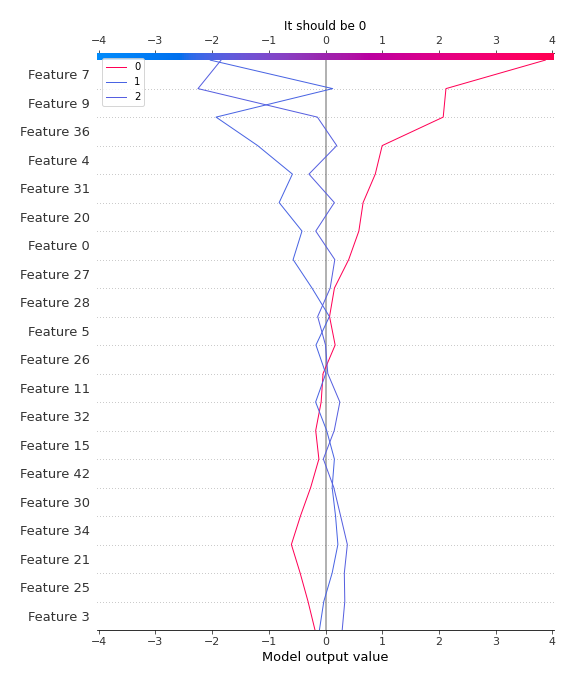
### Best decisions for selected sample 4 (Fold 1)
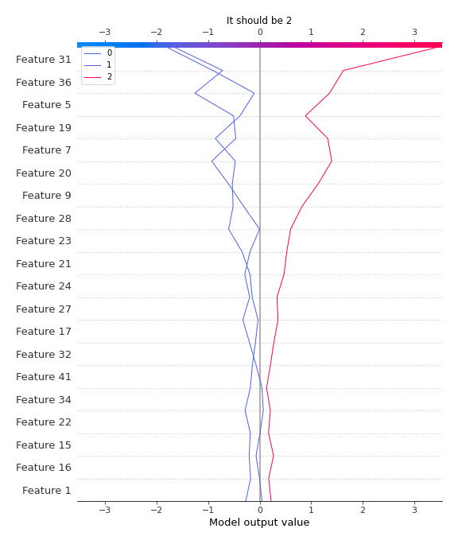

[<< Go back](../README.md)
