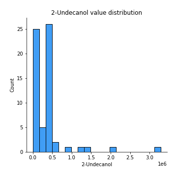

# Exploratory Data Analysis

[<< Go back](../README.md)
## Feature : target
- **Feature type** : discrete
- **Missing** : 0.0%
- **Unique** : 3
- **Count** :63.0
- **Mean** :1.0634920634920635
- **Std** :0.839988783969203
- **Min** :0.0
- **25%th Percentile** : 0.0
- **50%th Percentile** : 1.0
- **75%th Percentile** : 2.0
- **Max** :2.0

## Feature :  Ethyl Acetate
- **Feature type** : continous
- **Missing** : 0.0%
- **Unique** : 39
- **Count** :63.0
- **Mean** :217691.01013578122
- **Std** :274380.3572079834
- **Min** :0.0
- **25%th Percentile** : 0.0
- **50%th Percentile** : 129833.0
- **75%th Percentile** : 312884.0
- **Max** :961495.0

## Feature : Ethanol
- **Feature type** : continous
- **Missing** : 0.0%
- **Unique** : 50
- **Count** :63.0
- **Mean** :2144800.3174603176
- **Std** :2520975.290698582
- **Min** :0.0
- **25%th Percentile** : 100207.0
- **50%th Percentile** : 1050974.0
- **75%th Percentile** : 3249819.0
- **Max** :8155560.0

## Feature : Propanoic acid, ethyl ester
- **Feature type** : continous
- **Missing** : 0.0%
- **Unique** : 4
- **Count** :63.0
- **Mean** :15816.582598471494
- **Std** :23845.31644610333
- **Min** :0.0
- **25%th Percentile** : 0.0
- **50%th Percentile** : 17989.40740740741
- **75%th Percentile** : 17989.40740740741
- **Max** :175461.0

## Feature : 2-Pentanone
- **Feature type** : continous
- **Missing** : 0.0%
- **Unique** : 58
- **Count** :63.0
- **Mean** :1058363.9206349207
- **Std** :1011395.5159255931
- **Min** :0.0
- **25%th Percentile** : 437248.0
- **50%th Percentile** : 612393.0
- **75%th Percentile** : 1418101.5
- **Max** :4593791.0

## Feature : Decane
- **Feature type** : continous
- **Missing** : 0.0%
- **Unique** : 33
- **Count** :63.0
- **Mean** :267825.61904761905
- **Std** :452866.03521255904
- **Min** :0.0
- **25%th Percentile** : 0.0
- **50%th Percentile** : 15.0
- **75%th Percentile** : 435325.5
- **Max** :2992449.0

## Feature : Methyl Isobutyl Ketone
- **Feature type** : continous
- **Missing** : 0.0%
- **Unique** : 15
- **Count** :63.0
- **Mean** :224867.73572820955
- **Std** :330067.7431650603
- **Min** :0.0
- **25%th Percentile** : 0.0
- **50%th Percentile** : 218195.5614035088
- **75%th Percentile** : 218195.5614035088
- **Max** :1309090.0

## Feature : Amylene hydrate
- **Feature type** : continous
- **Missing** : 0.0%
- **Unique** : 31
- **Count** :63.0
- **Mean** :98076.09523809524
- **Std** :161150.82773898036
- **Min** :0.0
- **25%th Percentile** : 0.0
- **50%th Percentile** : 0.0
- **75%th Percentile** : 137735.0
- **Max** :759098.0

## Feature : Butanoic acid, 2-methyl-, methyl ester
- **Feature type** : continous
- **Missing** : 0.0%
- **Unique** : 8
- **Count** :63.0
- **Mean** :267015.73427395633
- **Std** :248515.3012696828
- **Min** :0.0
- **25%th Percentile** : 287247.7037037037
- **50%th Percentile** : 287247.7037037037
- **75%th Percentile** : 287247.7037037037
- **Max** :1437190.0

## Feature : Isobutyl acetate
- **Feature type** : continous
- **Missing** : 0.0%
- **Unique** : 14
- **Count** :63.0
- **Mean** :45325.48059964727
- **Std** :68836.89276438164
- **Min** :0.0
- **25%th Percentile** : 0.0
- **50%th Percentile** : 46016.2037037037
- **75%th Percentile** : 46016.2037037037
- **Max** :381024.0

## Feature : Methyl isovalerate
- **Feature type** : continous
- **Missing** : 0.0%
- **Unique** : 12
- **Count** :63.0
- **Mean** :87212.27708159291
- **Std** :124556.35265266529
- **Min** :0.0
- **25%th Percentile** : 0.0
- **50%th Percentile** : 97276.9298245614
- **75%th Percentile** : 97276.9298245614
- **Max** :608115.0

## Feature : 1-Propanol
- **Feature type** : continous
- **Missing** : 0.0%
- **Unique** : 11
- **Count** :63.0
- **Mean** :334804.2874779543
- **Std** :370385.73131796456
- **Min** :0.0
- **25%th Percentile** : 241172.5
- **50%th Percentile** : 317293.22222222225
- **75%th Percentile** : 317293.22222222225
- **Max** :1821750.0

## Feature : Methyl thiolacetate
- **Feature type** : continous
- **Missing** : 0.0%
- **Unique** : 47
- **Count** :63.0
- **Mean** :110741.46031746031
- **Std** :101386.9150701706
- **Min** :0.0
- **25%th Percentile** : 0.0
- **50%th Percentile** : 87526.0
- **75%th Percentile** : 168787.5
- **Max** :352289.0

## Feature : Butanoic acid, 2-methyl-, ethyl ester
- **Feature type** : continous
- **Missing** : 0.0%
- **Unique** : 18
- **Count** :63.0
- **Mean** :744336.4476190472
- **Std** :413303.5386906739
- **Min** :0.0
- **25%th Percentile** : 713709.4333333333
- **50%th Percentile** : 713709.4333333333
- **75%th Percentile** : 713709.4333333333
- **Max** :2198502.0

## Feature : 2-Hexanone
- **Feature type** : continous
- **Missing** : 0.0%
- **Unique** : 17
- **Count** :63.0
- **Mean** :39866.36953494846
- **Std** :48608.56202609963
- **Min** :0.0
- **25%th Percentile** : 0.0
- **50%th Percentile** : 39797.61403508772
- **75%th Percentile** : 39797.61403508772
- **Max** :183084.0

## Feature : Ethyl isocyanide
- **Feature type** : continous
- **Missing** : 0.0%
- **Unique** : 7
- **Count** :63.0
- **Mean** :18517.333333333332
- **Std** :18293.096950277668
- **Min** :0.0
- **25%th Percentile** : 0.0
- **50%th Percentile** : 19984.0
- **75%th Percentile** : 19984.0
- **Max** :105656.0

## Feature : 1-Propanol, 2-methyl-
- **Feature type** : continous
- **Missing** : 0.0%
- **Unique** : 53
- **Count** :63.0
- **Mean** :216887.50793650793
- **Std** :175416.10078655032
- **Min** :0.0
- **25%th Percentile** : 62121.0
- **50%th Percentile** : 189839.0
- **75%th Percentile** : 333946.0
- **Max** :613288.0

## Feature : 2-Pentanol, 2-methyl-
- **Feature type** : continous
- **Missing** : 0.0%
- **Unique** : 25
- **Count** :63.0
- **Mean** :37625.677184930195
- **Std** :59655.316710925144
- **Min** :0.0
- **25%th Percentile** : 0.0
- **50%th Percentile** : 0.0
- **75%th Percentile** : 70087.0
- **Max** :302615.0

## Feature : 2-Pentanol
- **Feature type** : continous
- **Missing** : 0.0%
- **Unique** : 21
- **Count** :63.0
- **Mean** :282105.5758841548
- **Std** :411017.1680877317
- **Min** :0.0
- **25%th Percentile** : 0.0
- **50%th Percentile** : 265630.649122807
- **75%th Percentile** : 265630.649122807
- **Max** :2282603.0

## Feature : 1-Butanol, 3-methyl-, acetate
- **Feature type** : continous
- **Missing** : 0.0%
- **Unique** : 7
- **Count** :63.0
- **Mean** :21858.514285714275
- **Std** :30001.729466659075
- **Min** :0.0
- **25%th Percentile** : 9563.1
- **50%th Percentile** : 19126.2
- **75%th Percentile** : 19126.2
- **Max** :156927.0

## Feature : 1 - Undecene
- **Feature type** : continous
- **Missing** : 0.0%
- **Unique** : 21
- **Count** :63.0
- **Mean** :5567759.82951205
- **Std** :2179939.6020776974
- **Min** :0.0
- **25%th Percentile** : 5627687.703703703
- **50%th Percentile** : 5627687.703703703
- **75%th Percentile** : 5627687.703703703
- **Max** :12179961.0

## Feature : 1-Butanol
- **Feature type** : continous
- **Missing** : 0.0%
- **Unique** : 37
- **Count** :63.0
- **Mean** :1420451.6984126987
- **Std** :1035375.3327735219
- **Min** :0.0
- **25%th Percentile** : 536536.0
- **50%th Percentile** : 1456599.6666666667
- **75%th Percentile** : 1594023.0
- **Max** :3954594.0

## Feature : 2-Heptanone
- **Feature type** : continous
- **Missing** : 0.0%
- **Unique** : 34
- **Count** :63.0
- **Mean** :121475.0
- **Std** :180611.20297005476
- **Min** :0.0
- **25%th Percentile** : 0.0
- **50%th Percentile** : 64568.0
- **75%th Percentile** : 184415.5
- **Max** :1022779.0

## Feature : Dodecane
- **Feature type** : continous
- **Missing** : 0.0%
- **Unique** : 6
- **Count** :63.0
- **Mean** :15352.428571428574
- **Std** :41193.90704687385
- **Min** :0.0
- **25%th Percentile** : 0.0
- **50%th Percentile** : 0.0
- **75%th Percentile** : 16751.333333333332
- **Max** :265644.0

## Feature : 1-Butanol, 3-methyl-
- **Feature type** : continous
- **Missing** : 0.0%
- **Unique** : 63
- **Count** :63.0
- **Mean** :7052706.396825396
- **Std** :6943746.913861814
- **Min** :908313.0
- **25%th Percentile** : 2473973.5
- **50%th Percentile** : 5059320.0
- **75%th Percentile** : 8349346.0
- **Max** :37125000.0

## Feature :  S-Methyl 3-methylbutanethioate
- **Feature type** : continous
- **Missing** : 0.0%
- **Unique** : 21
- **Count** :63.0
- **Mean** :339579.81481481466
- **Std** :151788.2251579528
- **Min** :0.0
- **25%th Percentile** : 334880.3333333333
- **50%th Percentile** : 334880.3333333333
- **75%th Percentile** : 334880.3333333333
- **Max** :1013976.0

## Feature : 2-Heptanone, 4,6-dimethyl-
- **Feature type** : continous
- **Missing** : 0.0%
- **Unique** : 19
- **Count** :63.0
- **Mean** :54162.00352733689
- **Std** :60383.45073134249
- **Min** :0.0
- **25%th Percentile** : 0.0
- **50%th Percentile** : 59419.96296296296
- **75%th Percentile** : 63039.98148148148
- **Max** :277538.0

## Feature :  3-Buten-1-ol, 3-methyl-
- **Feature type** : continous
- **Missing** : 0.0%
- **Unique** : 48
- **Count** :63.0
- **Mean** :147162.6984126984
- **Std** :162964.7944676747
- **Min** :0.0
- **25%th Percentile** : 27922.5
- **50%th Percentile** : 97760.0
- **75%th Percentile** : 156619.0
- **Max** :704490.0

## Feature : Thiocyanic acid, methyl ester
- **Feature type** : continous
- **Missing** : 0.0%
- **Unique** : 6
- **Count** :63.0
- **Mean** :52746.18342151671
- **Std** :51533.9323781419
- **Min** :0.0
- **25%th Percentile** : 29019.11111111111
- **50%th Percentile** : 58038.22222222222
- **75%th Percentile** : 58038.22222222222
- **Max** :301551.0

## Feature : Acetoin
- **Feature type** : continous
- **Missing** : 0.0%
- **Unique** : 24
- **Count** :63.0
- **Mean** :160827.2857142857
- **Std** :354151.86600704497
- **Min** :0.0
- **25%th Percentile** : 0.0
- **50%th Percentile** : 0.0
- **75%th Percentile** : 140495.0
- **Max** :2056879.0

## Feature : 1-Pentanol, 2-methyl-
- **Feature type** : continous
- **Missing** : 0.0%
- **Unique** : 13
- **Count** :63.0
- **Mean** :47000.37801293359
- **Std** :29770.284124430793
- **Min** :0.0
- **25%th Percentile** : 48789.62962962963
- **50%th Percentile** : 48789.62962962963
- **75%th Percentile** : 48789.62962962963
- **Max** :163793.0

## Feature : Butanoic acid, 3-methyl-, 2-methylbutyl ester
- **Feature type** : continous
- **Missing** : 0.0%
- **Unique** : 13
- **Count** :63.0
- **Mean** :107302.67019400359
- **Std** :84245.86515874878
- **Min** :0.0
- **25%th Percentile** : 103049.88888888888
- **50%th Percentile** : 103049.88888888888
- **75%th Percentile** : 103049.88888888888
- **Max** :590669.0

## Feature : 2-Heptanol, 4-methyl-
- **Feature type** : continous
- **Missing** : 0.0%
- **Unique** : 8
- **Count** :63.0
- **Mean** :48549.43327454441
- **Std** :51522.58519127328
- **Min** :0.0
- **25%th Percentile** : 45394.51851851852
- **50%th Percentile** : 45394.51851851852
- **75%th Percentile** : 45394.51851851852
- **Max** :254736.0

## Feature : 2-Nonanone 
- **Feature type** : continous
- **Missing** : 0.0%
- **Unique** : 43
- **Count** :63.0
- **Mean** :625602.1031746032
- **Std** :547842.8190333593
- **Min** :75932.0
- **25%th Percentile** : 297162.0
- **50%th Percentile** : 618535.1666666666
- **75%th Percentile** : 618535.1666666666
- **Max** :2654044.0

## Feature : Acetic acid
- **Feature type** : continous
- **Missing** : 0.0%
- **Unique** : 44
- **Count** :63.0
- **Mean** :3501542.069896965
- **Std** :3938974.1896112096
- **Min** :125680.0
- **25%th Percentile** : 1164562.0
- **50%th Percentile** : 3241608.0701754387
- **75%th Percentile** : 3241608.0701754387
- **Max** :21176351.0

## Feature : 2-Nonanol
- **Feature type** : continous
- **Missing** : 0.0%
- **Unique** : 20
- **Count** :63.0
- **Mean** :660374.844209289
- **Std** :429520.6178521412
- **Min** :0.0
- **25%th Percentile** : 628854.074074074
- **50%th Percentile** : 628854.074074074
- **75%th Percentile** : 628854.074074074
- **Max** :2526340.0

## Feature : Pyrrole
- **Feature type** : continous
- **Missing** : 0.0%
- **Unique** : 21
- **Count** :63.0
- **Mean** :383279.255144033
- **Std** :117681.1026060318
- **Min** :103804.0
- **25%th Percentile** : 371058.6296296296
- **50%th Percentile** : 371058.6296296296
- **75%th Percentile** : 371058.6296296296
- **Max** :862790.0

## Feature : 1H-Pyrrole, 2-methyl-
- **Feature type** : continous
- **Missing** : 0.0%
- **Unique** : 17
- **Count** :63.0
- **Mean** :345666.8865373313
- **Std** :133907.03900888818
- **Min** :0.0
- **25%th Percentile** : 333395.7407407408
- **50%th Percentile** : 333395.7407407408
- **75%th Percentile** : 333395.7407407408
- **Max** :709941.0

## Feature : 1-Heptanol, 2,4-dimethyl-,
- **Feature type** : continous
- **Missing** : 0.0%
- **Unique** : 21
- **Count** :63.0
- **Mean** :49991.104056437354
- **Std** :55483.16534035347
- **Min** :0.0
- **25%th Percentile** : 0.0
- **50%th Percentile** : 49898.40740740741
- **75%th Percentile** : 56241.0
- **Max** :274686.0

## Feature : Propanoic acid
- **Feature type** : continous
- **Missing** : 0.0%
- **Unique** : 23
- **Count** :63.0
- **Mean** :67286.34126984126
- **Std** :79968.2869044459
- **Min** :0.0
- **25%th Percentile** : 0.0
- **50%th Percentile** : 57874.07142857143
- **75%th Percentile** : 59858.5
- **Max** :364754.0

## Feature : Propanoic acid, 2-methyl-
- **Feature type** : continous
- **Missing** : 0.0%
- **Unique** : 4
- **Count** :63.0
- **Mean** :18478.11428571428
- **Std** :31531.354329536676
- **Min** :0.0
- **25%th Percentile** : 0.0
- **50%th Percentile** : 20034.1
- **75%th Percentile** : 20034.1
- **Max** :245699.0

## Feature : 1-Octanol
- **Feature type** : continous
- **Missing** : 0.0%
- **Unique** : 21
- **Count** :63.0
- **Mean** :654134.4585537913
- **Std** :351910.49481107236
- **Min** :0.0
- **25%th Percentile** : 664654.7777777778
- **50%th Percentile** : 664654.7777777778
- **75%th Percentile** : 664654.7777777778
- **Max** :1910713.0

## Feature : 2-Undecanone
- **Feature type** : continous
- **Missing** : 0.0%
- **Unique** : 42
- **Count** :63.0
- **Mean** :561567.6675485007
- **Std** :345202.1160955009
- **Min** :0.0
- **25%th Percentile** : 311037.5
- **50%th Percentile** : 590926.9074074074
- **75%th Percentile** : 590926.9074074074
- **Max** :1644906.0

## Feature : Benzoic acid, methyl ester
- **Feature type** : continous
- **Missing** : 0.0%
- **Unique** : 25
- **Count** :63.0
- **Mean** :135578.8941798941
- **Std** :130136.44115622735
- **Min** :0.0
- **25%th Percentile** : 0.0
- **50%th Percentile** : 134161.44444444444
- **75%th Percentile** : 135340.22222222222
- **Max** :556478.0

## Feature : Butyrolactone 
- **Feature type** : continous
- **Missing** : 0.0%
- **Unique** : 6
- **Count** :63.0
- **Mean** :39415.266666666685
- **Std** :37717.242780305365
- **Min** :0.0
- **25%th Percentile** : 0.0
- **50%th Percentile** : 43750.23333333333
- **75%th Percentile** : 43750.23333333333
- **Max** :191311.0

## Feature :  Decanoic acid, ethyl ester
- **Feature type** : continous
- **Missing** : 0.0%
- **Unique** : 7
- **Count** :63.0
- **Mean** :37744.305114638475
- **Std** :50070.208305341876
- **Min** :0.0
- **25%th Percentile** : 0.0
- **50%th Percentile** : 37525.444444444445
- **75%th Percentile** : 37525.444444444445
- **Max** :344949.0

## Feature : Acetic acid, decyl ester
- **Feature type** : continous
- **Missing** : 0.0%
- **Unique** : 7
- **Count** :63.0
- **Mean** :38021.40564373894
- **Std** :45101.272588763095
- **Min** :0.0
- **25%th Percentile** : 0.0
- **50%th Percentile** : 37478.11111111111
- **75%th Percentile** : 37478.11111111111
- **Max** :261433.0

## Feature : 2-Undecanol
- **Feature type** : continous
- **Missing** : 0.0%
- **Unique** : 26
- **Count** :63.0
- **Mean** :335268.3350970017
- **Std** :516745.78394323593
- **Min** :0.0
- **25%th Percentile** : 0.0
- **50%th Percentile** : 338121.48148148146
- **75%th Percentile** : 338121.48148148146
- **Max** :3287479.0

## Feature : Butanoic acid, 3-methyl-
- **Feature type** : continous
- **Missing** : 0.0%
- **Unique** : 22
- **Count** :63.0
- **Mean** :2444051.9904761896
- **Std** :743155.7822676433
- **Min** :1194878.0
- **25%th Percentile** : 2403459.033333333
- **50%th Percentile** : 2403459.033333333
- **75%th Percentile** : 2403459.033333333
- **Max** :5887513.0

## Feature : 2-Dodecanone
- **Feature type** : continous
- **Missing** : 0.0%
- **Unique** : 10
- **Count** :63.0
- **Mean** :31977.392710170516
- **Std** :28632.224968213814
- **Min** :0.0
- **25%th Percentile** : 30908.48148148148
- **50%th Percentile** : 30908.48148148148
- **75%th Percentile** : 30908.48148148148
- **Max** :159402.0

## Feature : 1-Decanol
- **Feature type** : continous
- **Missing** : 0.0%
- **Unique** : 22
- **Count** :63.0
- **Mean** :1544986.478542035
- **Std** :1217695.4351915692
- **Min** :0.0
- **25%th Percentile** : 1433216.1481481483
- **50%th Percentile** : 1524509.2962962964
- **75%th Percentile** : 1524509.2962962964
- **Max** :7740141.0

## Feature : 2-Tridecanone
- **Feature type** : continous
- **Missing** : 0.0%
- **Unique** : 23
- **Count** :63.0
- **Mean** :325367.4044679599
- **Std** :142949.70845326097
- **Min** :67510.0
- **25%th Percentile** : 314530.962962963
- **50%th Percentile** : 314530.962962963
- **75%th Percentile** : 314530.962962963
- **Max** :975303.0

## Feature :  Dodecanoic acid, ethyl ester
- **Feature type** : continous
- **Missing** : 0.0%
- **Unique** : 6
- **Count** :63.0
- **Mean** :22027.538506760728
- **Std** :30112.261600681868
- **Min** :0.0
- **25%th Percentile** : 0.0
- **50%th Percentile** : 21410.85185185185
- **75%th Percentile** : 21410.85185185185
- **Max** :171353.0

## Feature : 1,4-Butanediol
- **Feature type** : continous
- **Missing** : 0.0%
- **Unique** : 6
- **Count** :63.0
- **Mean** :19064.295238095216
- **Std** :17642.637419439154
- **Min** :0.0
- **25%th Percentile** : 0.0
- **50%th Percentile** : 21398.13333333333
- **75%th Percentile** : 21398.13333333333
- **Max** :84674.0

## Feature : Phenylethyl Alcohol
- **Feature type** : continous
- **Missing** : 0.0%
- **Unique** : 20
- **Count** :63.0
- **Mean** :147309.2827748383
- **Std** :55054.38090092387
- **Min** :0.0
- **25%th Percentile** : 147761.62962962964
- **50%th Percentile** : 147761.62962962964
- **75%th Percentile** : 147761.62962962964
- **Max** :386583.0

## Feature : Acetophenone, 2'-amino-
- **Feature type** : continous
- **Missing** : 0.0%
- **Unique** : 17
- **Count** :63.0
- **Mean** :337267.2445620222
- **Std** :259519.11011105136
- **Min** :0.0
- **25%th Percentile** : 343307.962962963
- **50%th Percentile** : 343307.962962963
- **75%th Percentile** : 343307.962962963
- **Max** :1937240.0

## Feature : 2-Tridecanol
- **Feature type** : continous
- **Missing** : 0.0%
- **Unique** : 13
- **Count** :63.0
- **Mean** :58256.39741328634
- **Std** :44717.332923988
- **Min** :0.0
- **25%th Percentile** : 56845.07407407407
- **50%th Percentile** : 56845.07407407407
- **75%th Percentile** : 56845.07407407407
- **Max** :231601.0

## Feature : Tetradecanal
- **Feature type** : continous
- **Missing** : 0.0%
- **Unique** : 4
- **Count** :63.0
- **Mean** :8977.079365079366
- **Std** :19249.84218477546
- **Min** :0.0
- **25%th Percentile** : 0.0
- **50%th Percentile** : 8317.0
- **75%th Percentile** : 8317.0
- **Max** :113303.0

## Feature : 1-Dodecanol
- **Feature type** : continous
- **Missing** : 0.0%
- **Unique** : 23
- **Count** :63.0
- **Mean** :2149461.273368608
- **Std** :1304869.0989300755
- **Min** :242246.0
- **25%th Percentile** : 2042975.0
- **50%th Percentile** : 2098782.4444444445
- **75%th Percentile** : 2098782.4444444445
- **Max** :8172616.0

## Feature : Methyl tetradecanoate
- **Feature type** : continous
- **Missing** : 0.0%
- **Unique** : 11
- **Count** :63.0
- **Mean** :104476.97883597879
- **Std** :112812.684634885
- **Min** :0.0
- **25%th Percentile** : 97878.33333333331
- **50%th Percentile** : 97878.33333333331
- **75%th Percentile** : 97878.33333333331
- **Max** :698476.0

## Feature :  2-Pentadecanone
- **Feature type** : continous
- **Missing** : 0.0%
- **Unique** : 17
- **Count** :63.0
- **Mean** :90516.1616696061
- **Std** :57903.1474673655
- **Min** :0.0
- **25%th Percentile** : 85753.37037037036
- **50%th Percentile** : 85753.37037037036
- **75%th Percentile** : 85753.37037037036
- **Max** :382222.0

## Feature : Tetradecanoic acid, ethyl ester
- **Feature type** : continous
- **Missing** : 0.0%
- **Unique** : 5
- **Count** :63.0
- **Mean** :10974.70429159319
- **Std** :19350.514539907712
- **Min** :0.0
- **25%th Percentile** : 0.0
- **50%th Percentile** : 10167.74074074074
- **75%th Percentile** : 10167.74074074074
- **Max** :119785.0

## Feature : Hexadecanal
- **Feature type** : continous
- **Missing** : 0.0%
- **Unique** : 14
- **Count** :63.0
- **Mean** :95274.98706643151
- **Std** :94110.12309457199
- **Min** :0.0
- **25%th Percentile** : 90906.0
- **50%th Percentile** : 94159.37037037036
- **75%th Percentile** : 94159.37037037036
- **Max** :652645.0

## Feature : n-Tridecan-1-ol
- **Feature type** : continous
- **Missing** : 0.0%
- **Unique** : 11
- **Count** :63.0
- **Mean** :89060.09229864788
- **Std** :80330.23723378421
- **Min** :0.0
- **25%th Percentile** : 85581.62962962964
- **50%th Percentile** : 85581.62962962964
- **75%th Percentile** : 85581.62962962964
- **Max** :448151.0

## Feature : 1-Tetradecanol
- **Feature type** : continous
- **Missing** : 0.0%
- **Unique** : 23
- **Count** :63.0
- **Mean** :594168.8436213989
- **Std** :331027.6995177793
- **Min** :78672.0
- **25%th Percentile** : 586042.2962962963
- **50%th Percentile** : 586042.2962962963
- **75%th Percentile** : 586042.2962962963
- **Max** :2450605.0

## Feature : n-Pentadecanol
- **Feature type** : continous
- **Missing** : 0.0%
- **Unique** : 9
- **Count** :63.0
- **Mean** :186770.7594627595
- **Std** :280749.3936804158
- **Min** :0.0
- **25%th Percentile** : 155812.3076923077
- **50%th Percentile** : 173037.61538461538
- **75%th Percentile** : 173037.61538461538
- **Max** :1869692.0

## Feature :  1-Hexadecanol
- **Feature type** : continous
- **Missing** : 0.0%
- **Unique** : 21
- **Count** :63.0
- **Mean** :687493.9212228104
- **Std** :591460.0919171026
- **Min** :0.0
- **25%th Percentile** : 662122.074074074
- **50%th Percentile** : 662122.074074074
- **75%th Percentile** : 662122.074074074
- **Max** :4268126.0

## Feature : Indole
- **Feature type** : continous
- **Missing** : 0.0%
- **Unique** : 23
- **Count** :63.0
- **Mean** :83695206.3968254
- **Std** :10035213.60602341
- **Min** :43562718.0
- **25%th Percentile** : 82469063.0
- **50%th Percentile** : 82469063.0
- **75%th Percentile** : 82469063.0
- **Max** :112700686.0

[<< Go back](../README.md)
