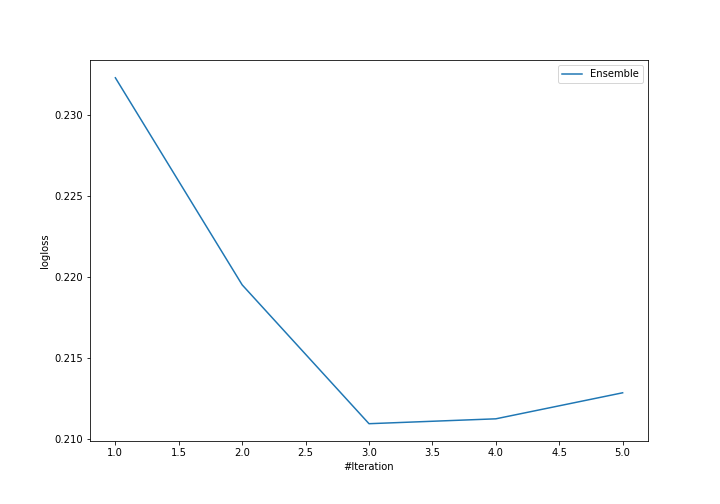
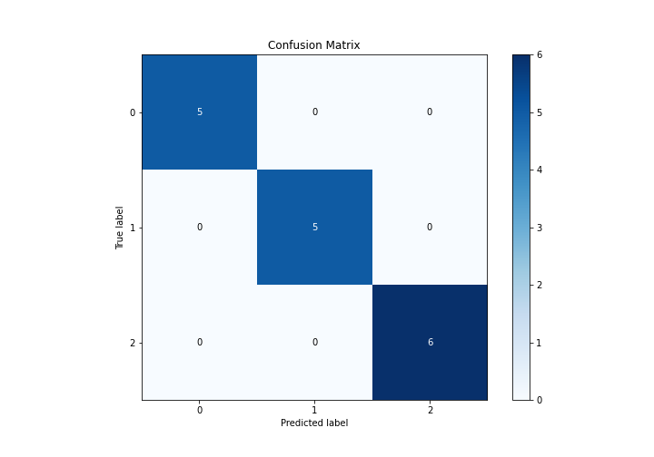
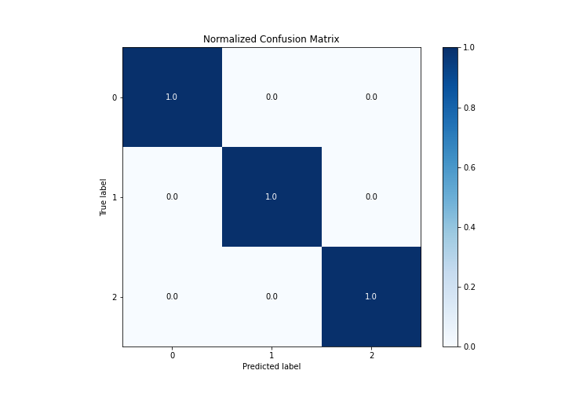
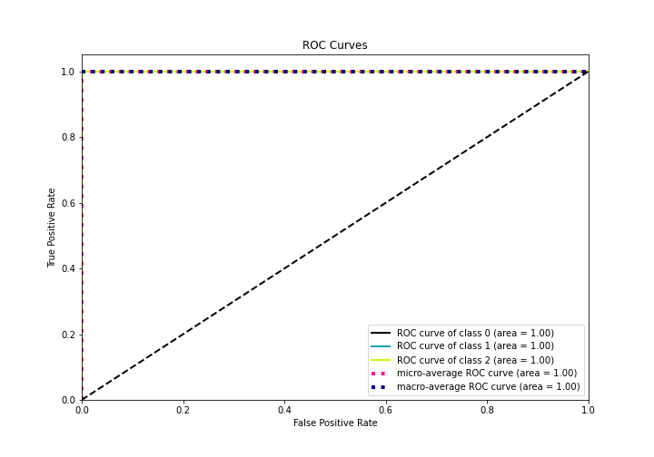
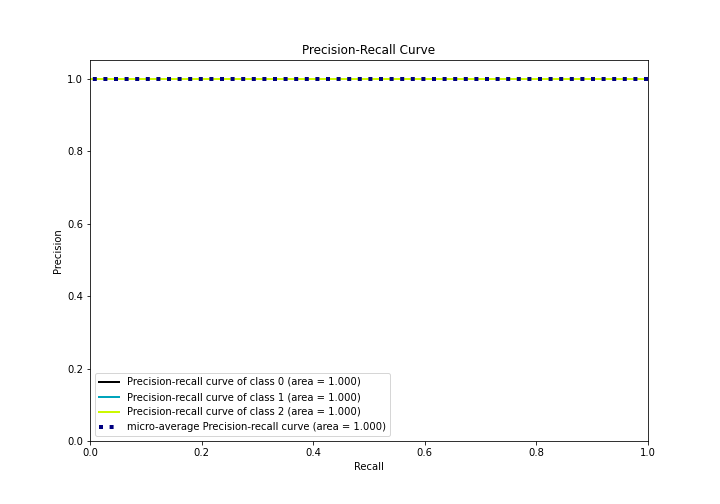

# Summary of Ensemble

[<< Go back](../README.md)

## Ensemble structure
| Model             |   Weight |
|:------------------|---------:|
| 2_Linear          |        1 |
| 3_Default_Xgboost |        2 |

### Metric details
|           |   0 |   1 |   2 |   accuracy |   macro avg |   weighted avg |   logloss |
|:----------|----:|----:|----:|-----------:|------------:|---------------:|----------:|
| precision |   1 |   1 |   1 |          1 |           1 |              1 |  0.210967 |
| recall    |   1 |   1 |   1 |          1 |           1 |              1 |  0.210967 |
| f1-score  |   1 |   1 |   1 |          1 |           1 |              1 |  0.210967 |
| support   |   5 |   5 |   6 |          1 |          16 |             16 |  0.210967 |

## Confusion matrix
|              |   Predicted as 0 |   Predicted as 1 |   Predicted as 2 |
|:-------------|-----------------:|-----------------:|-----------------:|
| Labeled as 0 |                5 |                0 |                0 |
| Labeled as 1 |                0 |                5 |                0 |
| Labeled as 2 |                0 |                0 |                6 |

## Learning curves

## Confusion Matrix

## Normalized Confusion Matrix

## ROC Curve

## Precision Recall Curve

[<< Go back](../README.md)
