# Summary of 2_Linear

[<< Go back](../README.md)

## Logistic Regression (Linear)
- **n_jobs**: -1
- **num_class**: 3
- **explain_level**: 2

## Validation
 - **validation_type**: split
 - **train_ratio**: 0.75
 - **shuffle**: True
 - **stratify**: True

## Optimized metric
logloss

## Training time

12.2 seconds

### Metric details
|           |        0 |        1 |        2 |   accuracy |   macro avg |   weighted avg |   logloss |
|:----------|---------:|---------:|---------:|-----------:|------------:|---------------:|----------:|
| precision | 1        | 0.555556 | 1        |       0.75 |    0.851852 |       0.861111 |  0.762603 |
| recall    | 0.8      | 1        | 0.5      |       0.75 |    0.766667 |       0.75     |  0.762603 |
| f1-score  | 0.888889 | 0.714286 | 0.666667 |       0.75 |    0.756614 |       0.750992 |  0.762603 |
| support   | 5        | 5        | 6        |       0.75 |   16        |      16        |  0.762603 |

## Confusion matrix
|              |   Predicted as 0 |   Predicted as 1 |   Predicted as 2 |
|:-------------|-----------------:|-----------------:|-----------------:|
| Labeled as 0 |                4 |                1 |                0 |
| Labeled as 1 |                0 |                5 |                0 |
| Labeled as 2 |                0 |                3 |                3 |

## Learning curves
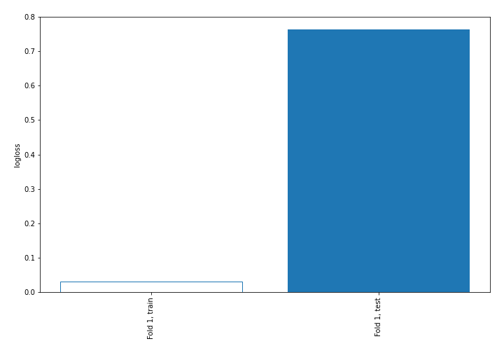

## Coefficients

### Coefficients learner #1
|                                               |            0 |           1 |           2 |
|:----------------------------------------------|-------------:|------------:|------------:|
| intercept                                     | -0.302224    |  0.0677652  |  0.234458   |
| Ethyl Acetate                                 | -0.188259    | -0.0373512  |  0.22561    |
| Ethanol                                       | -0.167135    | -0.0698075  |  0.236943   |
| Propanoic acid, ethyl ester                   | -0.0592218   |  0.0895933  | -0.0303715  |
| 2-Pentanone                                   |  0.0874514   |  0.0619432  | -0.149395   |
| Decane                                        |  0.146545    | -0.194372   |  0.0478274  |
| Methyl Isobutyl Ketone                        |  0.164759    | -0.313127   |  0.148368   |
| Amylene hydrate                               |  0.129564    | -0.0154019  | -0.114162   |
| Butanoic acid, 2-methyl-, methyl ester        |  0.288736    | -0.218945   | -0.0697915  |
| Isobutyl acetate                              |  0.0851914   | -0.148293   |  0.063102   |
| Methyl isovalerate                            |  0.134343    |  0.0829021  | -0.217245   |
| 1-Propanol                                    |  0.107325    | -0.0501586  | -0.0571664  |
| Methyl thiolacetate                           |  0.122613    |  0.199096   | -0.321709   |
| Butanoic acid, 2-methyl-, ethyl ester         | -0.188453    |  0.169783   |  0.01867    |
| 2-Hexanone                                    | -0.0386481   |  0.229229   | -0.19058    |
| Ethyl isocyanide                              | -0.0976997   |  0.107613   | -0.00991356 |
| 1-Propanol, 2-methyl-                         |  0.102896    | -0.218201   |  0.115304   |
| 2-Pentanol, 2-methyl-                         | -0.0554621   | -0.190399   |  0.245861   |
| 2-Pentanol                                    | -0.0529205   | -0.116802   |  0.169723   |
| 1-Butanol, 3-methyl-, acetate                 | -0.0402719   |  0.167719   | -0.127447   |
| 1 - Undecene                                  |  0.0357508   | -0.0817761  |  0.0460253  |
| 1-Butanol                                     |  0.0357042   |  0.19467    | -0.230374   |
| 2-Heptanone                                   |  0.0595016   |  0.110912   | -0.170414   |
| Dodecane                                      | -0.000129725 |  0.0349161  | -0.0347864  |
| 1-Butanol, 3-methyl-                          | -0.108533    |  0.0128636  |  0.0956695  |
| S-Methyl 3-methylbutanethioate                | -0.0877237   |  0.0202514  |  0.0674723  |
| 2-Heptanone, 4,6-dimethyl-                    |  0.0733981   | -0.184686   |  0.111288   |
| 3-Buten-1-ol, 3-methyl-                       | -0.115896    |  0.241552   | -0.125656   |
| Thiocyanic acid, methyl ester                 |  0.277617    | -0.196737   | -0.0808806  |
| Acetoin                                       | -0.152335    |  0.496854   | -0.344519   |
| 1-Pentanol, 2-methyl-                         | -0.086594    |  0.179612   | -0.0930183  |
| Butanoic acid, 3-methyl-, 2-methylbutyl ester | -0.0869303   | -0.00121765 |  0.088148   |
| 2-Heptanol, 4-methyl-                         | -0.123902    | -0.265055   |  0.388957   |
| 2-Nonanone                                    | -0.0771168   |  0.247761   | -0.170644   |
| Acetic acid                                   | -0.164538    | -0.1342     |  0.298737   |
| 2-Nonanol                                     | -0.0916297   |  0.0445774  |  0.0470522  |
| Pyrrole                                       | -0.0795187   |  0.392857   | -0.313338   |
| 1H-Pyrrole, 2-methyl-                         | -0.284425    |  0.308392   | -0.023967   |
| 1-Heptanol, 2,4-dimethyl-,                    |  0.0143271   | -0.141935   |  0.127607   |
| Propanoic acid                                |  0.276941    | -0.127174   | -0.149767   |
| Propanoic acid, 2-methyl-                     |  0.406609    | -0.0941107  | -0.312498   |
| 1-Octanol                                     | -0.213018    |  0.102758   |  0.11026    |
| 2-Undecanone                                  | -0.0628036   |  0.11651    | -0.0537062  |
| Benzoic acid, methyl ester                    | -0.00631117  |  0.0276818  | -0.0213706  |
| Butyrolactone                                 |  0.274429    | -0.0437894  | -0.23064    |
| Decanoic acid, ethyl ester                    | -0.0624877   |  0.0837562  | -0.0212685  |
| Acetic acid, decyl ester                      | -0.0739353   |  0.100902   | -0.0269671  |
| 2-Undecanol                                   | -0.106763    |  0.0458957  |  0.0608669  |
| Butanoic acid, 3-methyl-                      |  0.0313108   | -0.195627   |  0.164316   |
| 2-Dodecanone                                  |  0.220456    | -0.0430798  | -0.177377   |
| 1-Decanol                                     | -0.139133    |  0.145306   | -0.00617336 |
| 2-Tridecanone                                 |  0.1363      |  0.026541   | -0.16284    |
| Dodecanoic acid, ethyl ester                  | -0.0601211   |  0.0930909  | -0.0329698  |
| 1,4-Butanediol                                |  0.2789      | -0.0406173  | -0.238282   |
| Phenylethyl Alcohol                           | -0.248119    |  0.124256   |  0.123863   |
| Acetophenone, 2'-amino-                       | -0.0496149   | -0.215825   |  0.26544    |
| 2-Tridecanol                                  | -0.0163481   |  0.149942   | -0.133594   |
| Tetradecanal                                  | -0.0346806   |  0.0871828  | -0.0525022  |
| 1-Dodecanol                                   | -0.106849    |  0.0678694  |  0.0389796  |
| Methyl tetradecanoate                         |  0.051396    |  0.0506024  | -0.101998   |
| 2-Pentadecanone                               |  0.187869    |  0.0454023  | -0.233271   |
| Tetradecanoic acid, ethyl ester               | -0.0424524   |  0.0861528  | -0.0437004  |
| Hexadecanal                                   |  0.0215736   |  0.081953   | -0.103527   |
| n-Tridecan-1-ol                               |  0.255541    | -0.0452985  | -0.210243   |
| 1-Tetradecanol                                | -0.0452356   |  0.0568428  | -0.0116072  |
| n-Pentadecanol                                |  0.111117    | -0.0225819  | -0.088535   |
| 1-Hexadecanol                                 |  0.0412221   |  0.0352192  | -0.0764414  |
| Indole                                        | -0.151177    |  0.0183443  |  0.132832   |

## Permutation-based Importance
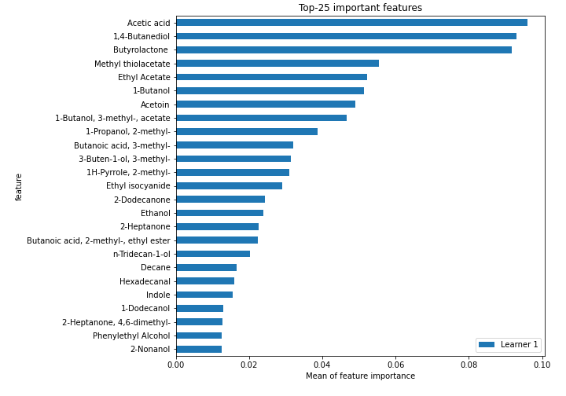
## Confusion Matrix

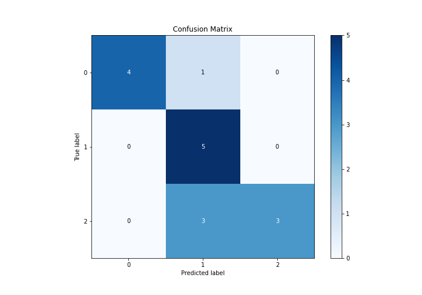

## Normalized Confusion Matrix

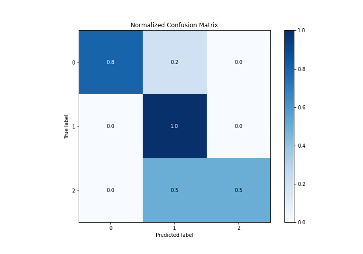

## ROC Curve

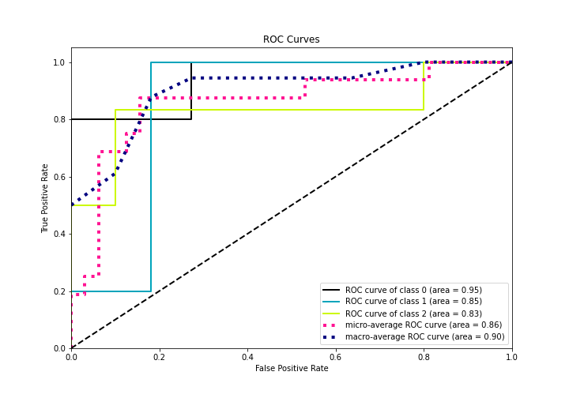

## Precision Recall Curve

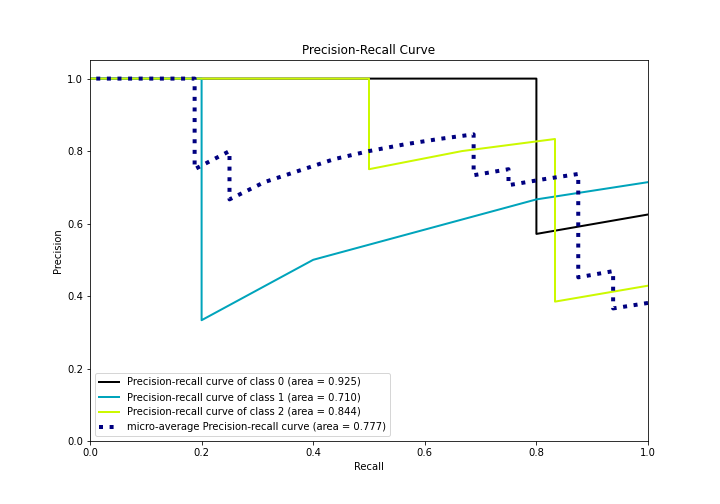

## SHAP Importance
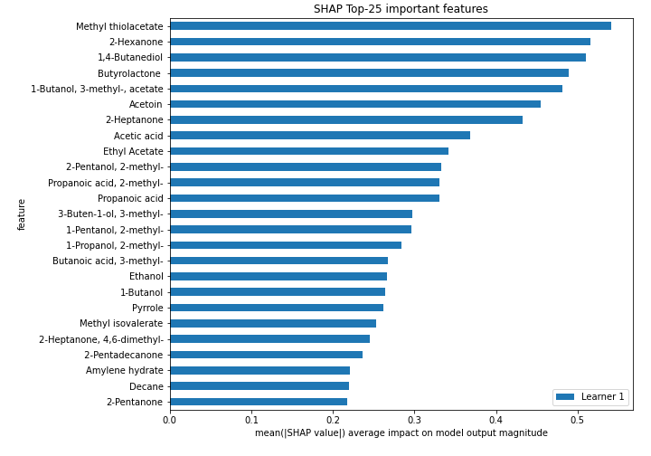

## SHAP Dependence plots

### Dependence 0 (Fold 1)
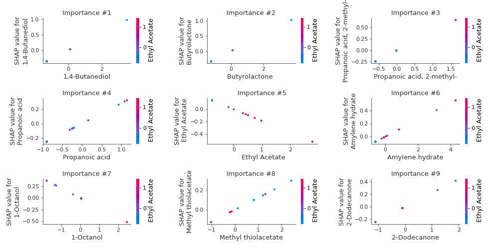
### Dependence 1 (Fold 1)
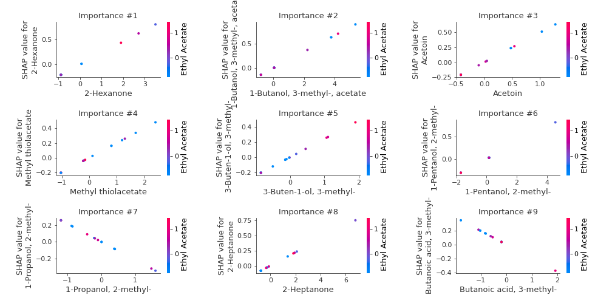
### Dependence 2 (Fold 1)
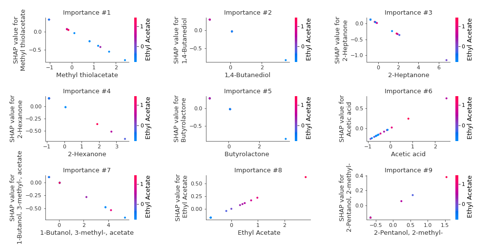

## SHAP Decision plots

### Worst decisions for selected sample 1 (Fold 1)
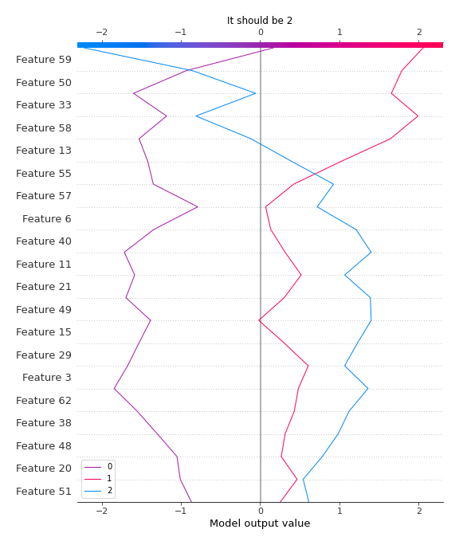
### Worst decisions for selected sample 2 (Fold 1)
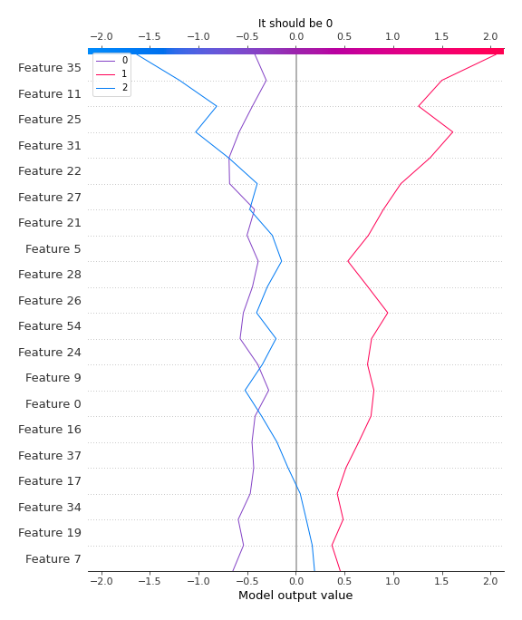
### Worst decisions for selected sample 3 (Fold 1)
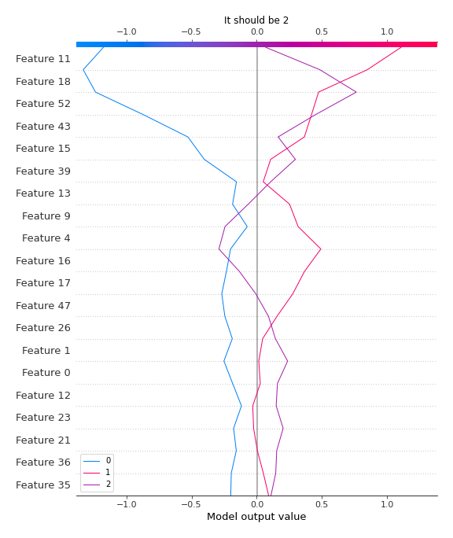
### Worst decisions for selected sample 4 (Fold 1)
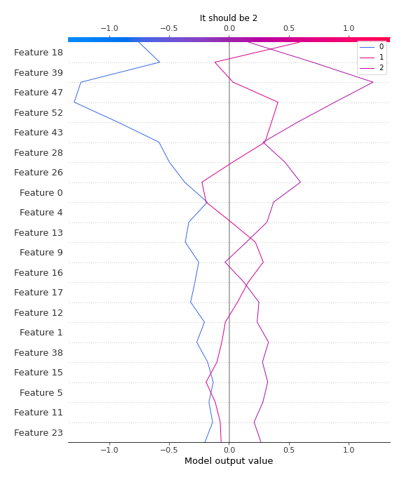
### Best decisions for selected sample 1 (Fold 1)

### Best decisions for selected sample 2 (Fold 1)
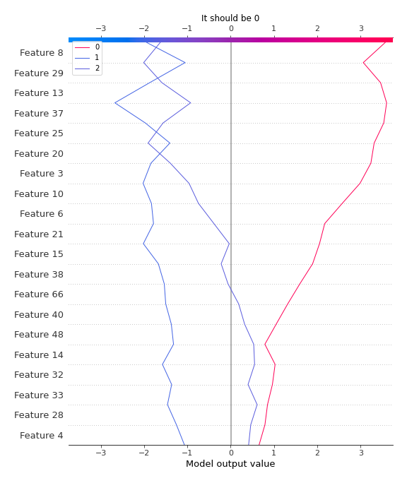
### Best decisions for selected sample 3 (Fold 1)
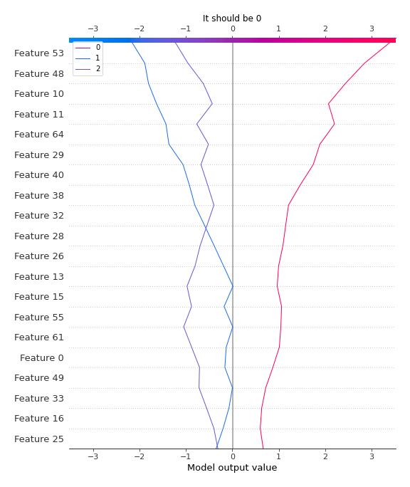
### Best decisions for selected sample 4 (Fold 1)
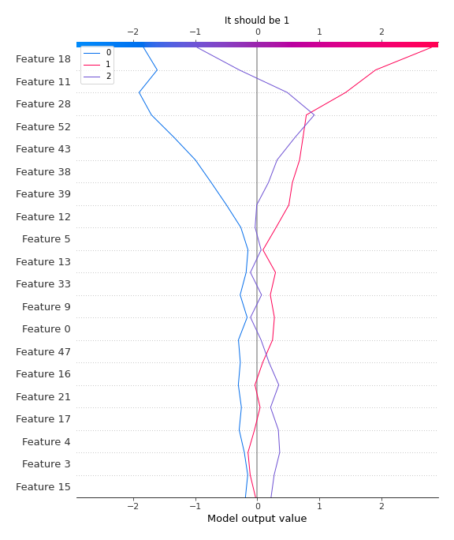

[<< Go back](../README.md)
