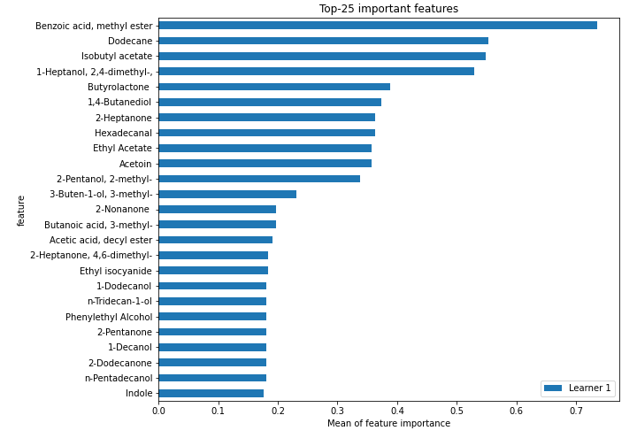

# Summary of 5_Default_NearestNeighbors

[<< Go back](../README.md)

## k-Nearest Neighbors (Nearest Neighbors)
- **n_jobs**: -1
- **n_neighbors**: 5
- **weights**: uniform
- **num_class**: 3
- **explain_level**: 2

## Validation
 - **validation_type**: split
 - **train_ratio**: 0.75
 - **shuffle**: True
 - **stratify**: True

## Optimized metric
logloss

## Training time

4.1 seconds

### Metric details
|           |    0 |        1 |        2 |   accuracy |   macro avg |   weighted avg |   logloss |
|:----------|-----:|---------:|---------:|-----------:|------------:|---------------:|----------:|
| precision | 1    | 0.571429 | 0.666667 |     0.6875 |    0.746032 |       0.741071 |   1.44855 |
| recall    | 0.6  | 0.8      | 0.666667 |     0.6875 |    0.688889 |       0.6875   |   1.44855 |
| f1-score  | 0.75 | 0.666667 | 0.666667 |     0.6875 |    0.694444 |       0.692708 |   1.44855 |
| support   | 5    | 5        | 6        |     0.6875 |   16        |      16        |   1.44855 |

## Confusion matrix
|              |   Predicted as 0 |   Predicted as 1 |   Predicted as 2 |
|:-------------|-----------------:|-----------------:|-----------------:|
| Labeled as 0 |                3 |                1 |                1 |
| Labeled as 1 |                0 |                4 |                1 |
| Labeled as 2 |                0 |                2 |                4 |

## Learning curves

## Permutation-based Importance

## Confusion Matrix

## Normalized Confusion Matrix

## ROC Curve

## Precision Recall Curve

[<< Go back](../README.md)
