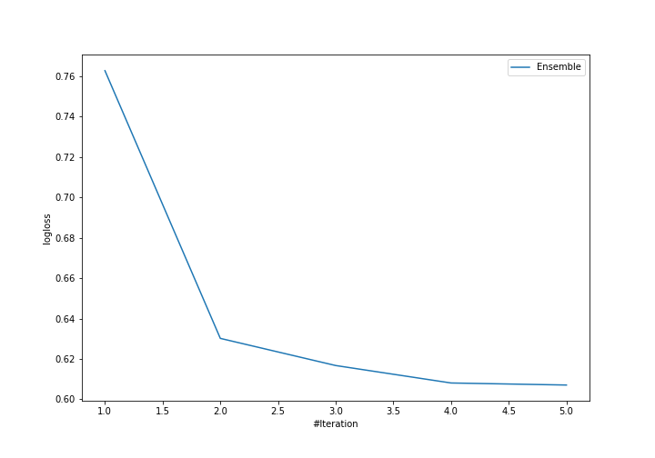
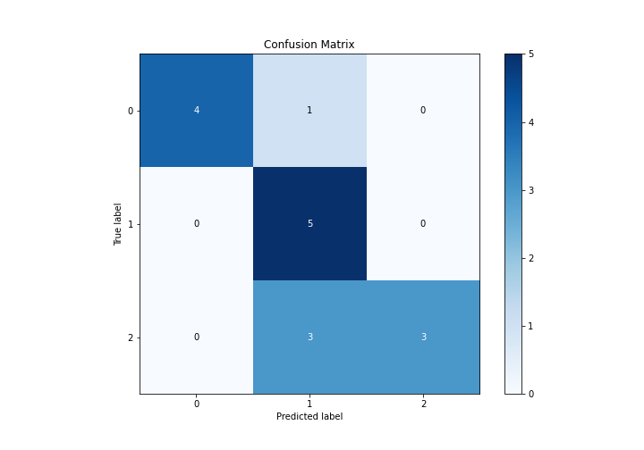
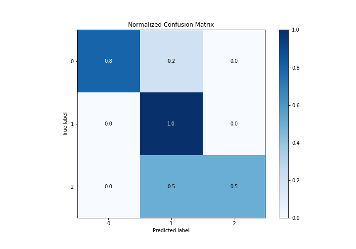
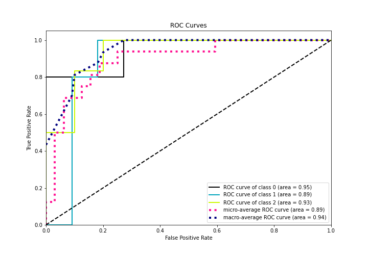
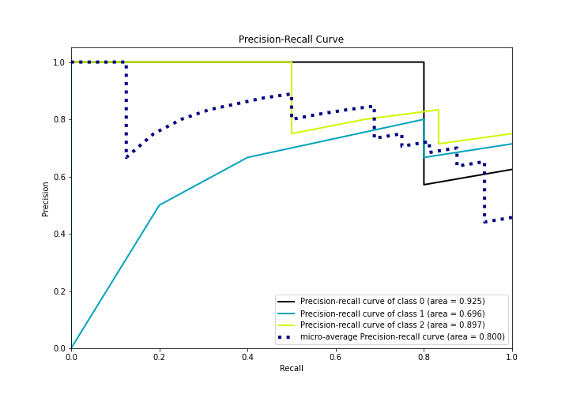

# Summary of Ensemble

[<< Go back](../README.md)

## Ensemble structure
| Model                      |   Weight |
|:---------------------------|---------:|
| 2_Linear                   |        3 |
| 3_Default_Xgboost          |        1 |
| 5_Default_NearestNeighbors |        1 |

### Metric details
|           |        0 |        1 |        2 |   accuracy |   macro avg |   weighted avg |   logloss |
|:----------|---------:|---------:|---------:|-----------:|------------:|---------------:|----------:|
| precision | 1        | 0.555556 | 1        |       0.75 |    0.851852 |       0.861111 |  0.607099 |
| recall    | 0.8      | 1        | 0.5      |       0.75 |    0.766667 |       0.75     |  0.607099 |
| f1-score  | 0.888889 | 0.714286 | 0.666667 |       0.75 |    0.756614 |       0.750992 |  0.607099 |
| support   | 5        | 5        | 6        |       0.75 |   16        |      16        |  0.607099 |

## Confusion matrix
|              |   Predicted as 0 |   Predicted as 1 |   Predicted as 2 |
|:-------------|-----------------:|-----------------:|-----------------:|
| Labeled as 0 |                4 |                1 |                0 |
| Labeled as 1 |                0 |                5 |                0 |
| Labeled as 2 |                0 |                3 |                3 |

## Learning curves

## Confusion Matrix

## Normalized Confusion Matrix

## ROC Curve

## Precision Recall Curve

[<< Go back](../README.md)
