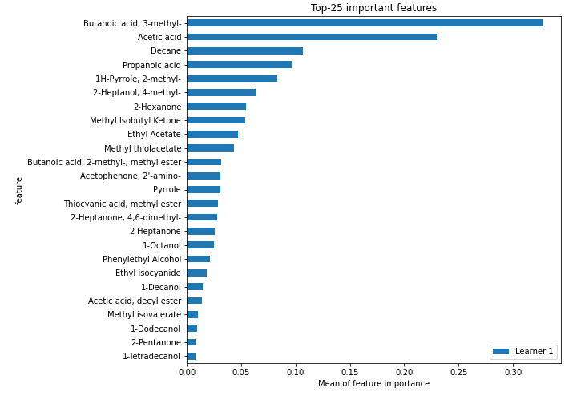

# Summary of 2_Linear

[<< Go back](../README.md)

## Logistic Regression (Linear)
- **n_jobs**: -1
- **num_class**: 3
- **explain_level**: 2

## Validation
 - **validation_type**: split
 - **train_ratio**: 0.75
 - **shuffle**: True
 - **stratify**: True

## Optimized metric
logloss

## Training time

12.4 seconds

### Metric details
|           |        0 |        1 |        2 |   accuracy |   macro avg |   weighted avg |   logloss |
|:----------|---------:|---------:|---------:|-----------:|------------:|---------------:|----------:|
| precision | 0.714286 | 1        | 0.75     |       0.75 |    0.821429 |       0.816964 |  0.615686 |
| recall    | 1        | 0.2      | 1        |       0.75 |    0.733333 |       0.75     |  0.615686 |
| f1-score  | 0.833333 | 0.333333 | 0.857143 |       0.75 |    0.674603 |       0.686012 |  0.615686 |
| support   | 5        | 5        | 6        |       0.75 |   16        |      16        |  0.615686 |

## Confusion matrix
|              |   Predicted as 0 |   Predicted as 1 |   Predicted as 2 |
|:-------------|-----------------:|-----------------:|-----------------:|
| Labeled as 0 |                5 |                0 |                0 |
| Labeled as 1 |                2 |                1 |                2 |
| Labeled as 2 |                0 |                0 |                6 |

## Learning curves

## Coefficients

### Coefficients learner #1
|                                               |          0 |           1 |           2 |
|:----------------------------------------------|-----------:|------------:|------------:|
| intercept                                     | -0.30492   | -0.069631   |  0.374551   |
| Ethyl Acetate                                 | -0.217956  | -0.181799   |  0.399755   |
| Ethanol                                       | -0.168624  |  0.112221   |  0.0564032  |
| Propanoic acid, ethyl ester                   | -0.0366545 |  0.0892003  | -0.0525458  |
| 2-Pentanone                                   |  0.0494204 | -0.00423707 | -0.0451833  |
| Decane                                        |  0.0642129 | -0.392278   |  0.328066   |
| Methyl Isobutyl Ketone                        |  0.115614  | -0.381626   |  0.266012   |
| Amylene hydrate                               |  0.0627185 | -0.152524   |  0.0898055  |
| Butanoic acid, 2-methyl-, methyl ester        |  0.16002   | -0.104523   | -0.0554971  |
| Isobutyl acetate                              |  0.087568  |  0.0223689  | -0.109937   |
| Methyl isovalerate                            |  0.148399  |  0.118436   | -0.266835   |
| 1-Propanol                                    |  0.138935  | -0.0402384  | -0.0986964  |
| Methyl thiolacetate                           |  0.0614649 |  0.26974    | -0.331205   |
| Butanoic acid, 2-methyl-, ethyl ester         | -0.168218  |  0.31233    | -0.144113   |
| 2-Hexanone                                    |  0.159869  |  0.11494    | -0.274809   |
| Ethyl isocyanide                              | -0.0531657 |  0.250751   | -0.197586   |
| 1-Propanol, 2-methyl-                         | -0.0167978 |  0.0501029  | -0.033305   |
| 2-Pentanol, 2-methyl-                         | -0.0591382 | -0.0286529  |  0.0877911  |
| 2-Pentanol                                    | -0.0214207 | -0.0317587  |  0.0531795  |
| 1-Butanol, 3-methyl-, acetate                 | -0.120841  |  0.108801   |  0.0120406  |
| 1 - Undecene                                  | -0.0863923 |  0.121142   | -0.0347501  |
| 1-Butanol                                     | -0.067579  |  0.256454   | -0.188875   |
| 2-Heptanone                                   |  0.0811052 | -0.0649302  | -0.016175   |
| Dodecane                                      |  0.265825  | -0.212683   | -0.053142   |
| 1-Butanol, 3-methyl-                          | -0.0359971 |  0.0635332  | -0.0275361  |
| S-Methyl 3-methylbutanethioate                | -0.0859832 | -0.00402014 |  0.0900033  |
| 2-Heptanone, 4,6-dimethyl-                    |  0.0813516 | -0.0923366  |  0.0109849  |
| 3-Buten-1-ol, 3-methyl-                       | -0.266016  |  0.249715   |  0.0163008  |
| Thiocyanic acid, methyl ester                 |  0.0681534 | -0.0928887  |  0.0247352  |
| Acetoin                                       | -0.204191  |  0.597135   | -0.392944   |
| 1-Pentanol, 2-methyl-                         |  0.0484999 |  0.00813488 | -0.0566348  |
| Butanoic acid, 3-methyl-, 2-methylbutyl ester | -0.178697  |  0.0553315  |  0.123365   |
| 2-Heptanol, 4-methyl-                         | -0.214621  | -0.138236   |  0.352858   |
| 2-Nonanone                                    | -0.17909   |  0.356602   | -0.177512   |
| Acetic acid                                   | -0.122075  | -0.22028    |  0.342355   |
| 2-Nonanol                                     | -0.178626  |  0.112323   |  0.0663033  |
| Pyrrole                                       | -0.0576052 |  0.0171109  |  0.0404943  |
| 1H-Pyrrole, 2-methyl-                         | -0.286238  |  0.107527   |  0.178711   |
| 1-Heptanol, 2,4-dimethyl-,                    | -0.0225169 | -0.0124541  |  0.034971   |
| Propanoic acid                                |  0.210494  |  0.00340579 | -0.2139     |
| Propanoic acid, 2-methyl-                     |  0.118973  | -0.0129772  | -0.105996   |
| 1-Octanol                                     | -0.140686  |  0.190335   | -0.0496495  |
| 2-Undecanone                                  | -0.150917  |  0.327812   | -0.176894   |
| Benzoic acid, methyl ester                    | -0.171188  | -0.022972   |  0.19416    |
| Butyrolactone                                 |  0.415859  | -0.0523288  | -0.36353    |
| Decanoic acid, ethyl ester                    | -0.0567947 |  0.026865   |  0.0299297  |
| Acetic acid, decyl ester                      | -0.0655071 |  0.177552   | -0.112045   |
| 2-Undecanol                                   | -0.145486  |  0.0161956  |  0.12929    |
| Butanoic acid, 3-methyl-                      |  0.0541427 | -0.340523   |  0.286381   |
| 2-Dodecanone                                  |  0.238321  | -0.0458372  | -0.192484   |
| 1-Decanol                                     | -0.0975904 |  0.179701   | -0.0821106  |
| 2-Tridecanone                                 |  0.0921369 | -0.00453328 | -0.0876036  |
| Dodecanoic acid, ethyl ester                  | -0.0590315 |  0.0387066  |  0.020325   |
| 1,4-Butanediol                                |  0.416035  | -0.052226   | -0.363809   |
| Phenylethyl Alcohol                           | -0.182117  |  0.129229   |  0.0528877  |
| Acetophenone, 2'-amino-                       | -0.0794327 | -0.0931137  |  0.172546   |
| 2-Tridecanol                                  | -0.0184486 |  0.0680601  | -0.0496115  |
| Tetradecanal                                  | -0.0269715 |  0.0910363  | -0.0640649  |
| 1-Dodecanol                                   | -0.0871382 |  0.0654108  |  0.0217274  |
| Methyl tetradecanoate                         | -0.0344462 |  0.0593482  | -0.024902   |
| 2-Pentadecanone                               |  0.0725082 |  0.00711763 | -0.0796258  |
| Tetradecanoic acid, ethyl ester               | -0.028288  |  0.10086    | -0.0725722  |
| Hexadecanal                                   | -0.017649  |  0.107644   | -0.0899949  |
| n-Tridecan-1-ol                               |  0.244327  | -0.0432224  | -0.201105   |
| 1-Tetradecanol                                | -0.0479098 |  0.0577681  | -0.00985829 |
| n-Pentadecanol                                |  0.0766996 | -0.0215467  | -0.055153   |
| 1-Hexadecanol                                 | -0.054152  |  0.0576426  | -0.00349063 |
| Indole                                        | -0.149638  |  0.0554453  |  0.094193   |

## Permutation-based Importance

## Confusion Matrix

## Normalized Confusion Matrix

## ROC Curve

## Precision Recall Curve

## SHAP Importance

## SHAP Dependence plots

### Dependence 0 (Fold 1)

### Dependence 1 (Fold 1)

### Dependence 2 (Fold 1)

## SHAP Decision plots

### Worst decisions for selected sample 1 (Fold 1)

### Worst decisions for selected sample 2 (Fold 1)

### Worst decisions for selected sample 3 (Fold 1)

### Worst decisions for selected sample 4 (Fold 1)

### Best decisions for selected sample 1 (Fold 1)

### Best decisions for selected sample 2 (Fold 1)

### Best decisions for selected sample 3 (Fold 1)

### Best decisions for selected sample 4 (Fold 1)

[<< Go back](../README.md)
