# Summary of 3_Default_Xgboost

[<< Go back](../README.md)

## Extreme Gradient Boosting (Xgboost)
- **n_jobs**: -1
- **objective**: multi:softprob
- **eta**: 0.075
- **max_depth**: 6
- **min_child_weight**: 1
- **subsample**: 1.0
- **colsample_bytree**: 1.0
- **eval_metric**: mlogloss
- **num_class**: 3
- **explain_level**: 2

## Validation
 - **validation_type**: split
 - **train_ratio**: 0.75
 - **shuffle**: True
 - **stratify**: True

## Optimized metric
logloss

## Training time

12.1 seconds

### Metric details
|           |        0 |        1 |        2 |   accuracy |   macro avg |   weighted avg |   logloss |
|:----------|---------:|---------:|---------:|-----------:|------------:|---------------:|----------:|
| precision | 0.5      | 0.333333 | 1        |      0.625 |    0.611111 |       0.635417 |  0.930856 |
| recall    | 0.8      | 0.2      | 0.833333 |      0.625 |    0.611111 |       0.625    |  0.930856 |
| f1-score  | 0.615385 | 0.25     | 0.909091 |      0.625 |    0.591492 |       0.611342 |  0.930856 |
| support   | 5        | 5        | 6        |      0.625 |   16        |      16        |  0.930856 |

## Confusion matrix
|              |   Predicted as 0 |   Predicted as 1 |   Predicted as 2 |
|:-------------|-----------------:|-----------------:|-----------------:|
| Labeled as 0 |                4 |                1 |                0 |
| Labeled as 1 |                4 |                1 |                0 |
| Labeled as 2 |                0 |                1 |                5 |

## Learning curves
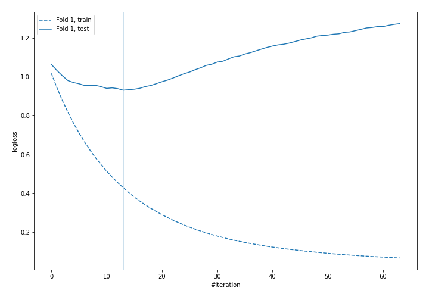

## Permutation-based Importance
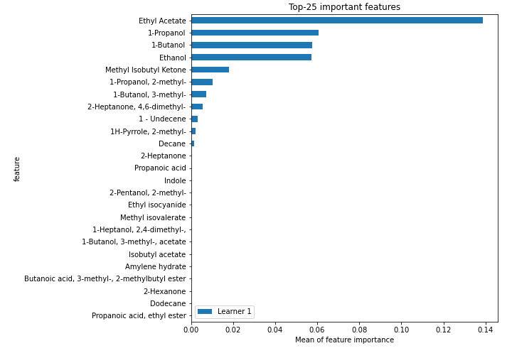
## Confusion Matrix

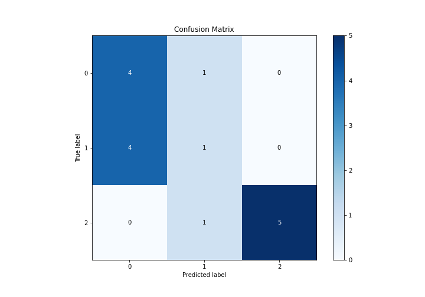

## Normalized Confusion Matrix

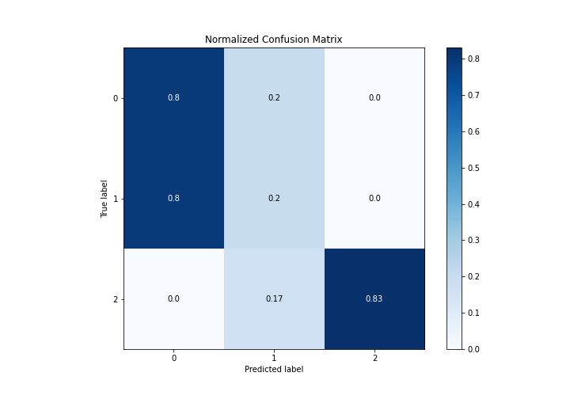

## ROC Curve

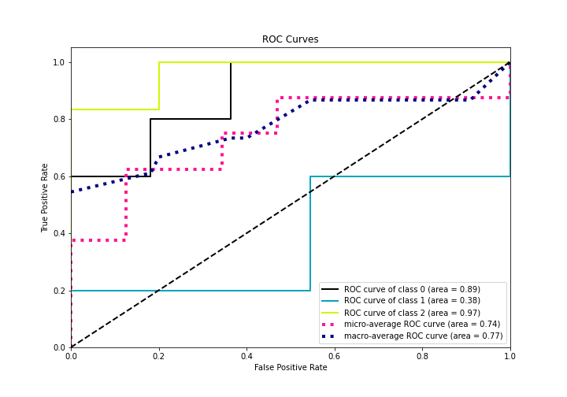

## Precision Recall Curve

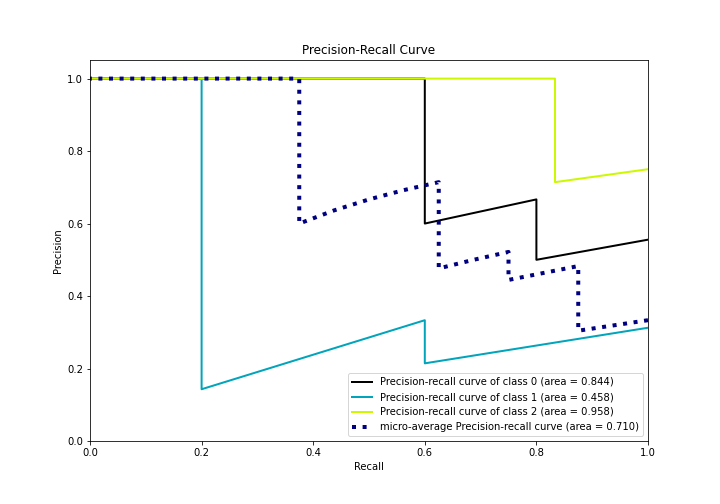

## SHAP Importance
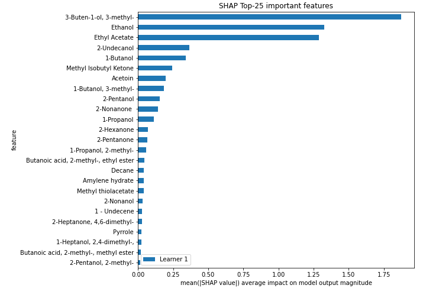

## SHAP Dependence plots

### Dependence 0 (Fold 1)
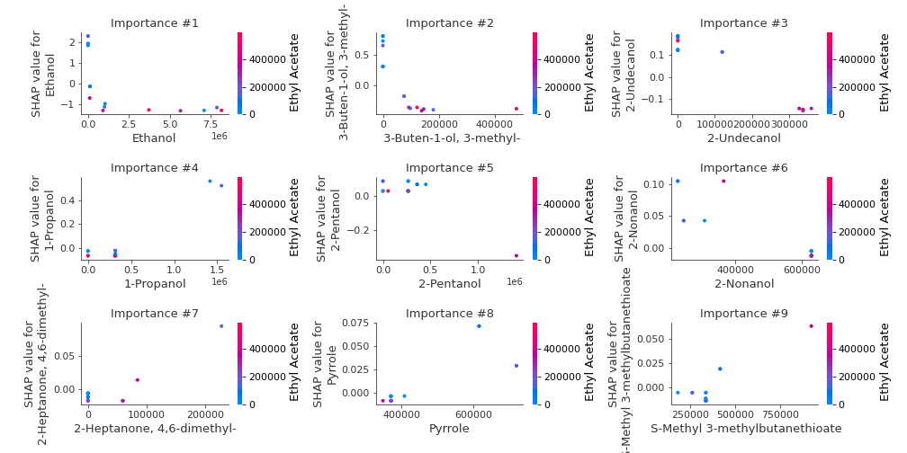
### Dependence 1 (Fold 1)
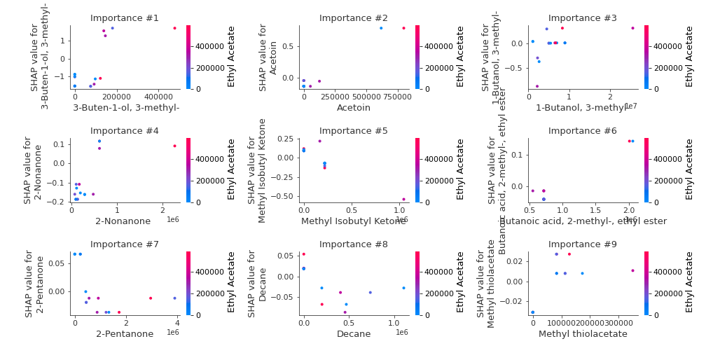
### Dependence 2 (Fold 1)
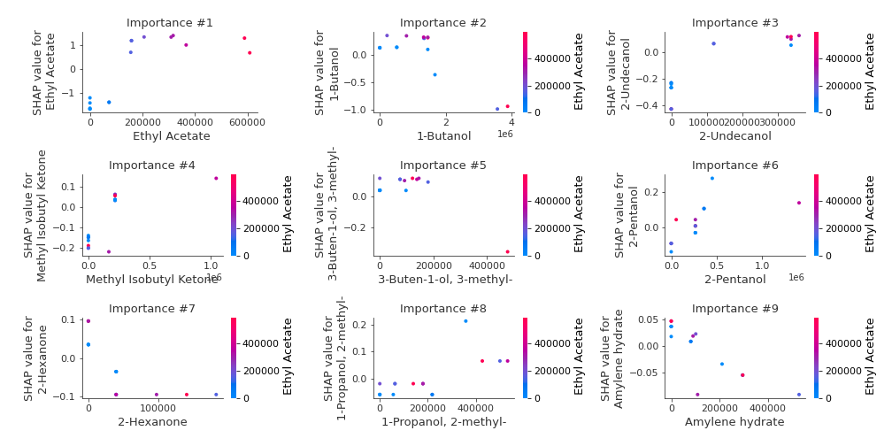

## SHAP Decision plots

### Worst decisions for selected sample 1 (Fold 1)

### Worst decisions for selected sample 2 (Fold 1)

### Worst decisions for selected sample 3 (Fold 1)

### Worst decisions for selected sample 4 (Fold 1)
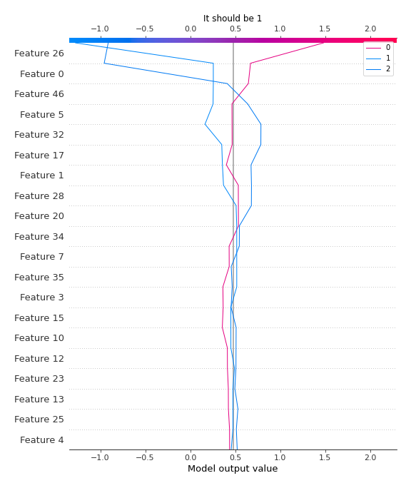
### Best decisions for selected sample 1 (Fold 1)
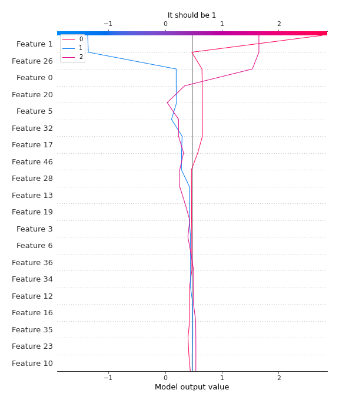
### Best decisions for selected sample 2 (Fold 1)
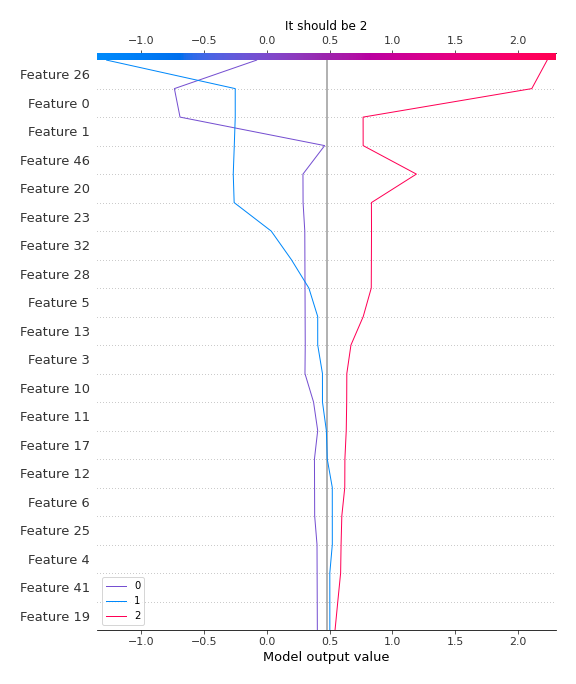
### Best decisions for selected sample 3 (Fold 1)
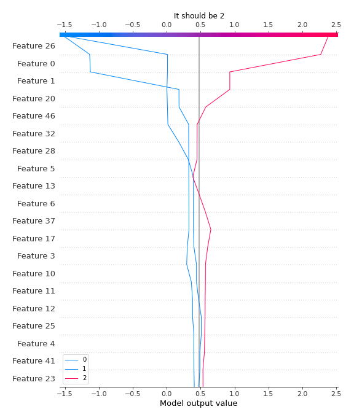
### Best decisions for selected sample 4 (Fold 1)
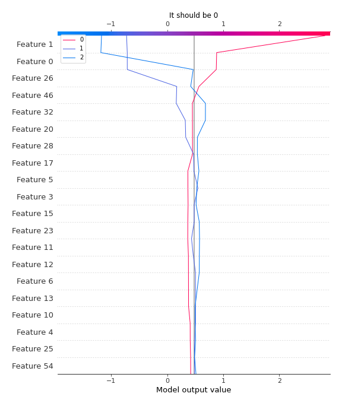

[<< Go back](../README.md)
