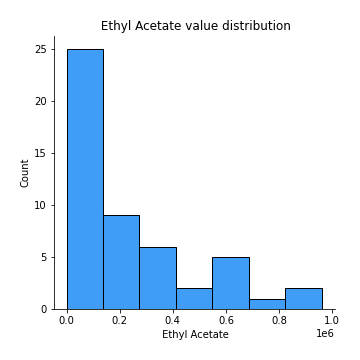
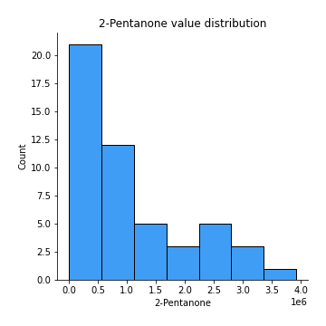
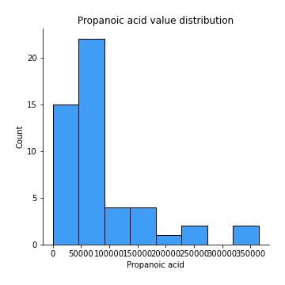
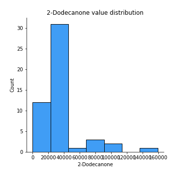

# Exploratory Data Analysis

[<< Go back](../README.md)
## Feature : target
- **Feature type** : discrete
- **Missing** : 0.0%
- **Unique** : 3
- **Count** :50.0
- **Mean** :1.16
- **Std** :0.8171628369185768
- **Min** :0.0
- **25%th Percentile** : 0.25
- **50%th Percentile** : 1.0
- **75%th Percentile** : 2.0
- **Max** :2.0

## Feature :  Ethyl Acetate
- **Feature type** : continous
- **Missing** : 0.0%
- **Unique** : 33
- **Count** :50.0
- **Mean** :223248.35277108435
- **Std** :264120.3314721084
- **Min** :0.0
- **25%th Percentile** : 0.0
- **50%th Percentile** : 142611.0
- **75%th Percentile** : 333744.0
- **Max** :961495.0

## Feature : Ethanol
- **Feature type** : continous
- **Missing** : 0.0%
- **Unique** : 43
- **Count** :50.0
- **Mean** :2269622.78
- **Std** :2518570.2198766354
- **Min** :0.0
- **25%th Percentile** : 140081.75
- **50%th Percentile** : 1170306.0
- **75%th Percentile** : 3643486.75
- **Max** :8155560.0

## Feature : Propanoic acid, ethyl ester
- **Feature type** : continous
- **Missing** : 0.0%
- **Unique** : 3
- **Count** :50.0
- **Mean** :14662.652592592598
- **Std** :24772.052889400322
- **Min** :0.0
- **25%th Percentile** : 0.0
- **50%th Percentile** : 17989.40740740741
- **75%th Percentile** : 17989.40740740741
- **Max** :175461.0

## Feature : 2-Pentanone
- **Feature type** : continous
- **Missing** : 0.0%
- **Unique** : 47
- **Count** :50.0
- **Mean** :1067727.48
- **Std** :949453.7946909852
- **Min** :0.0
- **25%th Percentile** : 453800.5
- **50%th Percentile** : 607125.5
- **75%th Percentile** : 1501276.5
- **Max** :3917970.0

## Feature : Decane
- **Feature type** : continous
- **Missing** : 0.0%
- **Unique** : 27
- **Count** :50.0
- **Mean** :241781.3
- **Std** :307114.12505100924
- **Min** :0.0
- **25%th Percentile** : 0.0
- **50%th Percentile** : 33048.5
- **75%th Percentile** : 444910.75
- **Max** :1105838.0

## Feature : Methyl Isobutyl Ketone
- **Feature type** : continous
- **Missing** : 0.0%
- **Unique** : 13
- **Count** :50.0
- **Mean** :219746.27333333343
- **Std** :303591.7775082141
- **Min** :0.0
- **25%th Percentile** : 0.0
- **50%th Percentile** : 218195.5614035088
- **75%th Percentile** : 218195.5614035088
- **Max** :1309090.0

## Feature : Amylene hydrate
- **Feature type** : continous
- **Missing** : 0.0%
- **Unique** : 24
- **Count** :50.0
- **Mean** :91325.64
- **Std** :145306.96834025232
- **Min** :0.0
- **25%th Percentile** : 0.0
- **50%th Percentile** : 0.0
- **75%th Percentile** : 134153.25
- **Max** :694251.0

## Feature : Butanoic acid, 2-methyl-, methyl ester
- **Feature type** : continous
- **Missing** : 0.0%
- **Unique** : 5
- **Count** :50.0
- **Mean** :264185.9925925925
- **Std** :263622.96796798095
- **Min** :0.0
- **25%th Percentile** : 287247.7037037037
- **50%th Percentile** : 287247.7037037037
- **75%th Percentile** : 287247.7037037037
- **Max** :1437190.0

## Feature : Isobutyl acetate
- **Feature type** : continous
- **Missing** : 0.0%
- **Unique** : 10
- **Count** :50.0
- **Mean** :39469.68518518516
- **Std** :66838.86661781218
- **Min** :0.0
- **25%th Percentile** : 0.0
- **50%th Percentile** : 0.0
- **75%th Percentile** : 46016.2037037037
- **Max** :381024.0

## Feature : Methyl isovalerate
- **Feature type** : continous
- **Missing** : 0.0%
- **Unique** : 8
- **Count** :50.0
- **Mean** :85447.35333333332
- **Std** :129890.46860462971
- **Min** :0.0
- **25%th Percentile** : 0.0
- **50%th Percentile** : 97276.9298245614
- **75%th Percentile** : 97276.9298245614
- **Max** :608115.0

## Feature : 1-Propanol
- **Feature type** : continous
- **Missing** : 0.0%
- **Unique** : 10
- **Count** :50.0
- **Mean** :321959.7577777777
- **Std** :351643.2483885321
- **Min** :0.0
- **25%th Percentile** : 157180.75
- **50%th Percentile** : 317293.22222222225
- **75%th Percentile** : 317293.22222222225
- **Max** :1682575.0

## Feature : Methyl thiolacetate
- **Feature type** : continous
- **Missing** : 0.0%
- **Unique** : 34
- **Count** :50.0
- **Mean** :100900.86
- **Std** :102833.68235978851
- **Min** :0.0
- **25%th Percentile** : 0.0
- **50%th Percentile** : 83333.0
- **75%th Percentile** : 168740.5
- **Max** :352289.0

## Feature : Butanoic acid, 2-methyl-, ethyl ester
- **Feature type** : continous
- **Missing** : 0.0%
- **Unique** : 17
- **Count** :50.0
- **Mean** :817916.1746666665
- **Std** :401221.92792665533
- **Min** :0.0
- **25%th Percentile** : 713709.4333333333
- **50%th Percentile** : 713709.4333333333
- **75%th Percentile** : 713709.4333333333
- **Max** :2198502.0

## Feature : 2-Hexanone
- **Feature type** : continous
- **Missing** : 0.0%
- **Unique** : 13
- **Count** :50.0
- **Mean** :38689.18421052631
- **Std** :50253.96202970838
- **Min** :0.0
- **25%th Percentile** : 0.0
- **50%th Percentile** : 39797.61403508772
- **75%th Percentile** : 39797.61403508772
- **Max** :183084.0

## Feature : Ethyl isocyanide
- **Feature type** : continous
- **Missing** : 0.0%
- **Unique** : 6
- **Count** :50.0
- **Mean** :17993.14
- **Std** :18988.0174589349
- **Min** :0.0
- **25%th Percentile** : 0.0
- **50%th Percentile** : 19984.0
- **75%th Percentile** : 19984.0
- **Max** :105656.0

## Feature : 1-Propanol, 2-methyl-
- **Feature type** : continous
- **Missing** : 0.0%
- **Unique** : 42
- **Count** :50.0
- **Mean** :214212.48
- **Std** :177141.23458637545
- **Min** :0.0
- **25%th Percentile** : 57414.75
- **50%th Percentile** : 193059.0
- **75%th Percentile** : 346065.0
- **Max** :613288.0

## Feature : 2-Pentanol, 2-methyl-
- **Feature type** : continous
- **Missing** : 0.0%
- **Unique** : 20
- **Count** :50.0
- **Mean** :34194.81325301205
- **Std** :50916.430755988426
- **Min** :0.0
- **25%th Percentile** : 0.0
- **50%th Percentile** : 0.0
- **75%th Percentile** : 63562.25
- **Max** :197683.0

## Feature : 2-Pentanol
- **Feature type** : continous
- **Missing** : 0.0%
- **Unique** : 16
- **Count** :50.0
- **Mean** :281735.1666666665
- **Std** :426732.92941427516
- **Min** :0.0
- **25%th Percentile** : 0.0
- **50%th Percentile** : 265630.649122807
- **75%th Percentile** : 265630.649122807
- **Max** :2282603.0

## Feature : 1-Butanol, 3-methyl-, acetate
- **Feature type** : continous
- **Missing** : 0.0%
- **Unique** : 7
- **Count** :50.0
- **Mean** :24481.535999999986
- **Std** :32892.44193657447
- **Min** :0.0
- **25%th Percentile** : 19126.2
- **50%th Percentile** : 19126.2
- **75%th Percentile** : 19126.2
- **Max** :156927.0

## Feature : 1 - Undecene
- **Feature type** : continous
- **Missing** : 0.0%
- **Unique** : 16
- **Count** :50.0
- **Mean** :5369591.012592591
- **Std** :1975954.6987178533
- **Min** :0.0
- **25%th Percentile** : 5627687.703703703
- **50%th Percentile** : 5627687.703703703
- **75%th Percentile** : 5627687.703703703
- **Max** :10477684.0

## Feature : 1-Butanol
- **Feature type** : continous
- **Missing** : 0.0%
- **Unique** : 30
- **Count** :50.0
- **Mean** :1353476.8933333328
- **Std** :1018856.3368103188
- **Min** :0.0
- **25%th Percentile** : 518589.0
- **50%th Percentile** : 1456599.6666666667
- **75%th Percentile** : 1456599.6666666667
- **Max** :3879386.0

## Feature : 2-Heptanone
- **Feature type** : continous
- **Missing** : 0.0%
- **Unique** : 28
- **Count** :50.0
- **Mean** :130232.02
- **Std** :195742.09251549988
- **Min** :0.0
- **25%th Percentile** : 0.0
- **50%th Percentile** : 65261.0
- **75%th Percentile** : 185165.75
- **Max** :1022779.0

## Feature : Dodecane
- **Feature type** : continous
- **Missing** : 0.0%
- **Unique** : 5
- **Count** :50.0
- **Mean** :14604.246666666671
- **Std** :41529.72231956509
- **Min** :0.0
- **25%th Percentile** : 0.0
- **50%th Percentile** : 0.0
- **75%th Percentile** : 16751.333333333332
- **Max** :265644.0

## Feature : 1-Butanol, 3-methyl-
- **Feature type** : continous
- **Missing** : 0.0%
- **Unique** : 50
- **Count** :50.0
- **Mean** :7140082.3
- **Std** :7502063.496750998
- **Min** :908313.0
- **25%th Percentile** : 2436511.75
- **50%th Percentile** : 5040107.0
- **75%th Percentile** : 8338310.5
- **Max** :37125000.0

## Feature :  S-Methyl 3-methylbutanethioate
- **Feature type** : continous
- **Missing** : 0.0%
- **Unique** : 16
- **Count** :50.0
- **Mean** :358648.5333333335
- **Std** :156021.16314416172
- **Min** :89553.0
- **25%th Percentile** : 334880.3333333333
- **50%th Percentile** : 334880.3333333333
- **75%th Percentile** : 334880.3333333333
- **Max** :1013976.0

## Feature : 2-Heptanone, 4,6-dimethyl-
- **Feature type** : continous
- **Missing** : 0.0%
- **Unique** : 14
- **Count** :50.0
- **Mean** :46911.428148148145
- **Std** :53722.11062787626
- **Min** :0.0
- **25%th Percentile** : 0.0
- **50%th Percentile** : 59419.96296296296
- **75%th Percentile** : 59419.96296296296
- **Max** :228006.0

## Feature :  3-Buten-1-ol, 3-methyl-
- **Feature type** : continous
- **Missing** : 0.0%
- **Unique** : 37
- **Count** :50.0
- **Mean** :145896.78
- **Std** :164202.52635945697
- **Min** :0.0
- **25%th Percentile** : 0.0
- **50%th Percentile** : 96212.5
- **75%th Percentile** : 158281.5
- **Max** :704490.0

## Feature : Thiocyanic acid, methyl ester
- **Feature type** : continous
- **Missing** : 0.0%
- **Unique** : 5
- **Count** :50.0
- **Mean** :51143.05555555553
- **Std** :43158.757948246144
- **Min** :0.0
- **25%th Percentile** : 58038.22222222222
- **50%th Percentile** : 58038.22222222222
- **75%th Percentile** : 58038.22222222222
- **Max** :254571.0

## Feature : Acetoin
- **Feature type** : continous
- **Missing** : 0.0%
- **Unique** : 20
- **Count** :50.0
- **Mean** :194314.1
- **Std** :390431.67021441564
- **Min** :0.0
- **25%th Percentile** : 0.0
- **50%th Percentile** : 0.0
- **75%th Percentile** : 199281.75
- **Max** :2056879.0

## Feature : 1-Pentanol, 2-methyl-
- **Feature type** : continous
- **Missing** : 0.0%
- **Unique** : 10
- **Count** :50.0
- **Mean** :43953.110370370385
- **Std** :30601.947406617397
- **Min** :0.0
- **25%th Percentile** : 48789.62962962963
- **50%th Percentile** : 48789.62962962963
- **75%th Percentile** : 48789.62962962963
- **Max** :163793.0

## Feature : Butanoic acid, 3-methyl-, 2-methylbutyl ester
- **Feature type** : continous
- **Missing** : 0.0%
- **Unique** : 11
- **Count** :50.0
- **Mean** :114360.02222222228
- **Std** :90252.77323955247
- **Min** :0.0
- **25%th Percentile** : 103049.88888888888
- **50%th Percentile** : 103049.88888888888
- **75%th Percentile** : 103049.88888888888
- **Max** :590669.0

## Feature : 2-Heptanol, 4-methyl-
- **Feature type** : continous
- **Missing** : 0.0%
- **Unique** : 7
- **Count** :50.0
- **Mean** :51937.66296296297
- **Std** :55695.85419073911
- **Min** :0.0
- **25%th Percentile** : 45394.51851851852
- **50%th Percentile** : 45394.51851851852
- **75%th Percentile** : 45394.51851851852
- **Max** :254736.0

## Feature : 2-Nonanone 
- **Feature type** : continous
- **Missing** : 0.0%
- **Unique** : 35
- **Count** :50.0
- **Mean** :595586.4133333334
- **Std** :553235.0034838421
- **Min** :75932.0
- **25%th Percentile** : 252504.5
- **50%th Percentile** : 589197.5
- **75%th Percentile** : 618535.1666666666
- **Max** :2654044.0

## Feature : Acetic acid
- **Feature type** : continous
- **Missing** : 0.0%
- **Unique** : 36
- **Count** :50.0
- **Mean** :3848167.861052632
- **Std** :4315945.565001228
- **Min** :125680.0
- **25%th Percentile** : 1265311.75
- **50%th Percentile** : 3241608.0701754387
- **75%th Percentile** : 3241608.0701754387
- **Max** :21176351.0

## Feature : 2-Nonanol
- **Feature type** : continous
- **Missing** : 0.0%
- **Unique** : 16
- **Count** :50.0
- **Mean** :639401.2918518521
- **Std** :411757.9454457555
- **Min** :0.0
- **25%th Percentile** : 628854.074074074
- **50%th Percentile** : 628854.074074074
- **75%th Percentile** : 628854.074074074
- **Max** :2526340.0

## Feature : Pyrrole
- **Feature type** : continous
- **Missing** : 0.0%
- **Unique** : 16
- **Count** :50.0
- **Mean** :377259.28074074053
- **Std** :86695.83320620657
- **Min** :103804.0
- **25%th Percentile** : 371058.6296296296
- **50%th Percentile** : 371058.6296296296
- **75%th Percentile** : 371058.6296296296
- **Max** :720171.0

## Feature : 1H-Pyrrole, 2-methyl-
- **Feature type** : continous
- **Missing** : 0.0%
- **Unique** : 14
- **Count** :50.0
- **Mean** :352149.0785185186
- **Std** :119856.18498810727
- **Min** :0.0
- **25%th Percentile** : 333395.7407407408
- **50%th Percentile** : 333395.7407407408
- **75%th Percentile** : 333395.7407407408
- **Max** :621874.0

## Feature : 1-Heptanol, 2,4-dimethyl-,
- **Feature type** : continous
- **Missing** : 0.0%
- **Unique** : 17
- **Count** :50.0
- **Mean** :48327.710370370354
- **Std** :55002.2828512524
- **Min** :0.0
- **25%th Percentile** : 0.0
- **50%th Percentile** : 49898.40740740741
- **75%th Percentile** : 56768.0
- **Max** :274686.0

## Feature : Propanoic acid
- **Feature type** : continous
- **Missing** : 0.0%
- **Unique** : 21
- **Count** :50.0
- **Mean** :76032.50285714284
- **Std** :86181.06566462602
- **Min** :0.0
- **25%th Percentile** : 0.0
- **50%th Percentile** : 57874.07142857143
- **75%th Percentile** : 91484.5
- **Max** :364754.0

## Feature : Propanoic acid, 2-methyl-
- **Feature type** : continous
- **Missing** : 0.0%
- **Unique** : 3
- **Count** :50.0
- **Mean** :15162.98799999999
- **Std** :12839.722628077887
- **Min** :0.0
- **25%th Percentile** : 0.0
- **50%th Percentile** : 20034.1
- **75%th Percentile** : 20034.1
- **Max** :76990.0

## Feature : 1-Octanol
- **Feature type** : continous
- **Missing** : 0.0%
- **Unique** : 18
- **Count** :50.0
- **Mean** :637581.8022222217
- **Std** :377373.97646444524
- **Min** :0.0
- **25%th Percentile** : 584858.6944444445
- **50%th Percentile** : 664654.7777777778
- **75%th Percentile** : 664654.7777777778
- **Max** :1910713.0

## Feature : 2-Undecanone
- **Feature type** : continous
- **Missing** : 0.0%
- **Unique** : 34
- **Count** :50.0
- **Mean** :530678.1703703703
- **Std** :359015.0549130026
- **Min** :0.0
- **25%th Percentile** : 288909.75
- **50%th Percentile** : 590668.9537037037
- **75%th Percentile** : 590926.9074074074
- **Max** :1644906.0

## Feature : Benzoic acid, methyl ester
- **Feature type** : continous
- **Missing** : 0.0%
- **Unique** : 22
- **Count** :50.0
- **Mean** :140785.46222222215
- **Std** :134177.07673576992
- **Min** :0.0
- **25%th Percentile** : 0.0
- **50%th Percentile** : 134161.44444444444
- **75%th Percentile** : 135929.61111111112
- **Max** :556478.0

## Feature : Butyrolactone 
- **Feature type** : continous
- **Missing** : 0.0%
- **Unique** : 3
- **Count** :50.0
- **Mean** :32754.178666666667
- **Std** :26340.52846971199
- **Min** :0.0
- **25%th Percentile** : 0.0
- **50%th Percentile** : 43750.23333333333
- **75%th Percentile** : 43750.23333333333
- **Max** :150201.0

## Feature :  Decanoic acid, ethyl ester
- **Feature type** : continous
- **Missing** : 0.0%
- **Unique** : 6
- **Count** :50.0
- **Mean** :36831.89555555558
- **Std** :52942.384324960265
- **Min** :0.0
- **25%th Percentile** : 0.0
- **50%th Percentile** : 37525.444444444445
- **75%th Percentile** : 37525.444444444445
- **Max** :344949.0

## Feature : Acetic acid, decyl ester
- **Feature type** : continous
- **Missing** : 0.0%
- **Unique** : 6
- **Count** :50.0
- **Mean** :36846.02888888887
- **Std** :45955.59278218058
- **Min** :0.0
- **25%th Percentile** : 0.0
- **50%th Percentile** : 37478.11111111111
- **75%th Percentile** : 37478.11111111111
- **Max** :261433.0

## Feature : 2-Undecanol
- **Feature type** : continous
- **Missing** : 0.0%
- **Unique** : 20
- **Count** :50.0
- **Mean** :336669.234074074
- **Std** :571836.7072761054
- **Min** :0.0
- **25%th Percentile** : 0.0
- **50%th Percentile** : 281559.5
- **75%th Percentile** : 338121.48148148146
- **Max** :3287479.0

## Feature : Butanoic acid, 3-methyl-
- **Feature type** : continous
- **Missing** : 0.0%
- **Unique** : 17
- **Count** :50.0
- **Mean** :2507541.2026666654
- **Std** :790842.7422471911
- **Min** :1607769.0
- **25%th Percentile** : 2403459.033333333
- **50%th Percentile** : 2403459.033333333
- **75%th Percentile** : 2403459.033333333
- **Max** :5887513.0

## Feature : 2-Dodecanone
- **Feature type** : continous
- **Missing** : 0.0%
- **Unique** : 9
- **Count** :50.0
- **Mean** :32034.73851851854
- **Std** :29836.044571765622
- **Min** :0.0
- **25%th Percentile** : 30908.48148148148
- **50%th Percentile** : 30908.48148148148
- **75%th Percentile** : 30908.48148148148
- **Max** :159402.0

## Feature : 1-Decanol
- **Feature type** : continous
- **Missing** : 0.0%
- **Unique** : 20
- **Count** :50.0
- **Mean** :1585427.763703704
- **Std** :1335762.4222377632
- **Min** :0.0
- **25%th Percentile** : 1179050.0
- **50%th Percentile** : 1524509.2962962964
- **75%th Percentile** : 1524509.2962962964
- **Max** :7740141.0

## Feature : 2-Tridecanone
- **Feature type** : continous
- **Missing** : 0.0%
- **Unique** : 20
- **Count** :50.0
- **Mean** :325221.5370370369
- **Std** :154745.650448717
- **Min** :67510.0
- **25%th Percentile** : 314530.962962963
- **50%th Percentile** : 314530.962962963
- **75%th Percentile** : 314530.962962963
- **Max** :975303.0

## Feature :  Dodecanoic acid, ethyl ester
- **Feature type** : continous
- **Missing** : 0.0%
- **Unique** : 5
- **Count** :50.0
- **Mean** :21002.50814814813
- **Std** :30269.12242312115
- **Min** :0.0
- **25%th Percentile** : 0.0
- **50%th Percentile** : 21410.85185185185
- **75%th Percentile** : 21410.85185185185
- **Max** :171353.0

## Feature : 1,4-Butanediol
- **Feature type** : continous
- **Missing** : 0.0%
- **Unique** : 3
- **Count** :50.0
- **Mean** :16017.470666666653
- **Std** :12871.635471828002
- **Min** :0.0
- **25%th Percentile** : 0.0
- **50%th Percentile** : 21398.13333333333
- **75%th Percentile** : 21398.13333333333
- **Max** :73337.0

## Feature : Phenylethyl Alcohol
- **Feature type** : continous
- **Missing** : 0.0%
- **Unique** : 17
- **Count** :50.0
- **Mean** :145405.79037037038
- **Std** :60959.70450078271
- **Min** :0.0
- **25%th Percentile** : 147761.62962962964
- **50%th Percentile** : 147761.62962962964
- **75%th Percentile** : 147761.62962962964
- **Max** :386583.0

## Feature : Acetophenone, 2'-amino-
- **Feature type** : continous
- **Missing** : 0.0%
- **Unique** : 13
- **Count** :50.0
- **Mean** :334516.0740740739
- **Std** :259734.60925866014
- **Min** :0.0
- **25%th Percentile** : 343307.962962963
- **50%th Percentile** : 343307.962962963
- **75%th Percentile** : 343307.962962963
- **Max** :1937240.0

## Feature : 2-Tridecanol
- **Feature type** : continous
- **Missing** : 0.0%
- **Unique** : 11
- **Count** :50.0
- **Mean** :58711.18592592595
- **Std** :49277.10625773388
- **Min** :0.0
- **25%th Percentile** : 56845.07407407407
- **50%th Percentile** : 56845.07407407407
- **75%th Percentile** : 56845.07407407407
- **Max** :231601.0

## Feature : Tetradecanal
- **Feature type** : continous
- **Missing** : 0.0%
- **Unique** : 3
- **Count** :50.0
- **Mean** :7381.66
- **Std** :15516.81081609391
- **Min** :0.0
- **25%th Percentile** : 0.0
- **50%th Percentile** : 8317.0
- **75%th Percentile** : 8317.0
- **Max** :111256.0

## Feature : 1-Dodecanol
- **Feature type** : continous
- **Missing** : 0.0%
- **Unique** : 20
- **Count** :50.0
- **Mean** :2147791.515555557
- **Std** :1449731.973756814
- **Min** :242246.0
- **25%th Percentile** : 1821316.75
- **50%th Percentile** : 2098782.4444444445
- **75%th Percentile** : 2098782.4444444445
- **Max** :8172616.0

## Feature : Methyl tetradecanoate
- **Feature type** : continous
- **Missing** : 0.0%
- **Unique** : 10
- **Count** :50.0
- **Mean** :109180.74666666664
- **Std** :124875.67027344793
- **Min** :0.0
- **25%th Percentile** : 97878.33333333331
- **50%th Percentile** : 97878.33333333331
- **75%th Percentile** : 97878.33333333331
- **Max** :698476.0

## Feature :  2-Pentadecanone
- **Feature type** : continous
- **Missing** : 0.0%
- **Unique** : 15
- **Count** :50.0
- **Mean** :91436.98962962962
- **Std** :63109.30515606179
- **Min** :0.0
- **25%th Percentile** : 85753.37037037036
- **50%th Percentile** : 85753.37037037036
- **75%th Percentile** : 85753.37037037036
- **Max** :382222.0

## Feature : Tetradecanoic acid, ethyl ester
- **Feature type** : continous
- **Missing** : 0.0%
- **Unique** : 4
- **Count** :50.0
- **Mean** :10026.499259259255
- **Std** :18586.685469356256
- **Min** :0.0
- **25%th Percentile** : 0.0
- **50%th Percentile** : 10167.74074074074
- **75%th Percentile** : 10167.74074074074
- **Max** :119785.0

## Feature : Hexadecanal
- **Feature type** : continous
- **Missing** : 0.0%
- **Unique** : 11
- **Count** :50.0
- **Mean** :84525.4696296296
- **Std** :68901.72704011425
- **Min** :0.0
- **25%th Percentile** : 65499.5
- **50%th Percentile** : 94159.37037037036
- **75%th Percentile** : 94159.37037037036
- **Max** :408288.0

## Feature : n-Tridecan-1-ol
- **Feature type** : continous
- **Missing** : 0.0%
- **Unique** : 10
- **Count** :50.0
- **Mean** :88813.71037037039
- **Std** :82483.08100618295
- **Min** :0.0
- **25%th Percentile** : 85581.62962962964
- **50%th Percentile** : 85581.62962962964
- **75%th Percentile** : 85581.62962962964
- **Max** :448151.0

## Feature : 1-Tetradecanol
- **Feature type** : continous
- **Missing** : 0.0%
- **Unique** : 20
- **Count** :50.0
- **Mean** :572074.8237037034
- **Std** :331998.341409065
- **Min** :78672.0
- **25%th Percentile** : 586042.2962962963
- **50%th Percentile** : 586042.2962962963
- **75%th Percentile** : 586042.2962962963
- **Max** :2450605.0

## Feature : n-Pentadecanol
- **Feature type** : continous
- **Missing** : 0.0%
- **Unique** : 8
- **Count** :50.0
- **Mean** :191322.87384615385
- **Std** :310822.63216871873
- **Min** :0.0
- **25%th Percentile** : 94253.0
- **50%th Percentile** : 173037.61538461538
- **75%th Percentile** : 173037.61538461538
- **Max** :1869692.0

## Feature :  1-Hexadecanol
- **Feature type** : continous
- **Missing** : 0.0%
- **Unique** : 18
- **Count** :50.0
- **Mean** :674663.7659259262
- **Std** :634031.5752312231
- **Min** :0.0
- **25%th Percentile** : 527050.0185185185
- **50%th Percentile** : 662122.074074074
- **75%th Percentile** : 662122.074074074
- **Max** :4268126.0

## Feature : Indole
- **Feature type** : continous
- **Missing** : 0.0%
- **Unique** : 20
- **Count** :50.0
- **Mean** :83250849.48
- **Std** :10454687.427628307
- **Min** :43562718.0
- **25%th Percentile** : 82469063.0
- **50%th Percentile** : 82469063.0
- **75%th Percentile** : 82469063.0
- **Max** :111534573.0

[<< Go back](../README.md)
