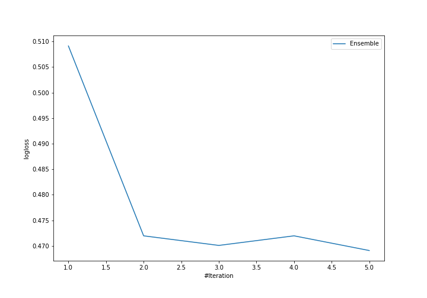
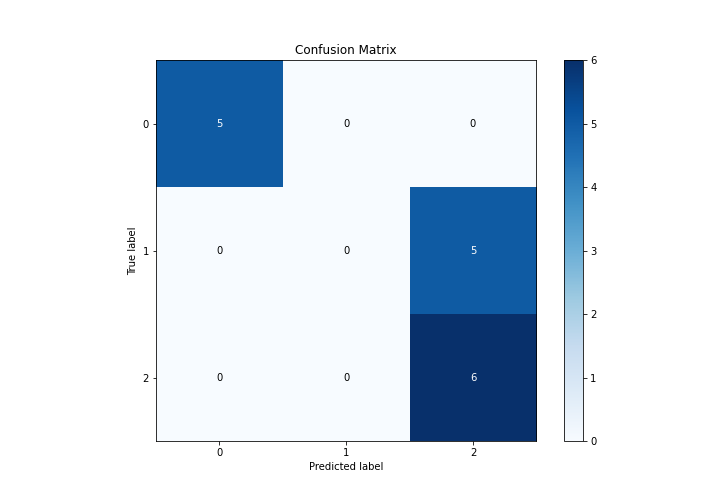
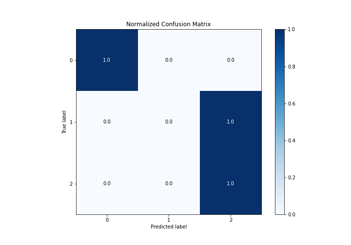
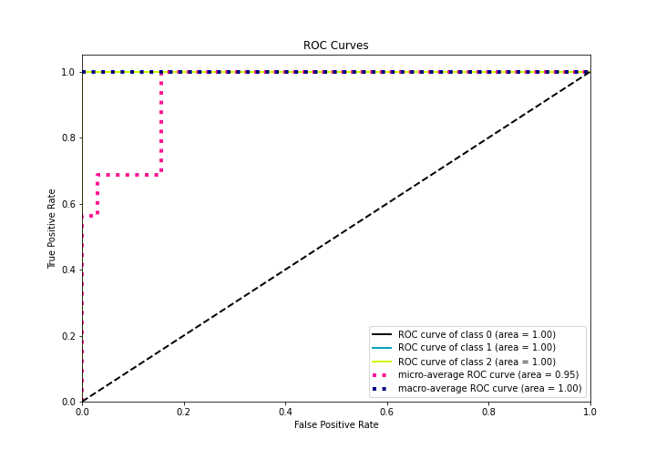
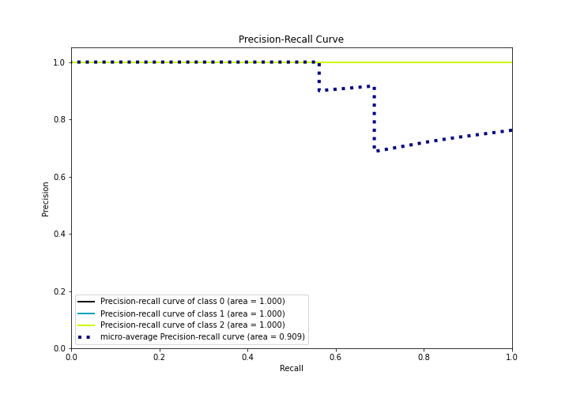

# Summary of Ensemble

[<< Go back](../README.md)

## Ensemble structure
| Model                      |   Weight |
|:---------------------------|---------:|
| 2_Linear                   |        2 |
| 5_Default_NearestNeighbors |        3 |

### Metric details
|           |   0 |   1 |        2 |   accuracy |   macro avg |   weighted avg |   logloss |
|:----------|----:|----:|---------:|-----------:|------------:|---------------:|----------:|
| precision |   1 |   0 | 0.545455 |     0.6875 |    0.515152 |       0.517045 |  0.469081 |
| recall    |   1 |   0 | 1        |     0.6875 |    0.666667 |       0.6875   |  0.469081 |
| f1-score  |   1 |   0 | 0.705882 |     0.6875 |    0.568627 |       0.577206 |  0.469081 |
| support   |   5 |   5 | 6        |     0.6875 |   16        |      16        |  0.469081 |

## Confusion matrix
|              |   Predicted as 0 |   Predicted as 1 |   Predicted as 2 |
|:-------------|-----------------:|-----------------:|-----------------:|
| Labeled as 0 |                5 |                0 |                0 |
| Labeled as 1 |                0 |                0 |                5 |
| Labeled as 2 |                0 |                0 |                6 |

## Learning curves

## Confusion Matrix

## Normalized Confusion Matrix

## ROC Curve

## Precision Recall Curve

[<< Go back](../README.md)
