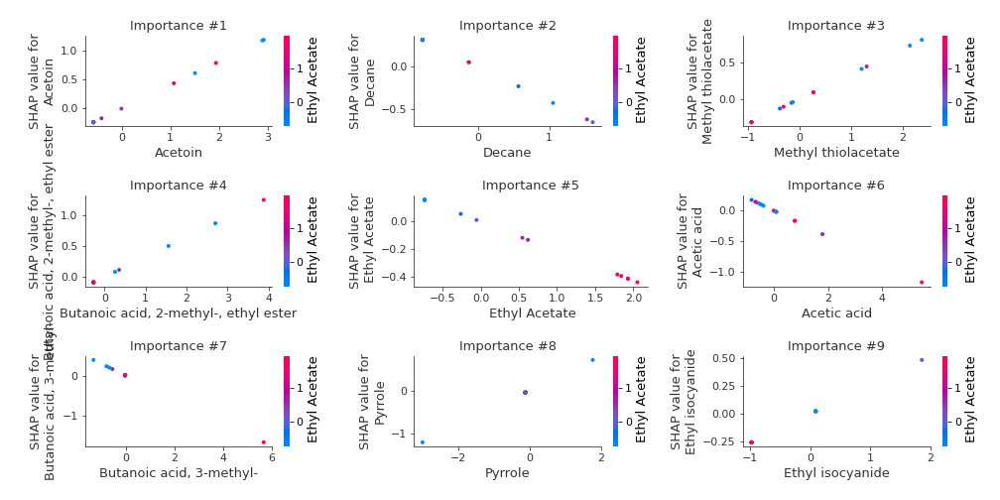

# Summary of 2_Linear

[<< Go back](../README.md)

## Logistic Regression (Linear)
- **n_jobs**: -1
- **num_class**: 3
- **explain_level**: 2

## Validation
 - **validation_type**: split
 - **train_ratio**: 0.75
 - **shuffle**: True
 - **stratify**: True

## Optimized metric
logloss

## Training time

11.4 seconds

### Metric details
|           |        0 |        1 |        2 |   accuracy |   macro avg |   weighted avg |   logloss |
|:----------|---------:|---------:|---------:|-----------:|------------:|---------------:|----------:|
| precision | 1        | 0.75     | 0.714286 |        0.8 |    0.821429 |       0.821429 |  0.648711 |
| recall    | 0.8      | 0.6      | 1        |        0.8 |    0.8      |       0.8      |  0.648711 |
| f1-score  | 0.888889 | 0.666667 | 0.833333 |        0.8 |    0.796296 |       0.796296 |  0.648711 |
| support   | 5        | 5        | 5        |        0.8 |   15        |      15        |  0.648711 |

## Confusion matrix
|              |   Predicted as 0 |   Predicted as 1 |   Predicted as 2 |
|:-------------|-----------------:|-----------------:|-----------------:|
| Labeled as 0 |                4 |                1 |                0 |
| Labeled as 1 |                0 |                3 |                2 |
| Labeled as 2 |                0 |                0 |                5 |

## Learning curves

## Coefficients

### Coefficients learner #1
|                                               |            0 |           1 |            2 |
|:----------------------------------------------|-------------:|------------:|-------------:|
| intercept                                     | -0.369135    |  0.0127767  |  0.356358    |
| Ethyl Acetate                                 | -0.200318    | -0.213773   |  0.414091    |
| Ethanol                                       | -0.183172    |  0.00207149 |  0.1811      |
| Propanoic acid, ethyl ester                   | -0.0669168   |  0.129286   | -0.0623692   |
| 2-Pentanone                                   |  0.0566205   | -0.0511186  | -0.00550191  |
| Decane                                        |  0.138304    | -0.402788   |  0.264484    |
| Methyl Isobutyl Ketone                        |  0.112266    | -0.365903   |  0.253637    |
| Amylene hydrate                               |  0.0329721   | -0.046013   |  0.013041    |
| Butanoic acid, 2-methyl-, methyl ester        |  0.122707    | -0.144699   |  0.0219915   |
| Isobutyl acetate                              |  0.101799    | -0.0100887  | -0.0917105   |
| Methyl isovalerate                            |  0.118304    |  0.0709287  | -0.189232    |
| 1-Propanol                                    |  0.14973     | -0.0374504  | -0.11228     |
| Methyl thiolacetate                           | -0.00144846  |  0.342348   | -0.3409      |
| Butanoic acid, 2-methyl-, ethyl ester         | -0.0959094   |  0.321921   | -0.226012    |
| 2-Hexanone                                    |  0.11379     |  0.139966   | -0.253757    |
| Ethyl isocyanide                              | -0.0454571   |  0.257953   | -0.212495    |
| 1-Propanol, 2-methyl-                         | -0.046516    | -0.119771   |  0.166287    |
| 2-Pentanol, 2-methyl-                         | -0.0446944   | -0.0425435  |  0.0872379   |
| 2-Pentanol                                    |  0.0151205   | -0.0739751  |  0.0588546   |
| 1-Butanol, 3-methyl-, acetate                 | -0.0421459   |  0.181678   | -0.139532    |
| 1 - Undecene                                  | -0.0161185   |  0.0158416  |  0.000276936 |
| 1-Butanol                                     |  0.000685664 |  0.13805    | -0.138735    |
| 2-Heptanone                                   | -0.0131439   | -0.0373565  |  0.0505003   |
| Dodecane                                      | -0.0107978   | -0.01865    |  0.0294478   |
| 1-Butanol, 3-methyl-                          | -0.107639    |  0.109367   | -0.00172738  |
| S-Methyl 3-methylbutanethioate                | -0.166271    |  0.0125736  |  0.153698    |
| 2-Heptanone, 4,6-dimethyl-                    | -0.0174186   | -0.049816   |  0.0672346   |
| 3-Buten-1-ol, 3-methyl-                       | -0.150387    |  0.0840781  |  0.0663086   |
| Thiocyanic acid, methyl ester                 |  0.104041    | -0.170352   |  0.0663112   |
| Acetoin                                       | -0.157109    |  0.40759    | -0.250481    |
| 1-Pentanol, 2-methyl-                         |  0.0128592   |  0.0565028  | -0.069362    |
| Butanoic acid, 3-methyl-, 2-methylbutyl ester | -0.174188    | -0.0461376  |  0.220325    |
| 2-Heptanol, 4-methyl-                         | -0.0688856   | -0.22784    |  0.296726    |
| 2-Nonanone                                    | -0.111821    |  0.141355   | -0.0295343   |
| Acetic acid                                   | -0.0946775   | -0.21561    |  0.310288    |
| 2-Nonanol                                     | -0.0824454   |  0.0744468  |  0.00799856  |
| Pyrrole                                       | -0.261277    |  0.403892   | -0.142615    |
| 1H-Pyrrole, 2-methyl-                         | -0.297422    |  0.263922   |  0.0335002   |
| 1-Heptanol, 2,4-dimethyl-,                    |  0.0523493   | -0.0589719  |  0.0066226   |
| Propanoic acid                                |  0.245881    |  0.00619124 | -0.252072    |
| Propanoic acid, 2-methyl-                     |  0.0412398   | -0.0561387  |  0.0148989   |
| 1-Octanol                                     | -0.206078    |  0.238938   | -0.0328595   |
| 2-Undecanone                                  | -0.0960582   |  0.0261039  |  0.0699543   |
| Benzoic acid, methyl ester                    | -0.0879465   | -0.0864441  |  0.174391    |
| Butyrolactone                                 |  0.325697    |  0.0109289  | -0.336626    |
| Decanoic acid, ethyl ester                    | -0.156876    |  0.0185542  |  0.138322    |
| Acetic acid, decyl ester                      | -0.111799    |  0.251124   | -0.139324    |
| 2-Undecanol                                   | -0.118269    |  0.0359414  |  0.0823276   |
| Butanoic acid, 3-methyl-                      |  0.0156342   | -0.291942   |  0.276308    |
| 2-Dodecanone                                  |  0.182118    | -0.0411801  | -0.140938    |
| 1-Decanol                                     | -0.145514    |  0.238398   | -0.0928843   |
| 2-Tridecanone                                 |  0.0434657   | -0.015844   | -0.0276218   |
| Dodecanoic acid, ethyl ester                  | -0.0983999   |  0.0507493  |  0.0476507   |
| 1,4-Butanediol                                |  0.325689    |  0.0111294  | -0.336818    |
| Phenylethyl Alcohol                           | -0.208514    |  0.153247   |  0.0552661   |
| Acetophenone, 2'-amino-                       |  0.00711333  | -0.157971   |  0.150857    |
| 2-Tridecanol                                  | -0.0142058   |  0.0816893  | -0.0674836   |
| Tetradecanal                                  | -0.0493172   |  0.126099   | -0.0767815   |
| 1-Dodecanol                                   | -0.152109    |  0.0724159  |  0.0796928   |
| Methyl tetradecanoate                         |  0.0270638   |  0.0423203  | -0.0693841   |
| 2-Pentadecanone                               |  0.106272    | -0.0121705  | -0.0941018   |
| Tetradecanoic acid, ethyl ester               | -0.0558281   |  0.127393   | -0.0715653   |
| Hexadecanal                                   | -0.00590095  |  0.113655   | -0.107755    |
| n-Tridecan-1-ol                               |  0.222972    | -0.0518506  | -0.171122    |
| 1-Tetradecanol                                | -0.154374    |  0.0883893  |  0.0659848   |
| n-Pentadecanol                                |  0.116995    | -0.0257474  | -0.0912475   |
| 1-Hexadecanol                                 |  0.0252847   |  0.0582316  | -0.0835163   |
| Indole                                        | -0.202506    |  0.102024   |  0.100482    |

## Permutation-based Importance

## Confusion Matrix

## Normalized Confusion Matrix

## ROC Curve

## Precision Recall Curve

## SHAP Importance

## SHAP Dependence plots

### Dependence 0 (Fold 1)

### Dependence 1 (Fold 1)

### Dependence 2 (Fold 1)

## SHAP Decision plots

### Worst decisions for selected sample 1 (Fold 1)

### Worst decisions for selected sample 2 (Fold 1)

### Worst decisions for selected sample 3 (Fold 1)

### Worst decisions for selected sample 4 (Fold 1)

### Best decisions for selected sample 1 (Fold 1)

### Best decisions for selected sample 2 (Fold 1)

### Best decisions for selected sample 3 (Fold 1)

### Best decisions for selected sample 4 (Fold 1)

[<< Go back](../README.md)
