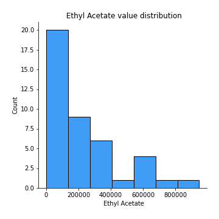
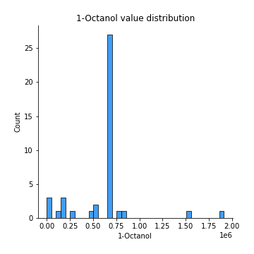

# Exploratory Data Analysis

[<< Go back](../README.md)
## Feature : target
- **Feature type** : discrete
- **Missing** : 0.0%
- **Unique** : 3
- **Count** :42.0
- **Mean** :1.119047619047619
- **Std** :0.832345523714672
- **Min** :0.0
- **25%th Percentile** : 0.0
- **50%th Percentile** : 1.0
- **75%th Percentile** : 2.0
- **Max** :2.0

## Feature :  Ethyl Acetate
- **Feature type** : continous
- **Missing** : 0.0%
- **Unique** : 27
- **Count** :42.0
- **Mean** :207267.1818703385
- **Std** :245569.5027662894
- **Min** :0.0
- **25%th Percentile** : 0.0
- **50%th Percentile** : 156298.5
- **75%th Percentile** : 314824.0
- **Max** :947309.0

## Feature : Ethanol
- **Feature type** : continous
- **Missing** : 0.0%
- **Unique** : 35
- **Count** :42.0
- **Mean** :2126133.595238095
- **Std** :2452195.1090214625
- **Min** :0.0
- **25%th Percentile** : 107634.5
- **50%th Percentile** : 1091656.5
- **75%th Percentile** : 3336188.0
- **Max** :8155560.0

## Feature : Propanoic acid, ethyl ester
- **Feature type** : continous
- **Missing** : 0.0%
- **Unique** : 3
- **Count** :42.0
- **Mean** :15742.26190476191
- **Std** :26648.51596819849
- **Min** :0.0
- **25%th Percentile** : 0.0
- **50%th Percentile** : 17989.40740740741
- **75%th Percentile** : 17989.40740740741
- **Max** :175461.0

## Feature : 2-Pentanone
- **Feature type** : continous
- **Missing** : 0.0%
- **Unique** : 40
- **Count** :42.0
- **Mean** :1058896.8333333333
- **Std** :931883.9954073086
- **Min** :0.0
- **25%th Percentile** : 488689.0
- **50%th Percentile** : 624154.5
- **75%th Percentile** : 1324438.75
- **Max** :3917970.0

## Feature : Decane
- **Feature type** : continous
- **Missing** : 0.0%
- **Unique** : 23
- **Count** :42.0
- **Mean** :239932.97619047618
- **Std** :303965.0431090991
- **Min** :0.0
- **25%th Percentile** : 0.0
- **50%th Percentile** : 33048.5
- **75%th Percentile** : 444528.0
- **Max** :1105838.0

## Feature : Methyl Isobutyl Ketone
- **Feature type** : continous
- **Missing** : 0.0%
- **Unique** : 12
- **Count** :42.0
- **Mean** :219905.48621553896
- **Std** :309893.6345392107
- **Min** :0.0
- **25%th Percentile** : 0.0
- **50%th Percentile** : 218195.5614035088
- **75%th Percentile** : 218195.5614035088
- **Max** :1309090.0

## Feature : Amylene hydrate
- **Feature type** : continous
- **Missing** : 0.0%
- **Unique** : 21
- **Count** :42.0
- **Mean** :99413.14285714286
- **Std** :154405.7866653164
- **Min** :0.0
- **25%th Percentile** : 0.0
- **50%th Percentile** : 0.0
- **75%th Percentile** : 144024.0
- **Max** :694251.0

## Feature : Butanoic acid, 2-methyl-, methyl ester
- **Feature type** : continous
- **Missing** : 0.0%
- **Unique** : 5
- **Count** :42.0
- **Mean** :273471.7477954143
- **Std** :281933.8877616681
- **Min** :0.0
- **25%th Percentile** : 287247.7037037037
- **50%th Percentile** : 287247.7037037037
- **75%th Percentile** : 287247.7037037037
- **Max** :1437190.0

## Feature : Isobutyl acetate
- **Feature type** : continous
- **Missing** : 0.0%
- **Unique** : 9
- **Count** :42.0
- **Mean** :43281.52028218693
- **Std** :71539.75333113092
- **Min** :0.0
- **25%th Percentile** : 0.0
- **50%th Percentile** : 23008.10185185185
- **75%th Percentile** : 46016.2037037037
- **Max** :381024.0

## Feature : Methyl isovalerate
- **Feature type** : continous
- **Missing** : 0.0%
- **Unique** : 8
- **Count** :42.0
- **Mean** :88010.66541353382
- **Std** :139134.16023383942
- **Min** :0.0
- **25%th Percentile** : 0.0
- **50%th Percentile** : 48638.4649122807
- **75%th Percentile** : 97276.9298245614
- **Max** :608115.0

## Feature : 1-Propanol
- **Feature type** : continous
- **Missing** : 0.0%
- **Unique** : 9
- **Count** :42.0
- **Mean** :332993.4523809523
- **Std** :365301.2274811202
- **Min** :0.0
- **25%th Percentile** : 206332.75
- **50%th Percentile** : 317293.22222222225
- **75%th Percentile** : 317293.22222222225
- **Max** :1682575.0

## Feature : Methyl thiolacetate
- **Feature type** : continous
- **Missing** : 0.0%
- **Unique** : 29
- **Count** :42.0
- **Mean** :104691.47619047618
- **Std** :106864.29244201997
- **Min** :0.0
- **25%th Percentile** : 0.0
- **50%th Percentile** : 83333.0
- **75%th Percentile** : 168740.5
- **Max** :352289.0

## Feature : Butanoic acid, 2-methyl-, ethyl ester
- **Feature type** : continous
- **Missing** : 0.0%
- **Unique** : 15
- **Count** :42.0
- **Mean** :814072.8126984127
- **Std** :368366.0335265047
- **Min** :0.0
- **25%th Percentile** : 713709.4333333333
- **50%th Percentile** : 713709.4333333333
- **75%th Percentile** : 713709.4333333333
- **Max** :2062898.0

## Feature : 2-Hexanone
- **Feature type** : continous
- **Missing** : 0.0%
- **Unique** : 11
- **Count** :42.0
- **Mean** :39596.59482038428
- **Std** :51726.58319164968
- **Min** :0.0
- **25%th Percentile** : 0.0
- **50%th Percentile** : 39797.61403508772
- **75%th Percentile** : 39797.61403508772
- **Max** :183084.0

## Feature : Ethyl isocyanide
- **Feature type** : continous
- **Missing** : 0.0%
- **Unique** : 5
- **Count** :42.0
- **Mean** :17885.404761904763
- **Std** :18560.853225052128
- **Min** :0.0
- **25%th Percentile** : 0.0
- **50%th Percentile** : 19984.0
- **75%th Percentile** : 19984.0
- **Max** :105656.0

## Feature : 1-Propanol, 2-methyl-
- **Feature type** : continous
- **Missing** : 0.0%
- **Unique** : 35
- **Count** :42.0
- **Mean** :213012.52380952382
- **Std** :174394.64451265283
- **Min** :0.0
- **25%th Percentile** : 61524.0
- **50%th Percentile** : 193059.0
- **75%th Percentile** : 346065.0
- **Max** :533119.0

## Feature : 2-Pentanol, 2-methyl-
- **Feature type** : continous
- **Missing** : 0.0%
- **Unique** : 17
- **Count** :42.0
- **Mean** :31732.730063109582
- **Std** :45644.90671159368
- **Min** :0.0
- **25%th Percentile** : 0.0
- **50%th Percentile** : 0.0
- **75%th Percentile** : 63562.25
- **Max** :155158.0

## Feature : 2-Pentanol
- **Feature type** : continous
- **Missing** : 0.0%
- **Unique** : 13
- **Count** :42.0
- **Mean** :265408.92230576434
- **Std** :436036.6719396584
- **Min** :0.0
- **25%th Percentile** : 0.0
- **50%th Percentile** : 265630.649122807
- **75%th Percentile** : 265630.649122807
- **Max** :2282603.0

## Feature : 1-Butanol, 3-methyl-, acetate
- **Feature type** : continous
- **Missing** : 0.0%
- **Unique** : 7
- **Count** :42.0
- **Mean** :26412.37142857142
- **Std** :35436.777736477816
- **Min** :0.0
- **25%th Percentile** : 19126.2
- **50%th Percentile** : 19126.2
- **75%th Percentile** : 19126.2
- **Max** :156927.0

## Feature : 1 - Undecene
- **Feature type** : continous
- **Missing** : 0.0%
- **Unique** : 14
- **Count** :42.0
- **Mean** :5467064.319223984
- **Std** :2038286.8968252453
- **Min** :0.0
- **25%th Percentile** : 5627687.703703703
- **50%th Percentile** : 5627687.703703703
- **75%th Percentile** : 5627687.703703703
- **Max** :10477684.0

## Feature : 1-Butanol
- **Feature type** : continous
- **Missing** : 0.0%
- **Unique** : 24
- **Count** :42.0
- **Mean** :1370303.341269841
- **Std** :1020507.1333577363
- **Min** :0.0
- **25%th Percentile** : 523797.5
- **50%th Percentile** : 1456599.6666666667
- **75%th Percentile** : 1499152.6666666667
- **Max** :3879386.0

## Feature : 2-Heptanone
- **Feature type** : continous
- **Missing** : 0.0%
- **Unique** : 23
- **Count** :42.0
- **Mean** :130568.80952380953
- **Std** :205778.5701848681
- **Min** :0.0
- **25%th Percentile** : 0.0
- **50%th Percentile** : 60585.5
- **75%th Percentile** : 175013.0
- **Max** :1022779.0

## Feature : Dodecane
- **Feature type** : continous
- **Missing** : 0.0%
- **Unique** : 5
- **Count** :42.0
- **Mean** :16588.325396825403
- **Std** :45008.647949911465
- **Min** :0.0
- **25%th Percentile** : 0.0
- **50%th Percentile** : 0.0
- **75%th Percentile** : 16751.333333333332
- **Max** :265644.0

## Feature : 1-Butanol, 3-methyl-
- **Feature type** : continous
- **Missing** : 0.0%
- **Unique** : 42
- **Count** :42.0
- **Mean** :6791992.904761905
- **Std** :6515515.430529114
- **Min** :1084828.0
- **25%th Percentile** : 2567397.0
- **50%th Percentile** : 5040107.0
- **75%th Percentile** : 8186640.0
- **Max** :28478038.0

## Feature :  S-Methyl 3-methylbutanethioate
- **Feature type** : continous
- **Missing** : 0.0%
- **Unique** : 14
- **Count** :42.0
- **Mean** :344364.6587301589
- **Std** :134687.54006848272
- **Min** :89553.0
- **25%th Percentile** : 334880.3333333333
- **50%th Percentile** : 334880.3333333333
- **75%th Percentile** : 334880.3333333333
- **Max** :922092.0

## Feature : 2-Heptanone, 4,6-dimethyl-
- **Feature type** : continous
- **Missing** : 0.0%
- **Unique** : 12
- **Count** :42.0
- **Mean** :49223.820987654304
- **Std** :56221.03868899396
- **Min** :0.0
- **25%th Percentile** : 0.0
- **50%th Percentile** : 59419.96296296296
- **75%th Percentile** : 59419.96296296296
- **Max** :228006.0

## Feature :  3-Buten-1-ol, 3-methyl-
- **Feature type** : continous
- **Missing** : 0.0%
- **Unique** : 31
- **Count** :42.0
- **Mean** :136301.80952380953
- **Std** :144971.03583150805
- **Min** :0.0
- **25%th Percentile** : 0.0
- **50%th Percentile** : 98950.0
- **75%th Percentile** : 152881.25
- **Max** :487632.0

## Feature : Thiocyanic acid, methyl ester
- **Feature type** : continous
- **Missing** : 0.0%
- **Unique** : 5
- **Count** :42.0
- **Mean** :52593.415343915345
- **Std** :45710.22406932576
- **Min** :0.0
- **25%th Percentile** : 58038.22222222222
- **50%th Percentile** : 58038.22222222222
- **75%th Percentile** : 58038.22222222222
- **Max** :254571.0

## Feature : Acetoin
- **Feature type** : continous
- **Missing** : 0.0%
- **Unique** : 17
- **Count** :42.0
- **Mean** :171366.69047619047
- **Std** :302081.07478594006
- **Min** :0.0
- **25%th Percentile** : 0.0
- **50%th Percentile** : 0.0
- **75%th Percentile** : 199281.75
- **Max** :1112605.0

## Feature : 1-Pentanol, 2-methyl-
- **Feature type** : continous
- **Missing** : 0.0%
- **Unique** : 9
- **Count** :42.0
- **Mean** :46326.285714285725
- **Std** :31076.961713986206
- **Min** :0.0
- **25%th Percentile** : 48789.62962962963
- **50%th Percentile** : 48789.62962962963
- **75%th Percentile** : 48789.62962962963
- **Max** :163793.0

## Feature : Butanoic acid, 3-methyl-, 2-methylbutyl ester
- **Feature type** : continous
- **Missing** : 0.0%
- **Unique** : 9
- **Count** :42.0
- **Mean** :100230.78042328048
- **Std** :56068.89309904642
- **Min** :0.0
- **25%th Percentile** : 103049.88888888888
- **50%th Percentile** : 103049.88888888888
- **75%th Percentile** : 103049.88888888888
- **Max** :323499.0

## Feature : 2-Heptanol, 4-methyl-
- **Feature type** : continous
- **Missing** : 0.0%
- **Unique** : 6
- **Count** :42.0
- **Mean** :49280.477072310365
- **Std** :51233.86623037397
- **Min** :0.0
- **25%th Percentile** : 45394.51851851852
- **50%th Percentile** : 45394.51851851852
- **75%th Percentile** : 45394.51851851852
- **Max** :237817.0

## Feature : 2-Nonanone 
- **Feature type** : continous
- **Missing** : 0.0%
- **Unique** : 29
- **Count** :42.0
- **Mean** :584190.5555555555
- **Std** :549691.5204892935
- **Min** :75932.0
- **25%th Percentile** : 272400.0
- **50%th Percentile** : 542709.0
- **75%th Percentile** : 618535.1666666666
- **Max** :2654044.0

## Feature : Acetic acid
- **Feature type** : continous
- **Missing** : 0.0%
- **Unique** : 30
- **Count** :42.0
- **Mean** :3833574.2598162075
- **Std** :4475620.175168203
- **Min** :125680.0
- **25%th Percentile** : 1136130.0
- **50%th Percentile** : 3241608.0701754387
- **75%th Percentile** : 3241608.0701754387
- **Max** :21176351.0

## Feature : 2-Nonanol
- **Feature type** : continous
- **Missing** : 0.0%
- **Unique** : 14
- **Count** :42.0
- **Mean** :659617.408289242
- **Std** :440939.66041578766
- **Min** :0.0
- **25%th Percentile** : 628854.074074074
- **50%th Percentile** : 628854.074074074
- **75%th Percentile** : 628854.074074074
- **Max** :2526340.0

## Feature : Pyrrole
- **Feature type** : continous
- **Missing** : 0.0%
- **Unique** : 14
- **Count** :42.0
- **Mean** :381288.22045855346
- **Std** :93469.83564791932
- **Min** :103804.0
- **25%th Percentile** : 371058.6296296296
- **50%th Percentile** : 371058.6296296296
- **75%th Percentile** : 371058.6296296296
- **Max** :720171.0

## Feature : 1H-Pyrrole, 2-methyl-
- **Feature type** : continous
- **Missing** : 0.0%
- **Unique** : 12
- **Count** :42.0
- **Mean** :350548.60670194
- **Std** :129304.26887910439
- **Min** :0.0
- **25%th Percentile** : 333395.7407407408
- **50%th Percentile** : 333395.7407407408
- **75%th Percentile** : 333395.7407407408
- **Max** :621874.0

## Feature : 1-Heptanol, 2,4-dimethyl-,
- **Feature type** : continous
- **Missing** : 0.0%
- **Unique** : 14
- **Count** :42.0
- **Mean** :48339.350088183426
- **Std** :56644.90979312547
- **Min** :0.0
- **25%th Percentile** : 0.0
- **50%th Percentile** : 49898.40740740741
- **75%th Percentile** : 56768.0
- **Max** :274686.0

## Feature : Propanoic acid
- **Feature type** : continous
- **Missing** : 0.0%
- **Unique** : 18
- **Count** :42.0
- **Mean** :77011.23809523808
- **Std** :89137.81640789761
- **Min** :0.0
- **25%th Percentile** : 0.0
- **50%th Percentile** : 57874.07142857143
- **75%th Percentile** : 82874.75
- **Max** :364754.0

## Feature : Propanoic acid, 2-methyl-
- **Feature type** : continous
- **Missing** : 0.0%
- **Unique** : 3
- **Count** :42.0
- **Mean** :15189.161904761897
- **Std** :13503.240627471296
- **Min** :0.0
- **25%th Percentile** : 0.0
- **50%th Percentile** : 20034.1
- **75%th Percentile** : 20034.1
- **Max** :76990.0

## Feature : 1-Octanol
- **Feature type** : continous
- **Missing** : 0.0%
- **Unique** : 14
- **Count** :42.0
- **Mean** :607503.3809523808
- **Std** :342187.47648646706
- **Min** :0.0
- **25%th Percentile** : 576927.4444444445
- **50%th Percentile** : 664654.7777777778
- **75%th Percentile** : 664654.7777777778
- **Max** :1910713.0

## Feature : 2-Undecanone
- **Feature type** : continous
- **Missing** : 0.0%
- **Unique** : 29
- **Count** :42.0
- **Mean** :529988.9215167547
- **Std** :345865.69320328184
- **Min** :0.0
- **25%th Percentile** : 283103.25
- **50%th Percentile** : 590668.9537037037
- **75%th Percentile** : 590926.9074074074
- **Max** :1644906.0

## Feature : Benzoic acid, methyl ester
- **Feature type** : continous
- **Missing** : 0.0%
- **Unique** : 18
- **Count** :42.0
- **Mean** :143109.6243386243
- **Std** :139683.71169997094
- **Min** :0.0
- **25%th Percentile** : 0.0
- **50%th Percentile** : 134161.44444444444
- **75%th Percentile** : 135929.61111111112
- **Max** :556478.0

## Feature : Butyrolactone 
- **Feature type** : continous
- **Missing** : 0.0%
- **Unique** : 3
- **Count** :42.0
- **Mean** :32743.0365079365
- **Std** :27553.137840547424
- **Min** :0.0
- **25%th Percentile** : 0.0
- **50%th Percentile** : 43750.23333333333
- **75%th Percentile** : 43750.23333333333
- **Max** :150201.0

## Feature :  Decanoic acid, ethyl ester
- **Feature type** : continous
- **Missing** : 0.0%
- **Unique** : 5
- **Count** :42.0
- **Mean** :32060.571428571446
- **Std** :30193.64928203145
- **Min** :0.0
- **25%th Percentile** : 0.0
- **50%th Percentile** : 37525.444444444445
- **75%th Percentile** : 37525.444444444445
- **Max** :152418.0

## Feature : Acetic acid, decyl ester
- **Feature type** : continous
- **Missing** : 0.0%
- **Unique** : 5
- **Count** :42.0
- **Mean** :34070.38095238094
- **Std** :34445.62216837987
- **Min** :0.0
- **25%th Percentile** : 0.0
- **50%th Percentile** : 37478.11111111111
- **75%th Percentile** : 37478.11111111111
- **Max** :164633.0

## Feature : 2-Undecanol
- **Feature type** : continous
- **Missing** : 0.0%
- **Unique** : 17
- **Count** :42.0
- **Mean** :370402.8747795414
- **Std** :616329.5590936482
- **Min** :0.0
- **25%th Percentile** : 0.0
- **50%th Percentile** : 338121.48148148146
- **75%th Percentile** : 338121.48148148146
- **Max** :3287479.0

## Feature : Butanoic acid, 3-methyl-
- **Feature type** : continous
- **Missing** : 0.0%
- **Unique** : 15
- **Count** :42.0
- **Mean** :2485945.688888888
- **Std** :787711.6315268481
- **Min** :1607769.0
- **25%th Percentile** : 2403459.033333333
- **50%th Percentile** : 2403459.033333333
- **75%th Percentile** : 2403459.033333333
- **Max** :5887513.0

## Feature : 2-Dodecanone
- **Feature type** : continous
- **Missing** : 0.0%
- **Unique** : 8
- **Count** :42.0
- **Mean** :33062.309523809534
- **Std** :30117.87640954085
- **Min** :0.0
- **25%th Percentile** : 30908.48148148148
- **50%th Percentile** : 30908.48148148148
- **75%th Percentile** : 30908.48148148148
- **Max** :159402.0

## Feature : 1-Decanol
- **Feature type** : continous
- **Missing** : 0.0%
- **Unique** : 16
- **Count** :42.0
- **Mean** :1496991.3095238102
- **Std** :1067467.714218314
- **Min** :0.0
- **25%th Percentile** : 1224696.5740740742
- **50%th Percentile** : 1524509.2962962964
- **75%th Percentile** : 1524509.2962962964
- **Max** :5542281.0

## Feature : 2-Tridecanone
- **Feature type** : continous
- **Missing** : 0.0%
- **Unique** : 16
- **Count** :42.0
- **Mean** :324595.52380952373
- **Std** :150311.16311055102
- **Min** :69218.0
- **25%th Percentile** : 314530.962962963
- **50%th Percentile** : 314530.962962963
- **75%th Percentile** : 314530.962962963
- **Max** :975303.0

## Feature :  Dodecanoic acid, ethyl ester
- **Feature type** : continous
- **Missing** : 0.0%
- **Unique** : 4
- **Count** :42.0
- **Mean** :18884.023809523795
- **Std** :22511.254870467368
- **Min** :0.0
- **25%th Percentile** : 0.0
- **50%th Percentile** : 21410.85185185185
- **75%th Percentile** : 21410.85185185185
- **Max** :118849.0

## Feature : 1,4-Butanediol
- **Feature type** : continous
- **Missing** : 0.0%
- **Unique** : 3
- **Count** :42.0
- **Mean** :16011.541269841258
- **Std** :13463.085566789243
- **Min** :0.0
- **25%th Percentile** : 0.0
- **50%th Percentile** : 21398.13333333333
- **75%th Percentile** : 21398.13333333333
- **Max** :73337.0

## Feature : Phenylethyl Alcohol
- **Feature type** : continous
- **Missing** : 0.0%
- **Unique** : 14
- **Count** :42.0
- **Mean** :144676.30952380956
- **Std** :58939.63701392855
- **Min** :0.0
- **25%th Percentile** : 147761.62962962964
- **50%th Percentile** : 147761.62962962964
- **75%th Percentile** : 147761.62962962964
- **Max** :386583.0

## Feature : Acetophenone, 2'-amino-
- **Feature type** : continous
- **Missing** : 0.0%
- **Unique** : 12
- **Count** :42.0
- **Mean** :344723.9506172838
- **Std** :277941.0820729297
- **Min** :0.0
- **25%th Percentile** : 343307.962962963
- **50%th Percentile** : 343307.962962963
- **75%th Percentile** : 343307.962962963
- **Max** :1937240.0

## Feature : 2-Tridecanol
- **Feature type** : continous
- **Missing** : 0.0%
- **Unique** : 9
- **Count** :42.0
- **Mean** :57708.666666666686
- **Std** :44750.69536439752
- **Min** :0.0
- **25%th Percentile** : 56845.07407407407
- **50%th Percentile** : 56845.07407407407
- **75%th Percentile** : 56845.07407407407
- **Max** :226100.0

## Feature : Tetradecanal
- **Feature type** : continous
- **Missing** : 0.0%
- **Unique** : 3
- **Count** :42.0
- **Mean** :7995.5952380952385
- **Std** :16791.776387470323
- **Min** :0.0
- **25%th Percentile** : 0.0
- **50%th Percentile** : 8317.0
- **75%th Percentile** : 8317.0
- **Max** :111256.0

## Feature : 1-Dodecanol
- **Feature type** : continous
- **Missing** : 0.0%
- **Unique** : 16
- **Count** :42.0
- **Mean** :2056882.142857144
- **Std** :1256494.2649989617
- **Min** :242246.0
- **25%th Percentile** : 1837700.25
- **50%th Percentile** : 2098782.4444444445
- **75%th Percentile** : 2098782.4444444445
- **Max** :8172616.0

## Feature : Methyl tetradecanoate
- **Feature type** : continous
- **Missing** : 0.0%
- **Unique** : 9
- **Count** :42.0
- **Mean** :107907.80952380954
- **Std** :115410.5012868409
- **Min** :0.0
- **25%th Percentile** : 97878.33333333331
- **50%th Percentile** : 97878.33333333331
- **75%th Percentile** : 97878.33333333331
- **Max** :698476.0

## Feature :  2-Pentadecanone
- **Feature type** : continous
- **Missing** : 0.0%
- **Unique** : 13
- **Count** :42.0
- **Mean** :90738.92857142855
- **Std** :59771.60751468867
- **Min** :0.0
- **25%th Percentile** : 85753.37037037036
- **50%th Percentile** : 85753.37037037036
- **75%th Percentile** : 85753.37037037036
- **Max** :382222.0

## Feature : Tetradecanoic acid, ethyl ester
- **Feature type** : continous
- **Missing** : 0.0%
- **Unique** : 3
- **Count** :42.0
- **Mean** :9388.428571428567
- **Std** :18103.89871708713
- **Min** :0.0
- **25%th Percentile** : 0.0
- **50%th Percentile** : 10167.74074074074
- **75%th Percentile** : 10167.74074074074
- **Max** :119785.0

## Feature : Hexadecanal
- **Feature type** : continous
- **Missing** : 0.0%
- **Unique** : 8
- **Count** :42.0
- **Mean** :83053.26190476188
- **Std** :72233.97882387055
- **Min** :0.0
- **25%th Percentile** : 60173.0
- **50%th Percentile** : 94159.37037037036
- **75%th Percentile** : 94159.37037037036
- **Max** :408288.0

## Feature : n-Tridecan-1-ol
- **Feature type** : continous
- **Missing** : 0.0%
- **Unique** : 9
- **Count** :42.0
- **Mean** :92661.07142857145
- **Std** :84848.52710745556
- **Min** :0.0
- **25%th Percentile** : 85581.62962962964
- **50%th Percentile** : 85581.62962962964
- **75%th Percentile** : 85581.62962962964
- **Max** :448151.0

## Feature : 1-Tetradecanol
- **Feature type** : continous
- **Missing** : 0.0%
- **Unique** : 16
- **Count** :42.0
- **Mean** :557632.9047619046
- **Std** :339631.39977140323
- **Min** :84426.0
- **25%th Percentile** : 499679.57407407404
- **50%th Percentile** : 586042.2962962963
- **75%th Percentile** : 586042.2962962963
- **Max** :2450605.0

## Feature : n-Pentadecanol
- **Feature type** : continous
- **Missing** : 0.0%
- **Unique** : 7
- **Count** :42.0
- **Mean** :166769.07692307682
- **Std** :208392.7891068655
- **Min** :0.0
- **25%th Percentile** : 147199.65384615384
- **50%th Percentile** : 173037.61538461538
- **75%th Percentile** : 173037.61538461538
- **Max** :1389615.0

## Feature :  1-Hexadecanol
- **Feature type** : continous
- **Missing** : 0.0%
- **Unique** : 15
- **Count** :42.0
- **Mean** :674946.5714285716
- **Std** :671916.3123996488
- **Min** :0.0
- **25%th Percentile** : 527050.0185185185
- **50%th Percentile** : 662122.074074074
- **75%th Percentile** : 662122.074074074
- **Max** :4268126.0

## Feature : Indole
- **Feature type** : continous
- **Missing** : 0.0%
- **Unique** : 16
- **Count** :42.0
- **Mean** :83439135.33333333
- **Std** :8696887.746765172
- **Min** :61263721.0
- **25%th Percentile** : 82469063.0
- **50%th Percentile** : 82469063.0
- **75%th Percentile** : 82469063.0
- **Max** :111534573.0

[<< Go back](../README.md)
