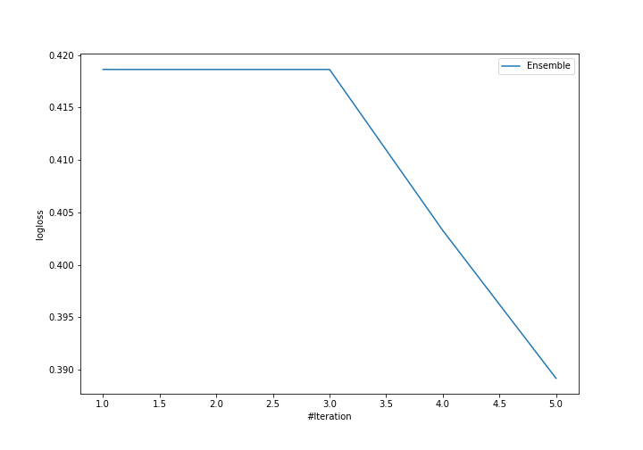
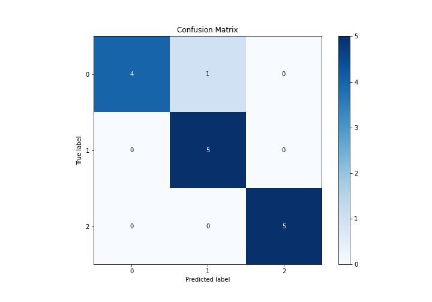
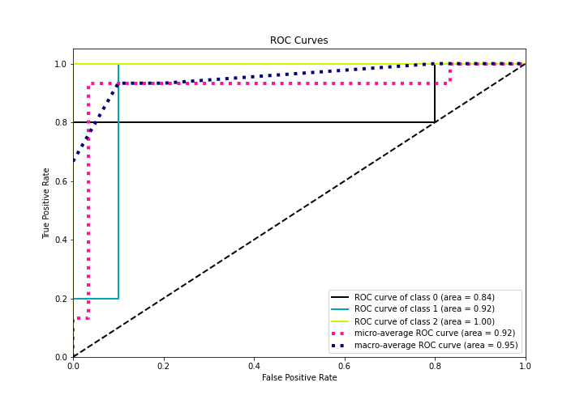
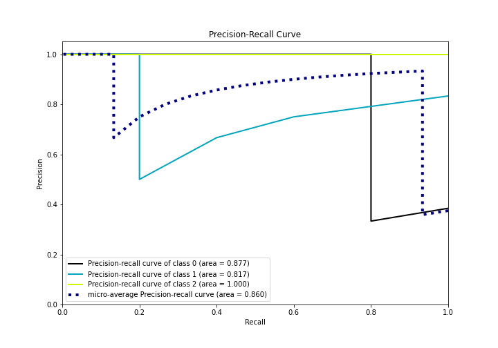

# Summary of Ensemble

[<< Go back](../README.md)

## Ensemble structure
| Model                  |   Weight |
|:-----------------------|---------:|
| 3_Default_Xgboost      |        4 |
| 4_Default_RandomForest |        1 |

### Metric details
|           |        0 |        1 |   2 |   accuracy |   macro avg |   weighted avg |   logloss |
|:----------|---------:|---------:|----:|-----------:|------------:|---------------:|----------:|
| precision | 1        | 0.833333 |   1 |   0.933333 |    0.944444 |       0.944444 |  0.389198 |
| recall    | 0.8      | 1        |   1 |   0.933333 |    0.933333 |       0.933333 |  0.389198 |
| f1-score  | 0.888889 | 0.909091 |   1 |   0.933333 |    0.93266  |       0.93266  |  0.389198 |
| support   | 5        | 5        |   5 |   0.933333 |   15        |      15        |  0.389198 |

## Confusion matrix
|              |   Predicted as 0 |   Predicted as 1 |   Predicted as 2 |
|:-------------|-----------------:|-----------------:|-----------------:|
| Labeled as 0 |                4 |                1 |                0 |
| Labeled as 1 |                0 |                5 |                0 |
| Labeled as 2 |                0 |                0 |                5 |

## Learning curves

## Confusion Matrix

## Normalized Confusion Matrix

## ROC Curve

## Precision Recall Curve

[<< Go back](../README.md)
