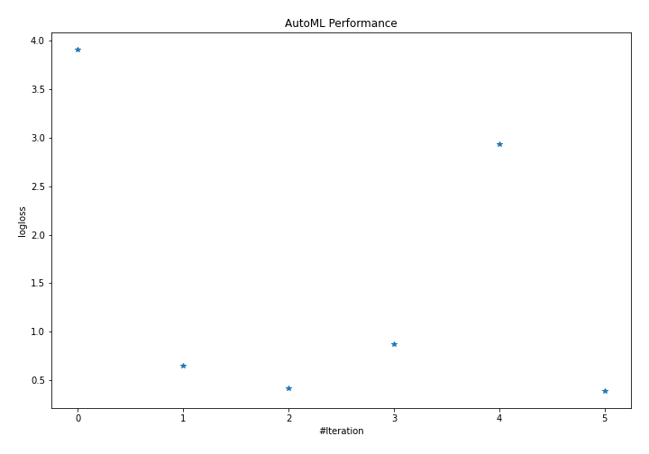
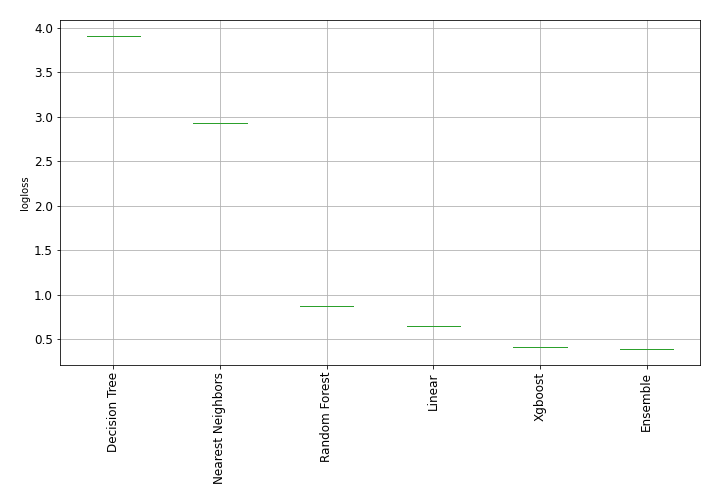
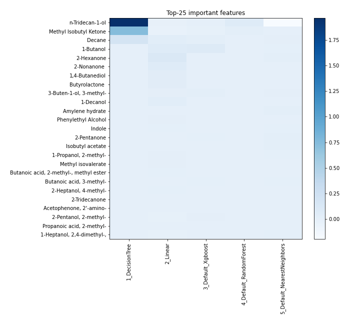
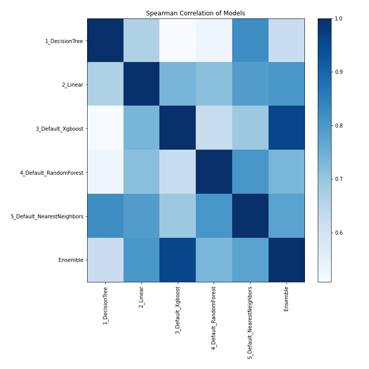

# AutoML Leaderboard

| Best model   | name                                                               | model_type        | metric_type   |   metric_value |   train_time |
|:-------------|:-------------------------------------------------------------------|:------------------|:--------------|---------------:|-------------:|
|              | [1_DecisionTree](1_DecisionTree/README.md)                         | Decision Tree     | logloss       |       3.9089   |        17.96 |
|              | [2_Linear](2_Linear/README.md)                                     | Linear            | logloss       |       0.648711 |        13.55 |
|              | [3_Default_Xgboost](3_Default_Xgboost/README.md)                   | Xgboost           | logloss       |       0.418621 |        16.3  |
|              | [4_Default_RandomForest](4_Default_RandomForest/README.md)         | Random Forest     | logloss       |       0.872037 |        16.22 |
|              | [5_Default_NearestNeighbors](5_Default_NearestNeighbors/README.md) | Nearest Neighbors | logloss       |       2.93421  |         5.88 |
| **the best** | [Ensemble](Ensemble/README.md)                                     | Ensemble          | logloss       |       0.389198 |         0.31 |

### AutoML Performance

### AutoML Performance Boxplot

### Features Importance

### Spearman Correlation of Models

